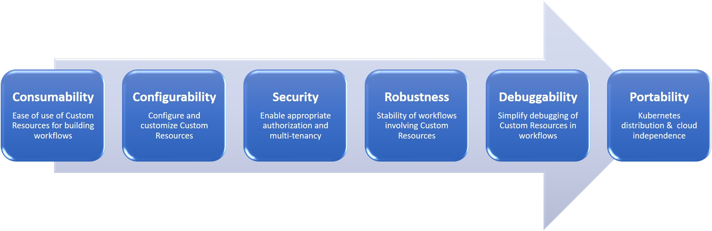

# Kubernetes Operator Maturity Model for multi-Operator Stacks

Kubernetes Operators enable running third-party softwares natively on Kubernetes. Operators are being built today for a variety of softwares such as MySQL, Postgres, Cassandra, Airflow, Kafka, Prometheus, Moodle, Wordpress, etc. A Kubernetes Operator consists of a Kubernetes Custom Controller for managing required workflow actions and associated Kubernetes Custom Resources that act as APIs. Increasingly enterprises are building their workflows like AI, Analytics, CI/CD, SaaS etc. on Kubernetes using multi-Operator stacks. In this regard, the typical challenges that enterprise teams face today include questions such as figuring out which Operators are appropriate for their needs, how to use various Operators together to build their workflows, ensuring that their multi-Operator stacks are portable across Kubernetes distributions, etc. 

As such, there is a need for enterprises to understand the enterprise readiness of various Operators and how to use them to build their particular workflows. Below we define Kubernetes Operator maturity model which is intended to capture the wide range of Operator setups that are seen in enterprises today. The model focuses on calibrating an Operator’s maturity towards increasingly complex setups such as, multi-Operator, multi-tenant application stacks, multi-cloud, and Kubernetes vendor neutrality. This model has emerged from our experience of working with Operator authors and enterprises. The model is defined as 4 levels as shown below and comes with associated guidelines for each level. These guidelines are discussed in the following section.  



If you are an Operator author, use this model as a guiding framework in developing your Operator to fit in real-life multi-Operator stacks. If you are a Platform Engineer/DevOps Engineer adopting Kubernetes for your enterprise use case, use this model for evaluating Operators for your platform needs. This model forms the foundation for our 
[Platform-as-Code approach](https://cloudark.io/platform-as-code) towards building purpose-built platforms on Kubernetes.

## Guidelines


### 1) Consumability - Application developer’s ability to consume Custom Resources

The first maturity level  defines the requirements related to 
usability of Custom Resources of an Operator focusing on the needs of the application developers.

[Design Custom Resource as a declarative API and avoid inputs as imperative actions](https://github.com/cloud-ark/kubeplus/blob/master/Guidelines.md#design-operator-with-declarative-apis-and-avoid-inputs-as-imperative-actions)

[Make Custom Resource Type definitions compliant with Kube OpenAPI](https://github.com/cloud-ark/kubeplus/blob/master/Guidelines.md#make-custom-resource-type-definitions-compliant-with-kube-openapi)

[Use ConfigMap or Custom Resource Annotation or Custom Resource Spec definition for underlying resource configuration](https://github.com/cloud-ark/kubeplus/blob/master/Guidelines.md#use-configmap-or-custom-resource-annotation-or-custom-resource-spec-definition-for-underlying-resource-configuration)

[Set OwnerReferences for underlying resources owned by your Custom Resource](https://github.com/cloud-ark/kubeplus/blob/master/Guidelines.md#set-ownerreferences-for-underlying-resources-owned-by-your-custom-resource)

[Decide Custom Resource Metrics Collection strategy](https://github.com/cloud-ark/kubeplus/blob/master/Guidelines.md#decide-custom-resource-metrics-collection-strategy)

[Consider to use kubectl as the primary interaction mechanism](https://github.com/cloud-ark/kubeplus/blob/master/Guidelines.md#consider-to-use-kubectl-as-the-primary-interaction-mechanism)

[Document Service Account needs of your Operator](https://github.com/cloud-ark/kubeplus/blob/master/Guidelines.md#document-service-account-needs-of-your-operator)

[Document naming convention and labels to be used with your Custom Resources](https://github.com/cloud-ark/kubeplus/blob/master/Guidelines.md#document-naming-convention-and-labels-to-be-used-with-your-custom-resources)


### 2) Interoperability - Interoperability guarantees for multi-Operator environments

The second maturity level identifies the requirements related to using an Operator alongside other Operators in a cluster. 
This level acknowledges the growing interest of enterprises in using multiple Operators in their clusters.

[Define Resource limits and Resource requests for Custom Resources](https://github.com/cloud-ark/kubeplus/blob/master/Guidelines.md#define-resource-limit-and-resource-requests-for-custom-resources)

[Define Custom Resource Node Affinity rules](https://github.com/cloud-ark/kubeplus/blob/master/Guidelines.md#define-custom-resource-node-affinity-rules)

[Define Custom Resource Pod Affinity rules](https://github.com/cloud-ark/kubeplus/blob/master/Guidelines.md#define-custom-resource-pod-affinity-rules)

[Define Custom Resource Anti-Affinity rules](https://github.com/cloud-ark/kubeplus/blob/master/Guidelines.md#define-custom-resource-anti-affinity-rules)

[Define Custom Resource Taint Toleration rules](https://github.com/cloud-ark/kubeplus/blob/master/Guidelines.md#define-custom-resource-taint-toleration-rules)

[Define PodDisruptionBudget for Custom Resources](https://github.com/cloud-ark/kubeplus/blob/master/Guidelines.md#define-poddisruptionbudget-for-custom-resources)


### 3) Multi-tenancy - Multi-tenant guarantees

Operators naturally provide a `managed service` experience in running third-party software on Kubernetes. The third maturity level ensures an Operator is ready for multi-tenant scenarios for a single service and also as a part of multi-Operator platform stacks. 

[Document how your Operator uses namespaces](https://github.com/cloud-ark/kubeplus/blob/master/Guidelines.md#document-how-your-operator-uses-namespaces)

[Make Custom Controllers Namespace aware](https://github.com/cloud-ark/kubeplus/blob/master/Guidelines.md#make-custom-controllers-namespace-aware)

[Define SecurityContext for Custom Resources](https://github.com/cloud-ark/kubeplus/blob/master/Guidelines.md#define-securitycontext-for-custom-resources)

[Evaluate Service Account needs for Custom Resource Pods](https://github.com/cloud-ark/kubeplus/blob/master/Guidelines.md#evaluate-service-account-needs-for-custom-resource-pods)


### Portability - Kubernetes distribution and Cloud provider independence

The goal of the fourth maturity level is to define Operator packaging and installation requirements such that an Operator can be installed on any Kubernetes cluster independent of any Kubernetes distribution or Cloud provider. 

[Package Operator as Helm Chart](https://github.com/cloud-ark/kubeplus/blob/master/Guidelines.md#package-operator-as-helm-chart)

[Register CRDs as YAML Spec in Helm chart rather than in Operator code](https://github.com/cloud-ark/kubeplus/blob/master/Guidelines.md#register-crds-as-yaml-spec-in-helm-chart-rather-than-in-operator-code)

[Add crd-install Helm hook annotation on your CRD YAML](https://github.com/cloud-ark/kubeplus/blob/master/Guidelines.md#add-crd-install-helm-hook-annotation-on-your-crd-yaml)

[Define Custom Resource Spec Validation rules as part of Custom Resource Definition YAML](https://github.com/cloud-ark/kubeplus/blob/master/Guidelines.md#define-custom-resource-spec-validation-rules-as-part-of-custom-resource-definition-yaml)

[Use Helm chart or ConfigMap for Operator configurables](https://github.com/cloud-ark/kubeplus/blob/master/Guidelines.md#use-helm-chart-or-configmap-for-operator-configurables)

[Add Platform-as-Code annotations on your CRD YAML](https://github.com/cloud-ark/kubeplus/blob/master/Guidelines.md#add-platform-as-code-annotations-on-your-crd-yaml)


# Detail Guidelines

# 1) Application developer usability

## Design Operator with declarative API/s and avoid inputs as imperative actions

A declarative API is one in which you specify the desired state of the software that your Operator is managing using the Custom Resource Spec definition. Prefer declarative specification over any imperative actions in Custom Resource Spec  definition. Custom controller code should be written such that it reconciles the current state of the underlying software with the desired state by performing diff of the current state with the desired state. For example, when writing a Postgres Operator, the Custom Controller should be written to perform diff of the existing value of ‘users’ with the desired value of ‘users’ based on the received desired state and perform the required actions (such as adding new users, deleting current users, etc.). An example where underlying imperative actions are exposed in the Spec is this 
[MySQL Backup Custom Resource Spec](https://github.com/oracle/mysql-operator/blob/master/examples/backup/backup.yaml#L7). Here the fact that MySQL Backup is done using mysqldump tool is exposed in the Spec.
In our view such internal details should not be exposed in the Spec as it prevents Custom Resource Spec definition 
to evolve independently without affecting its users.


## Make Custom Resource Type definitions compliant with Kube OpenAPI

Kubernetes API details are documented using Swagger v1.2 and OpenAPI. [Kube OpenAPI](https://github.com/kubernetes/kube-openapi) supports a subset of OpenAPI features to satisfy kubernetes use-cases. As Operators extend Kubernetes API, it is important to follow Kube OpenAPI features to provide consistent user experience.
Following actions are required to comply with Kube OpenAPI.

Add documentation on your Custom Resource Type definition and on the various fields in it.
The field names need to be defined using following pattern:
Kube OpenAPI name validation rules expect the field name in Go code and field name in JSON to be exactly 
same with just the first letter in different case (Go code requires CamelCase, JSON requires camelCase).

When defining the types corresponding to your Custom Resources, you should use kube-openapi annotation — “+k8s:openapi-gen=true’’ in the type definition to enable generating OpenAPI Spec documentation for your Custom Resources. An example of this annotation on type definition on CloudARK sample Postgres Custom Resource is shown below:
```
  // +k8s:openapi-gen=true
  type Postgres struct {
    :
  }
```

Defining this annotation on your type definition would enable Kubernetes API Server 
to generate documentation for your Custom Resource Spec properties. This can then be viewed using ``kubectl explain`` command.


## Use ConfigMap or Custom Resource Annotation or Custom Resource Spec definition for underlying resource configuration

An Operator generally needs to take configuration parameter as inputs for the underlying resource that it is managing.
We have seen three different approaches being used towards this in the community: using ConfigMaps, using Annotations, or using Spec definition itself. Any of these approaches should be fine based on your Operator design. 
It is also possible that you may end up using multiple approaches, such as a ConfigMap with its name specified in the 
Custom Resource Spec definition.

[Nginx Custom Controller](https://github.com/nginxinc/kubernetes-ingress/tree/master/examples/customization) supports both ConfigMap and Annotation.
[Oracle MySQL Operator](https://github.com/oracle/mysql-operator/blob/master/docs/user/clusters.md) uses ConfigMap.
[PressLabs MySQL Operator](https://github.com/presslabs/mysql-operator) uses Custom Resource [Spec definition](https://github.com/presslabs/mysql-operator/blob/master/examples/example-cluster.yaml#L22).


## Set OwnerReferences for underlying resources owned by your Custom Resource

An Operator will typically create one or more native Kubernetes resources as part of instantiating a Custom Resource instance. Set the OwnerReference attribute of such underlying resources to the Custom Resource instance that is
being created. OwnerReference setting is essential for correct garbage collection of Custom Resources. 
It also help with finding runtime composition tree of your Custom Resource instances.


## Decide Custom Resource Metrics Collection strategy

Plan for metrics collection of Custom Resources managed by your Operator. This information is useful for understanding effect of various actions on your Custom Resources over time for their traceability. 
For example, [this MySQL Operator](https://github.com/oracle/mysql-operator/) 
collects information such as how many clusters were created. One option to collect metrics 
is to build the metrics collection inside your Custom Controller itself, as done by the MySQL Operator.
Another option is to leverage Kubernetes Audit Logs for this purpose. 
Then, you can use external tooling like [kubeprovenance](https://github.com/cloud-ark/kubeprovenance) 
to build the required metrics. Once metrics are collected, you should consider exposing them in Prometheus format.


## Consider to use kubectl as the primary interaction mechanism

Custom Resources introduced by your Operator will naturally work with kubectl.
However, there might be operations that you want to support for which the declarative nature of Custom Resources
is not appropriate. An example of such an action is historical record of how Postgres Custom Resource has evolved over time
that might be supported by the Postgres Operator. Such an action does not fit naturally into the declarative
format of Custom Resource Definition. For such actions, we encourage you to consider using Kubernetes
extension mechanisms of Aggregated API servers and Custom Sub-resources. These mechanisms 
will allow you to continue using kubectl as the primary interaction point for your Operator.
Refer to [this blog post](https://medium.com/@cloudark/comparing-kubernetes-api-extension-mechanisms-of-custom-resource-definition-and-aggregated-api-64f4ca6d0966) to learn more about them. Before considering to introduce new CLI for your Operator, validate if you can use 
Kubernetes's built-in mechanisms instead. 

## Document Service Account needs of your Operator

Your Operator may be need to use a specific service account with specific permissions. Clearly document the service account needs of your Operator. Include this information in the ConfigMap that you will add for the 'usage' platform-as-code annotation on the CRD.


## Document naming convention and labels to be used with your Custom Resources

You may have special requirements for naming your Custom Resource instances or some of their
Spec properties. Similarly you may have requirements related to the labels that need to be added on them. Document this information in the ConfigMap corresponding to the 'usage' platform-as-code annotation on the CRD.


# 2) Multi-Operator interoperability


## Define Resource limit and Resource requests for Custom Resources

Kubernetes provides mechanism of [requests and limits](https://kubernetes.io/docs/concepts/configuration/manage-compute-resources-container/#resource-types) for specifying the cpu and memory resource needs of a Pod's containers. When specified, Kubernetes scheduler ensures that the Pod is scheduled on a Node that has enough capacity 
for these resources. A Pod with request and limits specified for every container is given ``guaranteed`` Quality-of-Service (QoS) by the Kubernetes scheduler. A Pod in which only resource requests are specified for at least one container is given ``burstable`` QoS. A Pod with no requests/limits specified is given ``best effort`` QoS.
Evaluate whether your Custom Resource Pods should have resource requests/limits specified.
Also evaluate whether you want to give the control for specifying these values to your Custom Resource user.
If you want to allow application developers to provide this information, 
then design the Custom Resource Spec to take the resource requests/limits as inputs. 
Implement your Custom Controller to pass this information through to the Pod creation Spec. 
In case you decide to hard code this information in your
Custom Controller, then surface this information to Custom Resource users through its ``man page`` 
[check guideline for Platform-as-Code annotations for details]
(https://github.com/cloud-ark/kubeplus/blob/master/Guidelines.md#add-platform-as-code-annotations-on-your-crd-yaml).


## Define Custom Resource Node Affinity rules

Kubernetes provides mechanism of [Pod Node Affinity](https://kubernetes.io/docs/concepts/configuration/assign-pod-node/)
This mechanism enables identifying the nodes on which a Pod should run.
A set of labels are specified on the Pod Spec which are matched by the scheduler 
with the labels on the nodes when making scheduling decision. If your Custom Resource Pods need to be
subject to this scheduling constraint then you will need to define the Custom Resource Spec to allow input of 
such labels. The Custom Controller will need to be implemented to pass these labels to the Custom Resource Pod Spec.


## Define Custom Resource Pod Affinity rules

Kubernetes provides mechanism of [Pod Affinity](https://kubernetes.io/docs/concepts/configuration/assign-pod-node/) which enables defining Pod scheduling rules based on labels of other Pods that are running on a node. 
Consider if your Custom Resource Pods need to be provided with such affinity rules corresponding
to other Custom Resources from same or other Operator. If so, provide an attribute in your Custom Resource
Spec definition where such rules can be specified. The Custom Controller will need to be implemented to pass these 
rules to the Custom Resource Pod Spec.


## Define Custom Resource Anti-Affinity rules

Kubernetes also provides mechanism of [Pod Anti-Affinity](https://kubernetes.io/docs/concepts/configuration/assign-pod-node/) which are opposite of Pod affinity rules. 
Consider if your Custom Resource Pods need to be provided with such anti-affinity rules corresponding to 
other Custom Resoures from other Operators. If so, provide an attribute in your Custom Resource
Spec definition where such rules can be specified. Implement the Custom Controller to pass these 
rules to the Custom Resource Pod Spec.


## Define Custom Resource Taint Toleration rules

Kubernetes provides mechanism of [taints and tolerations](https://kubernetes.io/docs/concepts/configuration/taint-and-toleration/) to restrict scheduling of Pods on certain nodes. If you want your Custom Resource pods
to be able to tolerate the taints on a node, define an attribute in your Custom Resource Spec definition
where such tolerations can be specified. Implement the Custom Controller to pass the toleration labels to
the Custom Resource Pod Spec.


## Define PodDisruptionBudget for Custom Resources

Kubernetes provides mechanism of [Pod Disruption Budget](https://kubernetes.io/docs/tasks/run-application/configure-pdb/) (PDB) that can be used to define the disruption tolerance for Pods. Specifically, two
fields are provided - 'minAvailable' and 'maxUnavailable'. minAvailable is the minimum number of Pods that 
should be always running in a cluster. maxUnavailable is complementary and defines the maximum number of Pods
that can be unavailable in a cluster. These two fields provide a way to control the availability of Pods in a cluster.
When implementing the controller for your Custom Resource, carefully consider such availability requirements for your Custom Resource Pods. If you decide to implement PDB for your Custom Resource Pods, consider whether
the disruption budget should be set by application developers. 
If yes, then ensure that the Custom Resource Spec definition has a field to specify a disruption budget.
Implement the Custom Controller to pass this value to the Pod Spec.
If on the other hand you decide to hard code this choice in your Custom Controller implementation then
surface it to Custom Resource users throught its ``man page``
[check guideline for Platform-as-Code annotations for details](https://github.com/cloud-ark/kubeplus/blob/master/Guidelines.md#add-platform-as-code-annotations-on-your-crd-yaml).


# 3) Multi-tenancy


## Document how your Operator uses namespaces

For Operator developers it is critical to consider how their Operator works with namespaces. Typically, an Operator can be installed in one of the following configurations:

  * Operator runs in the default namespace and Custom Resource instances are created in the default namespace.

  * Operator runs in the default namespace but Custom Resource instances can be created in non-default namespaces.

  * Operator runs in a non-default namespace and Custom Resource instances can be created in that namespace.

Given these options, it will help consumers of your Operator if there is a clear documentation of how namespaces are used by your Operator. Include this information in the ConfigMap that you will add for the 'usage' platform-as-code annotation on the CRD.


## Make Custom Controllers namespace aware

Your Operator should support creating resources within different namespaces rather than just in the namespace
in which it is deployed (or the default namespace). This will allow your Operator to support 
multi-tenancy through namespaces.


## Define SecurityContext for Custom Resources

Kubernetes provides mechanism of [SecurityContext](https://kubernetes.io/docs/tasks/configure-pod-container/security-context/) that can be used to define the security attributes of a Pod's containers (userID, groupID, Linux capabilities, etc.). In your Operator implementation, you may decide to create Custom Resource Pods using
certain settings for the securityContext. Surface these settings through 'platform-as-code/securitycontext' annotation
on the CRD. The value of this annotation should be the name of a ConfigMap that contains the security context attributes defined as the data values. Make sure to include this ConfigMap in your Operator's Helm chart.
By surfacing the security context information in this way, it will be possible for the DevOps engineers and
Application developers to find out the security context with which Custom Resource Pods will run in the cluster.


## Evaluate Service Account needs for Custom Resource Pods

Your Custom Resource's Pods may need to run with specific Service account. If that is the case, one
of the decisions you will need to make is whether that Service account should be provided by application
developers. If so, provide an attribute in Custom Resource Spec
definition to define a Service account. Alternatively, if the Custom Controller is hard coding
the Service account in the Pod Spec, then surface this information through the Custom Resource ``man page``
[check guideline for Platform-as-Code annotations for details](https://github.com/cloud-ark/kubeplus/blob/master/Guidelines.md#add-platform-as-code-annotations-on-your-crd-yaml).


# 4) Kubernetes Distribution and Cloud provider independence


## Package Operator as Helm Chart

Create a Helm chart for your Operator. The chart should include two things:

  * All Custom Resource Definitions for Custom Resources managed by the Operator. Examples of this can be seen in 
CloudARK [sample Postgres Operator](https://github.com/cloud-ark/kubeplus/blob/master/postgres-crd-v2/postgres-crd-v2-chart/templates/deployment.yaml) and in 
[this MySQL Operator](https://github.com/oracle/mysql-operator/blob/master/mysql-operator/templates/01-resources.yaml).

  * ConfigMaps corresponding to Platform-as-Code annotations that you have added on your Custom Resource Definition (CRD).


## Register CRDs as YAML Spec in Helm chart rather than in Operator code

Installing CRD requires Cluster-scope permission. If the CRD registration is done as YAML manifest, then it is possible to separate CRD registration from the Operator Pod deployment. CRD registration
can be done by DevOps engineers while Operator Pod deployment can be done by a non-admin user. 
It is then possible to deploy the Operator in different namespaces with different customizations.
On the other hand, if CRD registration is done as part of your Operator code then the deployment of the Operator Pod will need Cluster-scope permissions. This will tie together installation of CRD with that of the Operator, which
may not be the best setup in certain situations. 
Another reason to register CRD as YAML is because kube-openapi validation can be defined as part of it.


## Add crd-install Helm hook annotation on your CRD YAML (Helm 2.0)

Helm 2.0 defines crd-install hook that directs Helm to install CRDs first before installing rest of your
Helm chart that might refer to the Custom Resources defined by the CRDs. 
This is important as otherwise the Custom Resources defined in your chart won't be able to be
installed in your cluster.

```
  apiVersion: apiextensions.k8s.io/v1beta1
  kind: CustomResourceDefinition
  metadata:
    name: moodles.moodlecontroller.kubeplus
    annotations:
      helm.sh/hook: crd-install
```

In Helm 3.0 the crd-install annotation is no longer supported. Instead, a separate directory
named ``crd`` needs to be created as part of the Helm chart directory in which all the CRDs
are to be specified. By defining CRDs inside this directory, Helm 3.0 guarantees to install
the CRDs before installing other templates, which may consist of Custom Resources introduced by that CRD.


## Define Custom Resource Spec Validation rules as part of Custom Resource Definition YAML

Your Custom Resource Spec definitions will contain different properties and they may have some
domain-specific validation requirements. Kubernetes 1.13 onwards you will be able to use 
OpenAPI v3 schema to define validation requirements for your Custom Resource Spec. For instance,
below is an example of adding validation rules for our sample Postgres CRD. The rules define that
the Postgres Custom Resource Spec properties of 'databases' and 'users' should be of type Array
and that every element of this array should be of type String. Once such validation rules are defined,
Kubernetes will reject any Custom Resource Specs that do not satisfy these requirements.

```
apiVersion: apiextensions.k8s.io/v1beta1
kind: CustomResourceDefinition
metadata:
  name: postgreses.postgrescontroller.kubeplus
  annotations:
    helm.sh/hook: crd-install
    platform-as-code/composition: Deployment, Service
spec:
  group: postgrescontroller.kubeplus
  version: v1
  names:
    kind: Postgres
    plural: postgreses
  scope: Namespaced
validation:
   # openAPIV3Schema is the schema for validating custom objects.
    openAPIV3Schema:
      properties:
        spec:
          properties:
            databases:
              type: array
              items:
                type: string
            users:
              type: array
              items:
                type: string 
```


## Use Helm chart or ConfigMap for Operator configurables

Typically Operators will need to support some form of customization. For example, 
[this MySQL Operator](https://github.com/oracle/mysql-operator/blob/master/docs/tutorial.md#configuration) supports following customization settings: whether to deploy
the Operator cluster-wide or within a particular namespace, which version of MySQL should be installed, etc.
Use Values.yaml of your Helm chart to specify such parameters.


## Add Platform-as-Code annotations on your CRD YAML

[Platform-as-Code annotations](https://github.com/cloud-ark/kubeplus#kubeplus-components) provide an approach to package and surface information about Custom Resources to application developers.
Following annotations are available - 'usage', 'securitycontext', 'composition', .
The values of the 'usage' and 'securitycontext' annotations are names of ConfigMaps that contain
the corresponding information. The 'usage' annotation should be used to define 'man page' like 
information of a Custom Resource. This should include any assumptions that the Operator developer has made in implementing Custom Controllers. Hard coded values for resource requests/limits, disruption budgets, service accounts, tolerations, 
should be included when creating the 'usage' ConfigMap. The 'composition' annotation should be used to specify the underlying Kubernetes resources that will be created as part of managing a Custom Resource instance. 
This information is useful for application developers when figuring out how to use your Operator and its Custom Resources. 
We have built KubePlus API Add-on that provides ``man`` and ``composition`` endpoints that can be used to retrieve
static and dynamic information about Custom Resources. KubePlus API Add-on uses the platform-as-code annotations
for this. An example of using can be seen for our sample Moodle Custom Resource Definition below:

```
  apiVersion: apiextensions.k8s.io/v1beta1
  kind: CustomResourceDefinition
  metadata:
    name: moodles.moodlecontroller.kubeplus
    annotations:
      helm.sh/hook: crd-install
      platform-as-code/usage: moodle-operator-usage.usage
      platform-as-code/composition: Deployment, Service, PersistentVolume, PersistentVolumeClaim, Secret, Ingress
```
