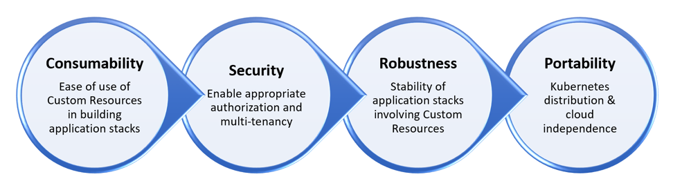

# Kubernetes Operator Maturity Model for multi-tenant multi-Operator environments

The Kubernetes Operator pattern has become popular as it allows packaging applications in Kubernetes native manner.Today, DevOps teams are using community or in-house developed Kubernetes Operators to build their custom PaaSes. We have developed this Kubernetes Operator maturity model to evaluate an Operator's readiness for such custom PaaSes. This includes a set of guidelines for an Operator's readiness for multi-tenant and multi-Operator environments.

This model has emerged from our experience of working alongside Operator authors as well as enterprises who are adopting Kubernetes and are using Operators. The model consists of a set of guidelines related to consumability, security, robustness, and portability. The guidelines are available [here](https://github.com/cloud-ark/kubeplus/blob/master/Guidelines.md). Operators that satisfy these properties are easy to consume in multi-Operator setups, support multi-tenant workloads and are portable across cloud providers.

If you are an Operator author, use this model as a guiding framework when developing your Operator to fit real-life multi-Operator environments. If you are a Platform Engineer/DevOps Engineer, use this model for evaluating Operators for your platform needs. 

## Platform as Code

The Operator Maturity Model is developed as a part of CloudARK's Platform-as-Code practice. Kubernetes Operators enable extending Kubernetes for application specific workflows. They add Custom Resources and offer foundation for creating application stacks as Code declaratively. Our Platform-as-Code practice offers tools and techniques enabling DevOps teams to build custom PaaSes using Kubernetes Operators.

Platform-as-Code practice primarily consists of:
- Operator Maturity Model: Operator readiness guidelines for multi-tenant and multi-Operator environment
- KubePlus: Generic tooling to simplify inventory and charge-back for application stacks created using Operators.   

