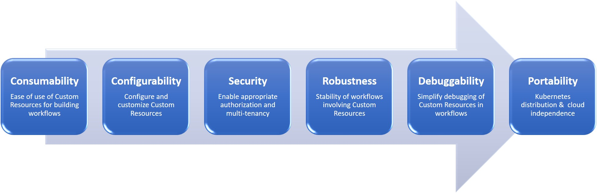

# Kubernetes Operator Maturity Model for multi-Operator Stacks

We are developing Kubernetes Operator Maturity Model with two broad goals:

1) Help Kubernetes Operator Development teams in developing Enterprise-ready
   Kubernetes Operators that are good citizens in multi-Operator world.

2) Help DevOps teams in selecting the Operators for running their workloads 
   on Kubernetes.

Kubernetes Operators enable running third-party softwares natively on Kubernetes. Operators are being built today for a variety of softwares such as MySQL, Postgres, Cassandra, Airflow, Kafka, Prometheus, Moodle, Wordpress, etc. A Kubernetes Operator consists of a Kubernetes Custom Controller for managing required workflow actions and associated Kubernetes Custom Resources that act as APIs. Increasingly enterprises are building their workflows like AI, Analytics, CI/CD, SaaS etc. on Kubernetes using multi-Operator stacks. In this regard, the typical challenges that enterprise teams face today include questions such as figuring out which Operators are appropriate for their needs, how to use various Operators together to build their workflows, ensuring that their multi-Operator stacks are portable across Kubernetes distributions, etc. 

As such, there is a need for enterprises to understand the enterprise readiness of various Operators and how to use them to build their particular workflows. Below we define Kubernetes Operator maturity model which is intended to capture the wide range of Operator setups that are seen in enterprises today. The model focuses on calibrating an Operator’s maturity towards increasingly complex setups such as, multi-Operator, multi-tenant application stacks, multi-cloud, and Kubernetes vendor neutrality. This model has emerged from our experience of working with Operator authors and enterprises. The model is defined as 4 levels as shown below and comes with associated guidelines for each level. These guidelines are available [here](https://github.com/cloud-ark/kubeplus/blob/master/Guidelines.md).

If you are an Operator author, use this model as a guiding framework in developing your Operator to fit in real-life multi-Operator stacks. If you are a Platform Engineer/DevOps Engineer adopting Kubernetes for your enterprise use case, use this model for evaluating Operators for your platform needs. 

