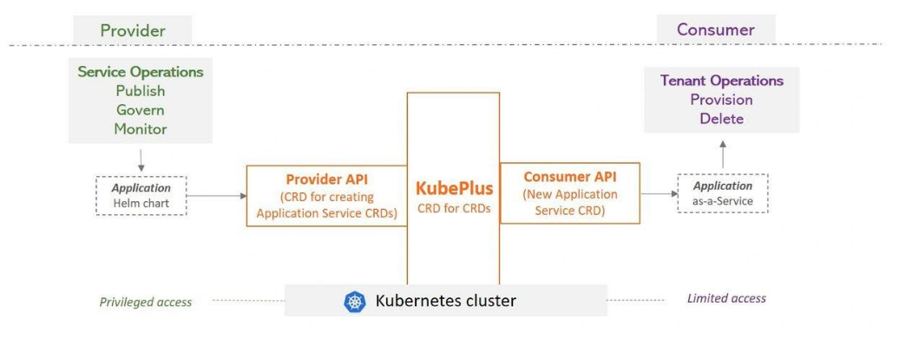
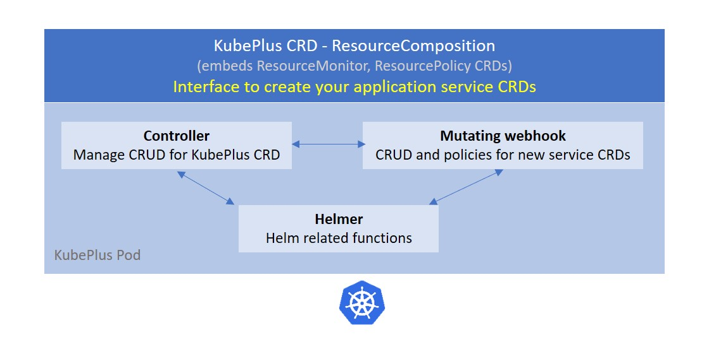
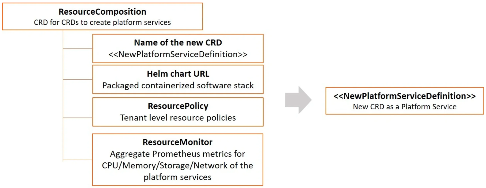
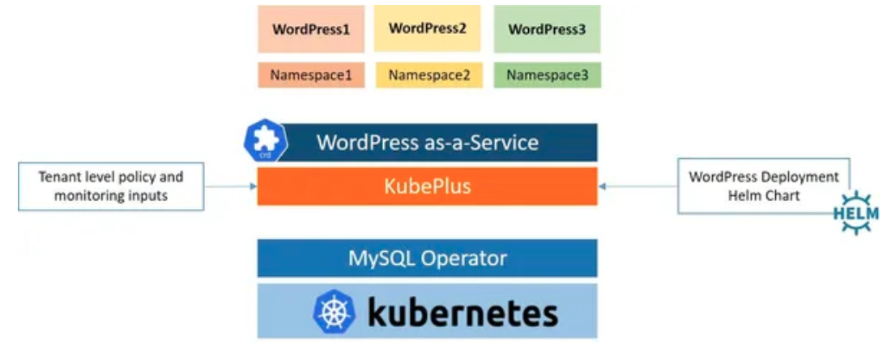
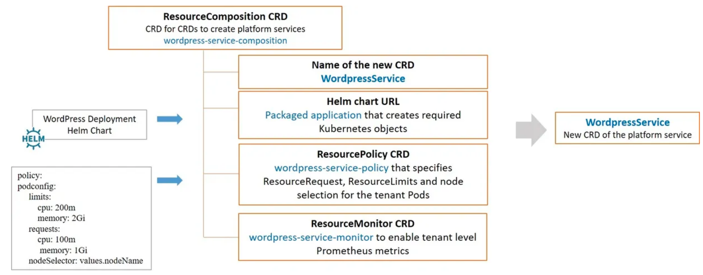
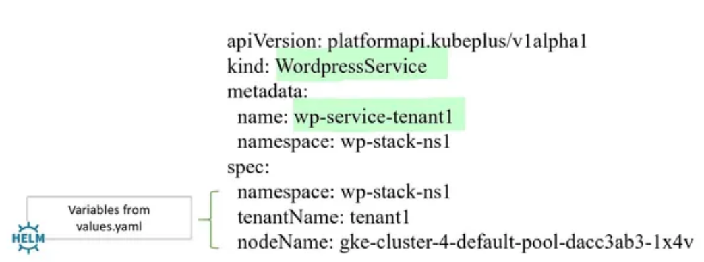
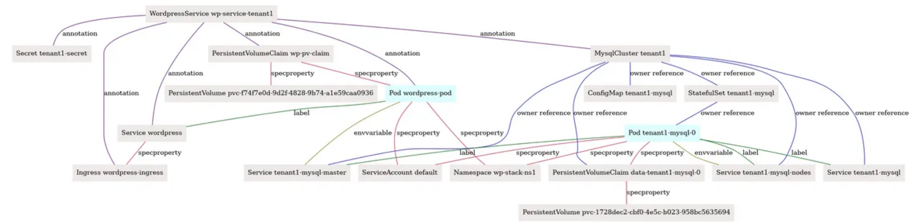

## KubePlus - Kubernetes Operator to create multi-tenant SaaS from Helm charts

Today Platform Engineering teams are dealing with a wide variety of Helm charts coming from different sources - open-source repositories, software vendors, Cloud marketplaces, or enterprise internal stakeholders. The requirement is to deliver these custom application stacks as-a-service taking care of multi-tenancy and day2 operations.

KubePlus is a turn-key solution to transform any containerized application into a SaaS. It takes an application Helm chart and delivers it as-a-service by automating multi-tenancy management and day2 operations such as monitoring, troubleshooting and application upgrades. KubePlus consists of a CRD that enables creating new Kubernetes APIs (CRDs) to realize such services. The new CRDs enable creation of a Helm release per tenant with tenant level isolation, monitoring and consumption tracking.


<p align="center">

</p>

KubePlus is designed to help software vendors accelerate their journey to SaaS or enterprise platform teams rapidly deliver managed services for any custom applications.

## Overview

KubePlus takes an application Helm chart and delivers it as-a-service by automating multi-tenancy management and day2 operations. KubePlus consists of a CRD that enables creating new Kubernetes APIs (CRDs) to realize such services. Provider of the service has privileged access to the cluster and is able to create these services from Helm charts. Consumer of the service has limited access to the cluster and is able to use newly created service API / CRD and create an instance of the application. Behind the scene the provider is able to upgrade, monitor or govern this service.

<p align="center">

</p>

- Create: Create SaaS for any application packaged as Helm chart.
- Govern: Tenant level policies for isolation and resource utilization.
- Monitor: Tenant level consumption metrics for CPU, memory, storage, network.
- Troubleshoot: Tenant level Kubernetes resource relationship graphs. 


## Components

KubePlus has two components briefly described below.


### 1. In cluster component - CRD for CRDs to design your services from Helm charts

<p align="center">

</p>


KubePlus offers a CRD named ```ResourceComposition``` to 
- Compose new CRDs (Custom Resource Definitions) to publish platform services wrapping Helm charts
- Define policies (e.g. Node selection, CPU/Memory limits, etc.) for managing resources of the platform services
- Get aggregated CPU/Memory/Storage/Network metrics for the platform services
(in prometheus format)

Here is the high-level structure of ResourceComposition CRD: 

<p align="center">

</p>

To understand this further let us see how a multi-tenant platform service can be created from WordPress Deployment Helm chart. The Helm chart creates Wordpress pod that depends on a MySQL custom resource.
The MySQL Operator is assumed to be installed on the cluster.
KubePlus takes Helm chart and other policy and monitoring inputs through ResourceComposition CRD as shown below to deliver a new CRD for Wordpress as-a-Service. 

<p align="center">

</p>

Here is a new platform service named WordpressService. 

<p align="center">

</p>

A new CRD named WordpressService has been created here using ResourceComposition. Wordpress SaaS provider uses a Helm chart that defines the required underlying resources, and additionally, defines the required policy and monitoring inputs, through ResourceComposition. The consumer of the service creates instances of WordpressService. The spec properties of the WordpressService Custom Resource are essentially the attributes exposed via the underlying Helm chart's values.yaml. Here is a YAML definition to create a tenant service instance using newly created WordpressService CRD.

<p align="center">

</p>


### 2. Client side Kubectl plugins for monitoring and troubleshooting

KubePlus kubectl plugins enable users to discover, monitor and troubleshoot service instances. The primary plugin is: ```kubectl connections```. It provides information about relationships of a Kubernetes resource instance (custom or built-in) with other resources (custom or built-in) via owner references, labels, annotations, and spec properties. KubePlus constructs Kubernetes Resource relationship graphs at runtime providing it the ability to build resource topologies and offer fine grained visibility and control over the application service.

Here is the resource relationship graph for WordpressService instance discovered using the ```kubectl connections``` command. 
```kubectl connections WordpressService wp-service-tenant1```.

<p align="center">

</p>

We have additional plugins such as ```kubectl metrics``` and ```kubectl applogs``` that use resource relationship graphs behind the scene and aggregate metrics and logs for the service instance.
You can also directly get CPU/Memory/Storage/Network metrics in Prometheus format if you setup ```ResourceMonitor``` while creating your new CRD.


Details about these components are available [here](https://cloud-ark.github.io/kubeplus/docs/html/html/kubeplus-components.html).


## Try it:

- Getting started:

  - Install KubePlus kubectl plugins. They can be used with any Kubernetes resource (built-in resources like Pod, Deployment, or custom resources like MysqlCluster).

```
   $ wget https://github.com/cloud-ark/kubeplus/raw/master/kubeplus-kubectl-plugins.tar.gz
   $ gunzip kubeplus-kubectl-plugins.tar.gz
   $ tar -xvf kubeplus-kubectl-plugins.tar
   $ export KUBEPLUS_HOME=`pwd`
   $ export PATH=$KUBEPLUS_HOME/plugins/:$PATH
   $ kubectl kubeplus commands
```

- Install KubePlus in-cluster component before trying out below examples.
To obtain metrics, enable Kubernetes Metrics API Server on your cluster. Hosted Kubernetes solutions like GKE has this already installed.

    ```
    - git clone --depth 1 https://github.com/cloud-ark/kubeplus.git
    - cd kubeplus/deploy
    - ./deploy-kubeplus.sh
    - We also provide a Helm chart (v3) (available inside kubeplus/deploy directory)
      - Install Helm version 3
      - helm install kubeplus kubeplus-chart
    ```

- SaaS examples:
  - [Hello World service](./examples/multitenancy/hello-world/steps.txt)
  - [Wordpress service](./examples/multitenancy/wordpress-mysqlcluster-stack/steps.txt)
  - [Mysql service](./examples/multitenancy/stacks/steps.txt)
  - [MongoDB service](./examples/multitenancy/mongodb-as-a-service/steps.md)
  - [Multiple teams](./examples/multitenancy/team/steps.txt) with applications deployed later

- Debug (check container logs):
  ```
  - kubectl logs kubeplus -c crd-hook
  - kubectl logs kubeplus -c helmer
  - kubectl logs kubeplus -c platform-operator
  - kubectl logs kubeplus -c webhook-cert-setup
  ```

## Operator Maturity Model

As enterprise teams build their custom platforms using community or in house developed Operators, they need a set of guidelines for Operator readiness in multi-Operator and multi-tenant environments. We have developed the [Operator Maturity Model](https://github.com/cloud-ark/kubeplus/blob/master/Guidelines.md) for this purpose. Operator developers are using this model today to ensure that their Operator is a good citizen of the multi-Operator world and ready to serve multi-tenant workloads. It is also being used by Kubernetes cluster administrators for curating community Operators towards building their custom platforms.


## Presentations/Talks

1. [Being a good citizen of the Multi-Operator world, Kubecon NA 2020](https://www.youtube.com/watch?v=NEGs0GMJbCw&t=2s)

2. [Operators and Helm: It takes two to Tango, Helm Summit 2019](https://youtu.be/F_Dgz1V5Q2g)

3. [KubePlus presentation at community meetings (CNCF sig-app-delivery, Kubernetes sig-apps, Helm)](https://github.com/cloud-ark/kubeplus/blob/master/KubePlus-presentation.pdf)


## Contact

Submit issues on this repository or reach out to our team on [Slack](https://join.slack.com/t/cloudark/shared_invite/zt-2yp5o32u-sOq4ub21TvO_kYgY9ZfFfw).


## Status

Actively under development

