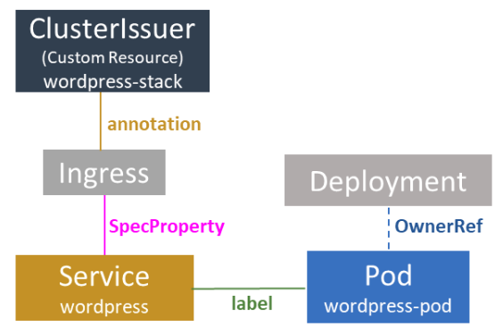

## KubePlus - Tooling for Kubernetes Operator stacks

Kubernetes native stacks are built by extending Kubernetes clusters with a variety of Operators. DevOps engineers are faced with the following challenges while running workloads on such stacks:

- How to discover and use Custom Resources introduced by the Operators for building platform automation in Kubernetes YAMLs?

- How to create linkages between multiple YAMLs or Helm charts coming from different teams / members? 

- How to troubleshoot the platform automation defined in Kubernetes YAMLs?

KubePlus addresses these issues in Operator stacks for the DevOps teams.
It simplifies building and analyzing platform automation in multi-Operator environments. KubePlus is being developed as part of our [Platform as Code practice](https://cloudark.io/platform-as-code).

KubePlus tooling consists of three components - the Operator Maturity Model for multi-Operator scenarios, client-side kubectl plugins, cluster-side runtime binding resolution component.


## Operator Maturity Model

While DevOps teams today want to adopt community Operators and build on top of that, they need a way to evaluate various Operators. They also need a set of guidelines for developing their own Operator/s that complement community Operators. We have developed [Operator Maturity Model](https://github.com/cloud-ark/kubeplus/blob/master/Guidelines.md) focusing on Operator usage in multi-Operator environments. Operator developers are using this model today to ensure that their Operator is a good citizen of a multi-Operator world. It is also being used for curating community Operators for building purpose-built stacks. (If you are new to Operators, check out [Operator FAQ](https://github.com/cloud-ark/kubeplus/blob/master/Operator-FAQ.md)).

## Client-side kubectl plugins


Operators add Custom Resources (e.g. Mysqlcluster) to the cluster. These resources become first class components of that cluster, alongside the built-in resources (e.g. Pod, Service). DevOps and application teams can leverage all these available Resources or APIs on their cluster to build their platform automation in Kubernetes YAMLs or Helm charts. DevOps engineers often face challenges in discovery and use of Custom Resources and troubleshooting the workflows built using them.  We have developed a mechanism to address this challenge. A set of annotations are added on CRDs (Custom Resource Definitions) to capture Operator developer’s assumptions. These are then leveraged by our kubectl plugins that simplify building and maintaining platform automation that uses Custom Resources. This mechanism is built on the fact that workflows are built in Kubernetes YAMLs by establishing relationships between available resources. These relationships are primarily of four types. 

(1) Owner references – A resource internally creates additional resources (e.g. MysqlCluster when instantiated, creates Pods and Services). These sub-resources are related to the parent resource through Owner reference relationship.

(2) Labels and (3) Annotations – Labels or Annotations are key/value pairs that are attached to Kubernetes resources. Operator for Resource A can depend on a specific label or annotation to be given on Resource B to take some action.

(4) Spec Properties – Resource A’s Spec property may depend on some value coming from Resource B. 

Here is a sample workflow for deploying wordpress application that can be built in YAML by creating the resources and relationships between them.

<p align="center">

</p>

KubePlus offers following CRD annotations that help Operator developers capture assumptions they have made around what type of relationships can be established with the Custom Resources of their Operators.


```
resource/usage
resource/composition
resource/annotation-relationship
resource/label-relationship
resource/specproperty-relationship
```

[Here](./Operator-annotations.md) are some sample CRD annotations for community Operators that can be used to unlock KubePlus tooling for them.

KubePlus leverages knowledge of relationships between Kubernetes built-in resources and combines that with the CRD annotations mentioned above and builds runtime Kubernetes resource topologies. KubePlus offers a variety of kubectl plugins that internally leverage this topology information and enable DevOps teams to analyze their platform workflows. 

KubePlus currently offers following kubectl plugins:

**1. kubectl composition**

- ``kubectl composition``: Provides information about sub resources created for a Kubernetes resource instance (custom or built-in).

**2. kubectl connections**

- ``kubectl connections``: Provides information about relationships of a Kubernetes resource instance (custom or built-in) with other resources (custom or built-in) via labels / annotations / spec properties / owner references.

**3. kubectl metrics**

- ``kubectl metrics cr``: Provides metrics for a Custom Resource instance (count of sub-resources, pods, containers, nodes, total CPU and total Memory consumption).
- ``kubectl metrics service``: Provides CPU/Memory metrics for all the Pods that are descendants of a Service instance. 
- ``kubectl metrics account``: Provides metrics for an account identity - user / service account. (counts of custom resources, built-in workload objects, pods, total CPU and Memory). Needs cluster-side component.
- ``kubectl metrics helmrelease``: Provides CPU/Memory metrics for all the Pods that are part of a Helm release.

**4. kubectl grouplogs**

- ``kubectl grouplogs cr``: Provides logs for all the containers of a Custom Resource instance.
- ``kubectl grouplogs service``: Provides logs for all the containers of all the Pods that are related to a Service object.
- ``kubectl grouplogs helmrelease`` (upcoming): Provides logs for all the containers of all the Pods that are part of a Helm release.

**5. kubectl man**

- ``kubectl man <Custom Resource> ``: Provides information about how to use a Custom Resource.


## Example

In this example we have two Custom Resources - ClusterIssuer and MysqlCluster. Their CRDs are annotated with following CRD annotations. 

CRD annotation on the ClusterIssuer Custom Resource:

```
resource/annotation-relationship: on:Ingress, key:cert-manager.io/cluster-issuer, value:INSTANCE.metadata.name
```

This defines that CertManager looks for cert-manager.io/cluster-issuer annotation on Ingress resources. The value of this annotation is the name of the ClusterIssuer instance.

CRD annotation on the MysqlCluster Custom Resource:

```
resource/composition: StatefulSet, Service, ConfigMap, Secret, PodDisruptionBudget
```

This identifies the set of resources that will be created by the Operator as part of instantiating the MysqlCluster Custom Resource instance. 

<p align="center">

</p>

Once these annotations are added to the respective CRDs, above resource topology can be discovered using ``kubectl connections`` plugin as follows:

``` 
$ kubectl connections Service wordpress namespace1

::Final connections graph::
------ Branch 1 ------
Level:0 Service/wordpress
Level:1 Pod/wordpress-pod [related to Service/wordpress by:label]
Level:2 Service/cluster1-mysql-master [related to Pod/wordpress-pod by:envvariable]
Level:3 Pod/cluster1-mysql-0 [related to Service/cluster1-mysql-master by:label]
Level:4 Service/cluster1-mysql-nodes [related to Pod/cluster1-mysql-0 by:envvariable]
Level:4 Service/cluster1-mysql [related to Pod/cluster1-mysql-0 by:label]
Level:4 Service/cluster1-mysql-nodes [related to Pod/cluster1-mysql-0 by:label]
Level:5 MysqlCluster/cluster1 [related to Service/cluster1-mysql-nodes by:owner reference]
Level:6 Service/cluster1-mysql [related to MysqlCluster/cluster1 by:owner reference]
Level:6 Service/cluster1-mysql-master [related to MysqlCluster/cluster1 by:owner reference]
Level:6 ConfigMap/cluster1-mysql [related to MysqlCluster/cluster1 by:owner reference]
Level:6 StatefulSet/cluster1-mysql [related to MysqlCluster/cluster1 by:owner reference]
Level:7 Pod/cluster1-mysql-0 [related to StatefulSet/cluster1-mysql by:owner reference]
------ Branch 2 ------
Level:0 Service/wordpress
Level:1 Ingress/wordpress-ingress [related to Service/wordpress by:specproperty]
Level:2 ClusterIssuer/wordpress-stack [related to Ingress/wordpress-ingress by:annotation]
```

The resource consumption of this resource topology can be obtained using ``kubectl metrics`` plugin as follows:

```
$ kubectl metrics service wordpress namespace1
---------------------------------------------------------- 
Kubernetes Resources consumed:
    Number of Pods: 2
    Number of Containers: 7
    Number of Nodes: 1
Underlying Physical Resoures consumed:
    Total CPU(cores): 25m
    Total MEMORY(bytes): 307Mi
    Total Storage(bytes): 21Gi
---------------------------------------------------------- 
```

[Try above example](https://github.com/cloud-ark/kubeplus/blob/master/examples/wordpress-mysqlcluster/steps.txt) in your cluster.

Read [this article](https://medium.com/@cloudark/kubernetes-resource-relationship-graphs-for-application-level-insights-70139e19fb0) to understand more about why tracking resource relationships is useful in Kubernetes.


## Cluster-side add-on

In enterprises, Helm charts and Kubernetes YAML manifests can come from multiple teams. The Kubernetes DevOps team may want to link these varied YAML resources with each other using information about resources that are already running in their cluster. An example of this is the requirement of binding to a Service instance which is a child of a Custom Resource when defining the Spec property of a new resource that the DevOps engineer wants to create. Typically such a Service's name is not known apriori as the instance is created by the corresponding Operator. For establishing such dynamic resource relationships using run time information, KubePlus provides following binding functions. They help us establish label, annotation or SpecProperty based relationships discussed above between resources. KubePlus cluster-side add-on intercepts the YAML deployment and resolves its runtime dependencies that are on other resources running in the cluster. 

- ```Fn::ImportValue(<ResourceType:ResourceName:SubResource(filter="<>")>)```: This function, if used as a part of the YAML definition, allows us to import a specific value (such as name) of the running instance of a resource and provide it as a spec property of the resource being deployed.

- ```Fn::AddLabel(<labelkey>,<ResourceType:ResourceName:SubResource(filter="<>")>)```: This function, if used as a part of the YAML definition, allows us to import a specific value (such as name) of the running instance of a resource and add it as a label to the resource being deployed.

- ```Fn::AddAnnotation(<annotationkey>,<ResourceType:ResourceName:SubResource(filter=”<>”)>)```: This function, if used as a part of the YAML definition, allows us to import a specific value (such as name) of the running instance of a resource and add it as an annotation to the resource being deployed.

Filter predicates are supported to enable selecting subset of resources if multiple exists of the specified sub resource type. Currently filter predicates use substring matching. Support for regular expressions in filter predicate values will be added in the future.

Here is an example of a YAML manifest where we are creating a Moodle Custom Resource instance (moodle1) that depends on the name of a master Service which is a child of Mysqlcluster instance (cluster1). You can try this example by following [these steps](https://github.com/cloud-ark/kubeplus/blob/master/examples/kubectl-plugins-and-binding-functions/steps.txt).

```
apiVersion: moodlecontroller.kubeplus/v1
kind: Moodle
metadata:
  name: moodle1
  annotations:
    function-AddLabel: "Fn::AddLabel(application/moodle1, MysqlCluster:default.cluster1:Service(filter=master))"
spec:
  plugins: ["profilecohort"]
  mySQLServiceName: Fn::ImportValue(MysqlCluster:default.cluster1:Service(filter=master))
  mySQLUserName: root
  mySQLUserPassword: cluster1-secret.ROOT_PASSWORD 
  moodleAdminEmail: test@test.com
```


## Try it:

- KubePlus kubectl commands:

```
   $ wget https://github.com/cloud-ark/kubeplus/raw/master/kubeplus-kubectl-plugins-latest.tar.gz
   $ gunzip kubeplus-kubectl-plugins-latest.tar.gz
   $ tar -xvf kubeplus-kubectl-plugins-latest.tar
   $ export KUBEPLUS_HOME=`pwd`
   $ export PATH=$KUBEPLUS_HOME/plugins/:$PATH
   $ kubectl kubeplus commands
```

- To obtain metrics, enable Kubernetes Metrics API Server on your cluster.
  - Hosted Kubernetes solutions like GKE has this already installed.

- Cluster-side component:

```
   $ git clone https://github.com/cloud-ark/kubeplus.git
   $ cd kubeplus/scripts
   $ ./deploy-kubeplus.sh
```
  - Check out [examples](./examples/).

## Support

Submit issues here on Github or reach out to our team on [Slack](https://join.slack.com/t/cloudark/shared_invite/zt-2yp5o32u-sOq4ub21TvO_kYgY9ZfFfw).


## Status

Actively under development

