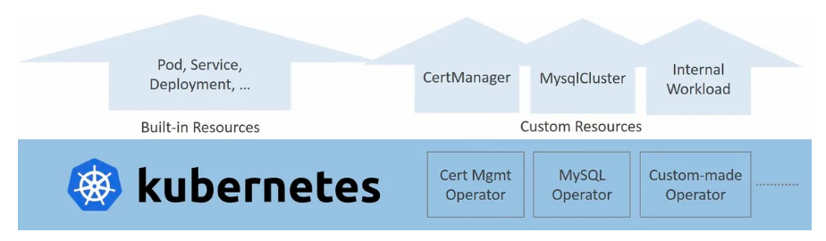
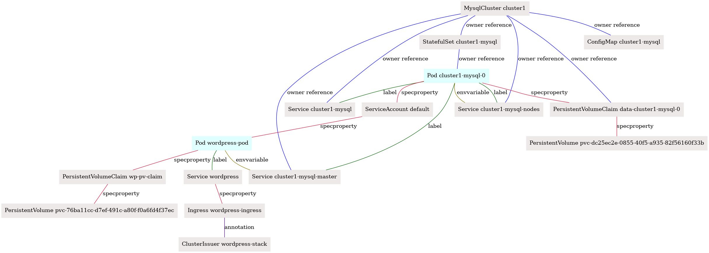
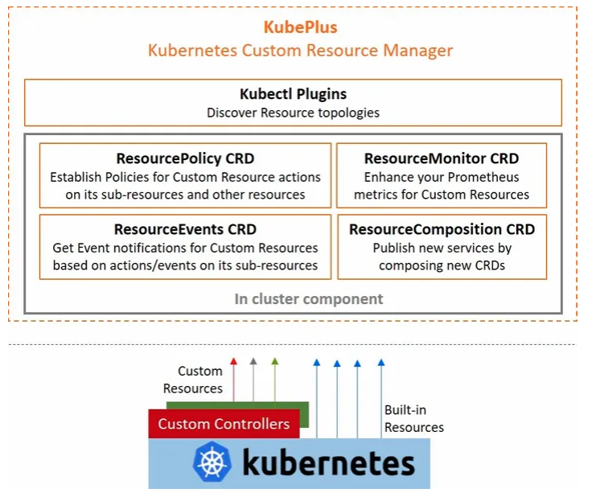
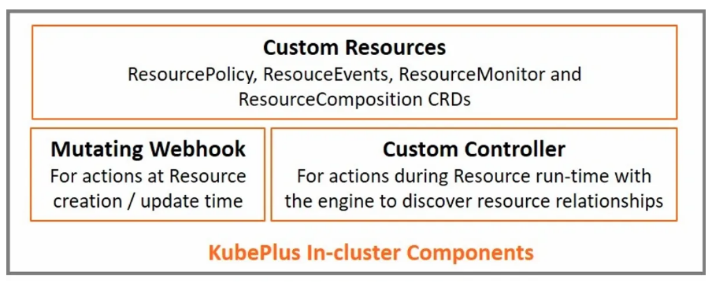

## KubePlus - Kubernetes Custom Resource Manager

Enterprises are building Kubernetes platforms by extending Kubernetes APIs (Resources) with Custom Resources and Custom Controllers. 

<p align="center">

</p>

Platform teams are faced with following challenges while managing such environments: 
- Visibility: Inventory of resource relationships to visualize application stacks
- Monitoring: Application stack level monitoring and chargeback
- Control: Establish guardrails around Custom Resource usage

## What is KubePlus?

KubePlus is a Kubernetes Custom Resource Manager that enables:
- Discovering runtime relationships between Kubernetes resources (Custom and built-in)
- Monitoring Custom Resource usage and exposing that as Prometheus metrics
- Setting and enforcing policies for Custom Resource usage
- Receiving notifications for interesting events involving Custom Resources
- Composing new Custom Resources to add new services to a cluster


## Core of KubePlus - Resource Relationship graphs

Operators add Custom Resources (e.g. Mysqlcluster) to the cluster. These resources become first class components of that cluster alongside built-in resources (e.g. Pod, Service, etc.). Application stacks are realized by establishing relationships between the Kubernetes Resources (built-in or Custom) available on the cluster. These relationships are primarily of four types.
 
(1) Owner references – A resource internally creates additional resources (e.g. MysqlCluster when instantiated, creates Pods and  Services). These sub-resources are related to the parent resource through Owner reference relationship.

(2) Labels and (3) Annotations – Labels or Annotations are key/value pairs that are attached to Kubernetes resources. Resource A can depend on a specific label or an annotation to be given on Resource B to take some action.

(4) Spec Properties – Resource A’s Spec property may depend on a value coming from Resource B.

Here is an example application stack for Wordpress (all resources not shown).

<p align="center">

</p>

KubePlus is able to construct Kubernetes Resource relationship graphs for such stacks at runtime. Here is the output of using KubePlus connections plugin to discover the complete topology for above stack:

```
$ kubectl connections MysqlCluster cluster1 namespace1 -o png
```

<p align="center">

</p>


## KubePlus Components

KubePlus consists of client-side kubectl plugins and in-cluster components.
These can be used independently.

<p align="center">

</p>

<!---
<p align="center">

</p>
--->
 
### Client-side components

KubePlus kubectl plugins enable users to discover, monitor and troubleshoot Custom Resources and their relationships. The plugins run entirely client-side and do not require the in-cluster component. Here is the list of KubePlus kubectl plugins. 

<!---
**1. kubectl composition**

- ``kubectl composition``: Provides information about sub resources created for a Kubernetes resource instance (custom or built-in). Essentially, 'kubectl composition' shows ownerReference based relationships.
-->

**1. kubectl connections**

- ``kubectl connections``: Provides information about relationships of a Kubernetes resource instance (custom or built-in) with other resources (custom or built-in) via owner references, labels, annotations, and spec properties.

**2. kubectl metrics**

- ``kubectl metrics cr``: Provides metrics for a Custom Resource instance (count of sub-resources, pods, containers, nodes, total CPU and total Memory consumption).
- ``kubectl metrics service``: Provides CPU/Memory metrics for all the Pods that are descendants of a Service instance. 
- ``kubectl metrics account``: Provides metrics for an account identity - user / service account. (counts of custom resources, built-in workload objects, pods, total CPU and Memory). Needs cluster-side component.
- ``kubectl metrics helmrelease``: Provides CPU/Memory metrics for all the Pods that are part of a Helm release.

**3. kubectl grouplogs**

- ``kubectl grouplogs cr``: Provides logs for all the containers of a Custom Resource instance.
- ``kubectl grouplogs service``: Provides logs for all the containers of all the Pods that are related to a Service object.
- ``kubectl grouplogs helmrelease`` (upcoming): Provides logs for all the containers of all the Pods that are part of a Helm release.

**4. kubectl man**

- ``kubectl man <Custom Resource> ``: Provides information about how to use a Custom Resource.


### In-cluster components

In-cluster components enable custom resource policy enforcement, custom resource event tracking, and composing and publishing new custom resources. Towards this, KubePlus comes with 4 CRDs to take inputs from the users to take specified actions on the Custom Resources - ResourcePolicy, ResourceMonitor, ResourceComposition, ResourceEvent

<!---
**ResourceComposition, ResourcePolicy**

KubePlus enables publishing new Services in a cluster. Cluster Admins use KubePlus to govern their cluster usage by defining and registering opinionated Services with appropriate guard rails. The new Services are registered as new Custom Resources. Application development teams consume the Services by creating instances of these Custom Resources. Cluster Admins can also define and enforce policies on Custom Resources. --->

Checkout following examples:
- [ResourcePolicy](https://github.com/cloud-ark/kubeplus/tree/master/examples/resource-policy)
- [ResourceMonitor](https://github.com/cloud-ark/kubeplus/tree/master/examples/resource-policy)
- [ResourceComposition](https://github.com/cloud-ark/kubeplus/tree/master/examples/resource-composition)


## CRD annotations

In order to capture the Operator developer's assumptions about Custom Resources supported by the Operator, KubePlus offers following CRD annotations:

```
resource/usage
resource/composition
resource/annotation-relationship
resource/label-relationship
resource/specproperty-relationship
```

Kubernetes Operator developers or cluster administrators can add these annotations to the CRDs. [Here](https://github.com/cloud-ark/kubeplus/blob/master/Operator-annotations.md) are some sample CRD annotations for community Operators that can be used to unlock KubePlus tooling for them. The `composition` annotation is optional. If it is not specified, KubePlus uses following Kinds as default when discovering the owner relationship for that Custom Resource instances (`Deployment, StatefulSet, DaemonSet, ReplicationController, Service, Secret, PodDisruptionBudget, ServiceAccount, PersistentVolumeClaim`).


KubePlus leverages knowledge of relationships between Kubernetes built-in resources and combines that with the CRD annotations mentioned above and builds runtime Kubernetes resource topologies.


## Example

In this example we have two Custom Resources - ClusterIssuer and MysqlCluster. Their CRDs are annotated with following CRD annotations. 

CRD annotation on the ClusterIssuer Custom Resource:

```
resource/annotation-relationship: on:Ingress, key:cert-manager.io/cluster-issuer, value:INSTANCE.metadata.name
```

This defines that CertManager looks for cert-manager.io/cluster-issuer annotation on Ingress resources. The value of this annotation is the name of the ClusterIssuer instance.

CRD annotation on the MysqlCluster Custom Resource:

```
resource/composition: StatefulSet, Service, ConfigMap, Secret, PodDisruptionBudget
```

This identifies the set of resources that will be created by the Operator as part of instantiating the MysqlCluster Custom Resource instance.

Once these annotations are added to the respective CRDs by the cluster administrator, the resource topology can be discovered by DevOps teams using ``kubectl connections`` plugin (output above)

Note: When using KubePlus connections plugins, use the kind name as registered with the cluster (e.g.: Deployment) and not their short form (e.g.: deployment) or plural (e.g.: deployments).


<!---
``` 
$ kubectl connections Service wordpress namespace1

::Final connections graph::
------ Branch 1 ------
Level:0 Service/wordpress
Level:1 Pod/wordpress-pod [related to Service/wordpress by:label]
Level:2 Service/cluster1-mysql-master [related to Pod/wordpress-pod by:envvariable]
Level:3 Pod/cluster1-mysql-0 [related to Service/cluster1-mysql-master by:label]
Level:4 Service/cluster1-mysql-nodes [related to Pod/cluster1-mysql-0 by:envvariable]
Level:4 Service/cluster1-mysql [related to Pod/cluster1-mysql-0 by:label]
Level:4 Service/cluster1-mysql-nodes [related to Pod/cluster1-mysql-0 by:label]
Level:5 MysqlCluster/cluster1 [related to Service/cluster1-mysql-nodes by:owner reference]
Level:6 Service/cluster1-mysql [related to MysqlCluster/cluster1 by:owner reference]
Level:6 Service/cluster1-mysql-master [related to MysqlCluster/cluster1 by:owner reference]
Level:6 ConfigMap/cluster1-mysql [related to MysqlCluster/cluster1 by:owner reference]
Level:6 StatefulSet/cluster1-mysql [related to MysqlCluster/cluster1 by:owner reference]
Level:7 Pod/cluster1-mysql-0 [related to StatefulSet/cluster1-mysql by:owner reference]
------ Branch 2 ------
Level:0 Service/wordpress
Level:1 Ingress/wordpress-ingress [related to Service/wordpress by:specproperty]
Level:2 ClusterIssuer/wordpress-stack [related to Ingress/wordpress-ingress by:annotation]
```
--->

The resource consumption of above resource topology can be obtained using ``kubectl metrics`` plugin as follows:

```
$ kubectl metrics service wordpress namespace1
---------------------------------------------------------- 
Kubernetes Resources consumed:
    Number of Pods: 2
    Number of Containers: 7
    Number of Nodes: 1
Underlying Physical Resoures consumed:
    Total CPU(cores): 25m
    Total MEMORY(bytes): 307Mi
    Total Storage(bytes): 21Gi
---------------------------------------------------------- 
```

[Try above example](https://github.com/cloud-ark/kubeplus/blob/master/examples/wordpress-mysqlcluster/steps.txt) in your cluster.

Read [this article](https://medium.com/@cloudark/kubernetes-resource-relationship-graphs-for-application-level-insights-70139e19fb0) to understand more about why tracking resource relationships is useful in Kubernetes.


## Try it:

- KubePlus kubectl commands:

```
   $ wget https://github.com/cloud-ark/kubeplus/raw/master/kubeplus-kubectl-plugins.tar.gz
   $ gunzip kubeplus-kubectl-plugins.tar.gz
   $ tar -xvf kubeplus-kubectl-plugins.tar
   $ export KUBEPLUS_HOME=`pwd`
   $ export PATH=$KUBEPLUS_HOME/plugins/:$PATH
   $ kubectl kubeplus commands
```

- To obtain metrics, enable Kubernetes Metrics API Server on your cluster.
  - Hosted Kubernetes solutions like GKE has this already installed.

  - Check out [examples](./examples/).

## Platform-as-Code

KubePlus is developed as a part of CloudARK's [Platform-as-Code practice](https://cloudark.io/platform-as-code). Kubernetes Operators enable extending Kubernetes for application specific workflows. They add Custom Resources and offer foundation for creating application stacks as Code declaratively. Our Platform-as-Code practice offers tools and techniques enabling DevOps teams to build custom PaaSes using Kubernetes Operators.

## Operator Maturity Model

As DevOps team build their custom PaaSes using community or in house developed Operators, they need a set of guidelines for Operator development and evaluation. We have developed [Operator Maturity Model](https://github.com/cloud-ark/kubeplus/blob/master/Guidelines.md) focusing on Operator usage in multi-tenant and multi-Operator environments. Operator developers are using this model today to ensure that their Operator is a good citizen of the multi-Operator world and ready to serve multi-tenant workloads. It is also being used by Kubernetes cluster administrators today for curating community Operators towards building their custom PaaSes.


## Contact

Submit issues on this repository or reach out to our team on [Slack](https://join.slack.com/t/cloudark/shared_invite/zt-2yp5o32u-sOq4ub21TvO_kYgY9ZfFfw).


## Status

Actively under development

