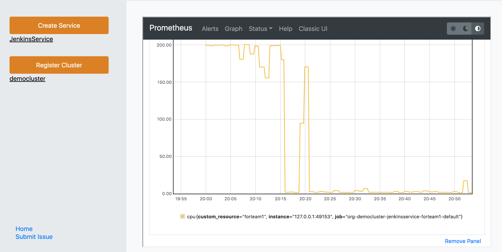

## KubePlus - Kubernetes SaaS Operator to deliver Helm charts as-a-service

KubePlus is a turn-key solution to transform any containerized application into a SaaS. It takes an application Helm chart and delivers it as-a-service by automating multi-tenancy management and day2 operations such as monitoring, troubleshooting and application upgrades. KubePlus consists of a CRD that enables creating new Kubernetes APIs (CRDs) to realize such services. The new CRDs enable creation of a Helm release per tenant with tenant level isolation, monitoring and consumption tracking.

<p align="center">

</p>

KubePlus offers following benefits towards deploying a Kubernetes-native application (Helm chart) in SaaS form:
- Seamless support for [Namespace-based multi-tenancy](https://kubernetes.io/docs/concepts/security/multi-tenancy/) where each application instance (Helm release) is created in a separate namespace.
- Application-specific provider and consumer APIs for role based access to the clusters.
- Troubleshooting and governance of application instances.
- Tracking consumption metrics (cpu, memory, storage and network) at Helm release level in Prometheus. Application providers can use these metrics to define consumption-based chargeback models.

<p align="center">

</p>


## Overview

The typical requirements in a service-based delivery model of Kubernetes applications are as follows:
- From cluster admin's perspective it is important to isolate different application instances from one another on the cluster.
- Application consumers need a self-service model to provision application instances.
- Application providers need to be able to troubleshoot application instances, monitor them, track their resource consumption, possibly remotely.

KubePlus achieves these goals as follows. KubePlus defines a ```provider API``` to create application-specific ```consumer APIs```.
The ```provider API``` is a KubePlus CRD (Custom Resource Definition) named ``ResourceComposition`` that enables registering an application Helm chart in the cluster by defining a new Kubernetes API (CRD) representing the chart. The new CRD is essentially the ```consumer API``` which the application consumers use to instantiate the registered Helm chart in a self-service manner. Through ``ResourceComposition``application providers can define application-level policies, which KubePlus applies when instantiating the registered chart as part of handling the consumer APIs.


<p align="center">

</p>

KubePlus offers following functions to application providers:
- Create: Create a Kubernetes-native API to represent an application packaged as a Helm chart.
- Govern: Define policies for isolation and resource utilization per application instance.
- Monitor: Track application-specific consumption metrics for cpu, memory, storage, network.
- Troubleshoot: Gain application-level insights through fine-grained Kubernetes resource relationship graphs.


## Use-cases

KubePlus supports two use-cases - multi-customer SaaS and managed application delivery.
The multi-customer SaaS use-case involves an application provider/DevOps team creating a separate instance of an application in a separate namespace. The multi-customer SaaS use-case has been identified in the Kubernetes documentation as one of the [primary use-cases of Kubernetes multi-tenancy](https://kubernetes.io/docs/concepts/security/multi-tenancy/).
The managed application delivery use-case involves an application provider delivering their application on other team's cluster.

From KubePlus setup perspective, the primary difference between the two use-cases is the permissions that are granted to the KubePlus Operator. For the multi-instance SaaS use-case, the KubePlus Operator needs permissions to create namespaces and deploy applications within them. For managed application delivery use-case, our design does not provide the namespace creation permissions to the KubePlus Operator.

Configuring KubePlus for the above use-cases is simple. In our design, if KubePlus Operator is installed in the default namespace, then it gets namespace create permissions, otherwise it does not. So for multi-instance SaaS use-case, install KubePlus in the default namespace. For managed application delivery use-case, install it in any other namespace. You can experiment with the two use-cases by following the example steps [here](./examples/multitenancy/hello-world/saas-and-managed-app-testing.md)


## Example

To understand the working of KubePlus, let us see how a Wordpress provider can offer a multi-tenant Wordpress service using KubePlus (Wordpress SaaS).


### Cluster admin actions

*1. Install KubePlus*

Cluster administrator installs KubePlus on their cluster.

```
$ KUBEPLUS_NS=default
$ helm install kubeplus "https://github.com/cloud-ark/operatorcharts/blob/master/kubeplus-chart-3.0.0.tgz?raw=true" -n $KUBEPLUS_NS
```

*2. Retrieve Provider kubeconfig file*

KubePlus creates provider and consumer kubeconfig files with appropriately scoped
RBAC policies. Cluster admin needs to distribute them to application providers and consumers. The provider kubeconfig file has permissions to register application helm charts under consumer APIs in the cluster. The consumer kubeconfig file has permissions to perform CRUD operations on the registered consumer APIs.

```
$ kubectl get configmaps kubeplus-saas-provider-kubeconfig -n $KUBEPLUS_NS -o jsonpath="{.data.kubeplus-saas-provider\.json}" > provider.conf
```

### Provider actions

*1. Create consumer API*

The provider team defines the consumer API named ```WordpressService``` using the ```ResourceComposition``` CRD (the provider API). The Wordpress Helm chart that underlies this service is created by the provider team. The spec properties of the ```WordpressService Custom Resource``` are the attributes defined in the Wordpress Helm chart's values.yaml.

```
$ kubectl create -f wordpress-service-composition.yaml --kubeconfig=provider.conf
```

As part of registering the consumer API, the provider team can define policies such as the cpu and memory that should be allocated to each Wordpress stack, or the specific worker node on which to deploy a Wordpress stack, etc. KubePlus will apply these policies to the Helm releases when instantiating the underlying Helm chart.

<p align="center">

</p> 

[Here](https://raw.githubusercontent.com/cloud-ark/kubeplus/master/examples/multitenancy/wordpress-mysqlcluster-stack/wordpress-service-composition.yaml) is the ResourceComposition definition for the WordpressService.


*2. Create application instance*

The provider uses WordpressService Custom Resource (the consumer API) to provision an instance of Wordpress stack. The instances can be created using ``kubectl`` or through a web portal.  Here is consumer portal for WordpressService showing the created ```tenant1``` instance.

<p align="center">

</p>

```
$ kubectl create -f <wordpress-service>.yaml --kubeconfig=provider.conf
                        or
$ wget https://raw.githubusercontent.com/cloud-ark/kubeplus/master/deploy/open-consumer-ui.sh
$ chmod +x open-consumer-ui.sh
$ ./open-consumer-ui.sh provider.conf
```

*3. Troubleshoot and monitor application instances*.

Once a WordpressService instance has been created, the provider can
monitor and troubleshoot it using the various kubectl plugins that KubePlus provides.

With the ``kubectl connections`` plugin provider can check whether all Kubernetes resources have been created as expected. The graphical output makes it easy to check the connectivity between different resources.

```
kubectl connections WordpressService tenant1 default -k provider.conf -o png -i Namespace:default,ServiceAccount:default -n label,specproperty,envvariable,annotation 
```
<p align="center">

</p>

Using ```kubectl metrics``` plugin, provider can check cpu, memory, storage, network ingress/egress for a WordpressService instance. The metrics output is available in pretty, json and Prometheus formats.

```
kubectl metrics WordpressService tenant1 default -o pretty -k provider.conf 
```

<p align="center">

</p>

```kubectl applogs``` enables retrieving WordpressService instance logs and ```kubectl appurl``` enables retrieving the instance's url.


## Demo

In order to enable application providers manage and deliver their applications using KubePlus, we have developed a control center with embedded Prometheus that enables managing their application SaaS across multiple Kubernetes clusters.
See the control center in action [here](https://youtu.be/aIVnC4GKIV4).

To try out the control center, download and install it from [here](https://cloudark.io/download). Then follow the steps in the README.md therein.


## Components

The KubePlus Operator consists of a custom controller, a mutating webhook, a helmer module, and a consumer ui module. 

<p align="center">

</p>

The custom controller handles the ```ResourceComposition``` CRD. This CRD is used to:
- Define new CRDs representing application Helm charts (the consumer APIs).
- Define policies (e.g. cpu/memory limits, node selection, etc.) at application Helm chart level.

The mutating webook and helmer modules support the custom controller in delivering the KubePlus experience. Consumer UI is service specific and can be used to create service instances by consumers. It is accessible through proxy.

KubePlus kubectl plugins are installed outside the cluster. They enable discovering, monitoring and troubleshooting of application instances. The plugins track resource relationships through owner references, labels, annotations, and spec properties. These relationships enable providers to get aggregated consumption metrics for cpu, memory, storage, network, and logs at Helm release level.

More details about these components are available [here](https://cloud-ark.github.io/kubeplus/docs/html/html/kubeplus-components.html).

## Try

- Create a minikube cluster with a specific version like so:
```
    $ minikube start --kubernetes-version=v1.24.3
```

- Install KubePlus Operator.

Choose the default namespace if configuring for the multi-customer SaaS use-case.
For managed application delivery, choose any other namespace.

```
   $ KUBEPLUS_NS=default
   $ helm install kubeplus "https://github.com/cloud-ark/operatorcharts/blob/master/kubeplus-chart-3.0.0.tgz?raw=true" -n $KUBEPLUS_NS
```

- Install KubePlus kubectl plugins

KubePlus kubectl plugins enable discovery, monitoring and troubleshooting of Kubernetes applications.

```
   $ wget https://github.com/cloud-ark/kubeplus/raw/master/kubeplus-kubectl-plugins.tar.gz
   $ gunzip kubeplus-kubectl-plugins.tar.gz
   $ tar -xvf kubeplus-kubectl-plugins.tar
   $ export KUBEPLUS_HOME=`pwd`
   $ export PATH=$KUBEPLUS_HOME/plugins/:$PATH
   $ kubectl kubeplus commands
```

- Try following examples:
  - [Hello World service](./examples/multitenancy/hello-world/saas-and-managed-app-testing.md)
  - [Wordpress service](./examples/multitenancy/wordpressl/steps.txt)
  - [Jenkins service](./examples/jenkins/non-operator/steps.txt)

- Debug:
  ```
  - kubectl logs <kubeplus-pod> $KUBEPLUS_NS -c crd-hook
  - kubectl logs <kubeplus-pod> $KUBEPLUS_NS -c helmer
  - kubectl logs <kubeplus-pod> $KUBEPLUS_NS -c platform-operator
  - kubectl logs <kubeplus-pod> $KUBEPLUS_NS -c webhook-cert-setup
  - kubectl logs <kubeplus-pod> $KUBEPLUS_NS -c consumerui
  ```

- Cleanup:
  ```
  - helm delete kubeplus -n $KUBEPLUS_NS
  ```

## CNCF Landscape

KubePlus is part of CNCF landscape's [Application Definition section](https://landscape.cncf.io/card-mode?category=application-definition-image-build&grouping=category).


## Operator Maturity Model

As enterprise teams build their custom Kubernetes platforms using community or in house developed Operators, they need a set of guidelines for Operator readiness in multi-Operator and multi-tenant environments. We have developed the [Operator Maturity Model](https://github.com/cloud-ark/kubeplus/blob/master/Guidelines.md) for this purpose. Operator developers are using this model today to ensure that their Operator is a good citizen of the multi-Operator world and ready to serve multi-tenant workloads. It is also being used by Kubernetes cluster administrators for curating community Operators towards building their custom platforms.


## Presentations

1. [DevOps.com Webinar: Deliver your Kubernetes Applications as-a-Service](https://webinars.devops.com/deliver-your-kubernetes-applications-as-a-service)

2. [Being a good citizen of the Multi-Operator world, Kubecon NA 2020](https://www.youtube.com/watch?v=NEGs0GMJbCw&t=2s)

3. [Operators and Helm: It takes two to Tango, Helm Summit 2019](https://youtu.be/F_Dgz1V5Q2g)

4. [KubePlus presentation at community meetings (CNCF sig-app-delivery, Kubernetes sig-apps, Helm)](https://github.com/cloud-ark/kubeplus/blob/master/KubePlus-presentation.pdf)


## Contact

For support and new features [reach out to us](https://cloudark.io/kubeplus-saas-manager) or contact our team on [Slack](https://join.slack.com/t/cloudark/shared_invite/zt-2yp5o32u-sOq4ub21TvO_kYgY9ZfFfw).
