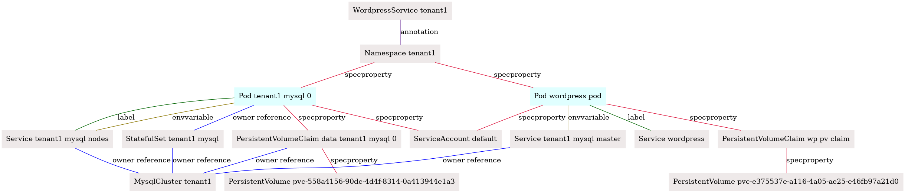
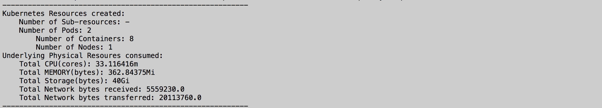
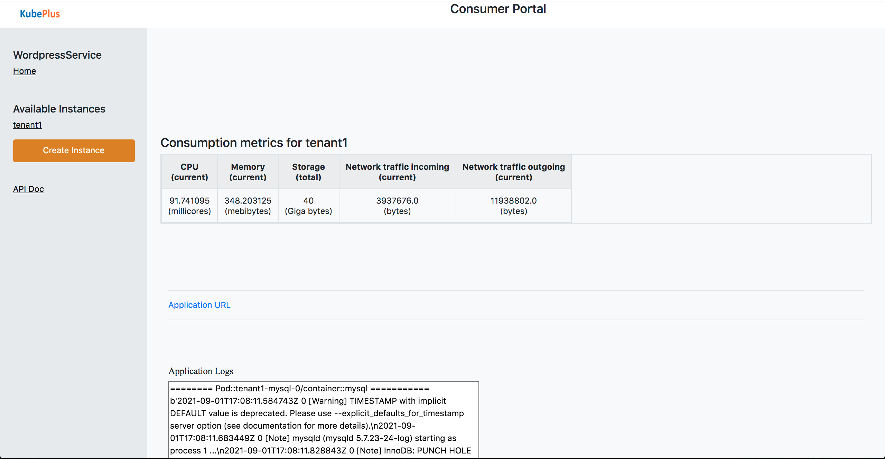

## KubePlus - Kubernetes SaaS Operator to deliver Helm charts as-a-service

As enterprise adoption of Kubernetes is growing, multiple teams collaborate on a Kubernetes cluster to realize the broader organizational goals. Typically, there is one team that is offering a service that the other team is looking to consume. It can be an ISV offering a service for their data & analytics software that their customer is looking to consume, or it can be a platform team offering a service for an internal application that the product team is planning to use (e.g secret management, data processing, etc.). Such teams can be thought of as providers and consumers in the context of delivering and consuming software on Kubernetes.

KubePlus is a turn-key solution that enables provider teams to deliver any application packaged as a Helm chart as-a-service to its consumers. It does this by abstracting the application Helm chart under provider and consumer APIs.

KubePlus offers following benefits towards deploying a Kubernetes-native application (Helm chart) in SaaS form:
- Application-specific provider and consumer APIs for role based access to the clusters.
- Seamless support for Namespace-based multi-tenancy where each application instance (Helm release) is created in a separate namespace.
- Monitoring and governance of application instances.
- Tracking consumption metrics (cpu, memory, storage and network) at Helm release level. Application providers can use these metrics to define consumption-based chargeback models.

<p align="center">

</p>


## Overview

The typical requirements in a service-based delivery model of Kubernetes applications are as follows:
- From cluster admin's perspective it is important to isolate different application instances from one another on the cluster.
- Application consumers need a self-service model to provision application instances.
- Application providers need to be able to troubleshoot and monitor deployed instances of the application.
- Application providers should also be able to track consumption metrics for application instances provisioned on the cluster.

KubePlus achieves these goals as follows. KubePlus defines a ```provider API``` to create application-specific ```consumer APIs```.
The ```provider API``` is a KubePlus CRD (Custom Resource Definition) named ``ResourceComposition`` that enables registering an application Helm chart in the cluster by defining a new Kubernetes API (CRD) representing the chart. As part of this, application providers can define application-level policies which KubePlus applies to every instance of the registered chart. The new CRD is essentially the ```consumer API``` which the application consumers use to instantiate the registered Helm chart in a self-service manner.

<p align="center">

</p>

KubePlus offers following functions:
- Create: Create a Kubernetes-native API to represent an application packaged as a Helm chart.
- Govern: Tenant level policies for isolation and resource utilization per application instance.
- Monitor: Tenant level consumption metrics for cpu, memory, storage, network.
- Troubleshoot: Application-level insights through fine-grained Kubernetes resource relationship graphs.


## Example

To understand the working of KubePlus, let us see how a Wordpress provider can offer multi-tenant Wordpress service.


### Cluster admin actions

*1. Install KubePlus*

Cluster administrator installs KubePlus on their cluster.

```
$ KUBEPLUS_NS=default
$ helm install kubeplus "https://github.com/cloud-ark/operatorcharts/blob/master/kubeplus-chart-2.0.5.tgz?raw=true" -n $KUBEPLUS_NS
```

*2. Retrieve Provider kubeconfig file*

KubePlus creates kubeconfig file for the provider which is generated by KubePlus. It has appropriate RBAC policies that enable a provider to register application helm charts under consumer APIs. Cluster admin needs to distribute this kubeconfig file to the provider. 

```
$ kubectl retrieve kubeconfig provider $KUBEPLUS_NS > provider.conf
```

### Provider actions

*1. Create consumer API*

The provider team defines the consumer API named ```WordpressService``` using the ```ResourceComposition``` CRD (the provider API). The Wordpress Helm chart that underlies this service is created by the provider team. The spec properties of the ```WordpressService Custom Resource``` are the attributes defined in the Wordpress Helm chart's values.yaml.

As part of creating the consumer API, the provider team can define policies such as the cpu and memory that should be allocated to each Wordpress stack; specific worker nodes on which to deploy the Wordpress stacks, etc. KubePlus will apply these policies to the Helm releases when instantiating the underlying Helm chart.

<p align="center">

</p> 

[Here](https://raw.githubusercontent.com/cloud-ark/kubeplus/master/examples/multitenancy/wordpress-mysqlcluster-stack/wordpress-service-composition.yaml) is the ResourceComposition definition for the WordpressService.

*2. Grant permission to the consumer to create instances of WordpressService*

Before consumers can instantiate WordpressService resources, the provider needs to grant permission to the consumer for that resource. The provider's kubeconfig needs to be provided as input to the ``kubectl grantpermission`` command.

```
kubectl grantpermission consumer wordpressservices provider.conf $KUBEPLUS_NS
```

*3. Provider team uses kubeplus kubectl plugins to troubleshoot and monitor WordpressService instances*. 

With the ``kubectl connections`` plugin provider can check whether all Kubernetes resources have been created as expected. The graphical output makes it easy to check the connectivity between different resources.

```
kubectl connections WordpressService tenant1 default -k provider.conf -o png -i Namespace:default,ServiceAccount:default -n label,specproperty,envvariable,annotation 
```
<p align="center">

</p>

Using ```kubectl metrics``` plugin provider can check cpu, memory, storage, network ingress/egress for a WordpressService instance.
The metrics output is available in pretty, json and prometheus formats.

```
kubectl metrics WordpressService tenant1 default -o pretty -k provider.conf 
```

<p align="center">

</p>

### Consumer action

The consumer uses WordpressService Custom Resource (the consumer API) to provision an instance of Wordpress stack. KubePlus includes a web portal through which the service instances can be created. The portal runs on the cluster and is accessible through local proxy. Here is consumer portal for WordpressService showing the created ```tenant1``` instance.

<p align="center">

</p>


Our [KubePlus SaaS Manager product](https://cloudark.io/kubeplus-saas-manager) offers enterprise-ready control center with embedded Prometheus integration for providers to manage their SaaS across multiple Kubernetes clusters.


## Components

KubePlus consists of an Operator and kubectl plugins.

### 1. KubePlus Operator

The KubePlus Operator consists of a custom controller, a mutating webhook and the helmer module. Here is a brief summary of these components. Details about them are available [here](https://cloud-ark.github.io/kubeplus/docs/html/html/kubeplus-components.html).

<p align="center">

</p>

The custom controller handles KubePlus CRDs. The primary CRD is ```ResourceComposition```. It is used to:
- Define new CRDs (consumer APIs) wrapping Helm charts.
- Define policies (e.g. cpu/memory limits, node selection, etc.) for managing resources of the service instances.

The mutating webook and helmer modules support the custom controller in delivering the KubePlus experience.


### 2. KubePlus kubectl plugins

KubePlus kubectl plugins enable providers to discover, monitor and troubleshoot application instances. The primary plugin is: ```kubectl connections```. It tracks resource relationships through owner references, labels, annotations, and spec properties. These relationships enable providers to gain fine grained visibility into running application instances  through resource relationship graphs. Additional plugins offer the ability to get aggregated consumption metrics (for cpu, memory, storage, network) and logs at the application instance level.


## Try

- Install KubePlus Operator. (Note that you will need Helm v3).

```
   $ KUBEPLUS_NS=default (or any namespace in which you want to install KubePlus)
   $ helm install kubeplus "https://github.com/cloud-ark/operatorcharts/blob/master/kubeplus-chart-2.0.2.tgz?raw=true" -n $KUBEPLUS_NS
```

- Install KubePlus kubectl plugins.

```
   $ wget https://github.com/cloud-ark/kubeplus/raw/master/kubeplus-kubectl-plugins.tar.gz
   $ gunzip kubeplus-kubectl-plugins.tar.gz
   $ tar -xvf kubeplus-kubectl-plugins.tar
   $ export KUBEPLUS_HOME=`pwd`
   $ export PATH=$KUBEPLUS_HOME/plugins/:$PATH
   $ kubectl kubeplus commands
```

Try the `kubectl connections` plugin. It can be used with any Kubernetes resource (built-in resources like Pod, Deployment, or custom resources like MysqlCluster).

- Try following examples:
  - [Hello World service](./examples/multitenancy/hello-world/steps.txt)
  - [Wordpress service](./examples/multitenancy/wordpress-mysqlcluster-stack/steps.txt)
  - [Mysql service](./examples/multitenancy/stacks/steps.txt)
  - [MongoDB service](./examples/multitenancy/mongodb-as-a-service/steps.md)
  - [Multiple teams](./examples/multitenancy/team/steps.txt) with applications deployed later

- Debug:
  ```
  - kubectl logs kubeplus $KUBEPLUS_NS -c crd-hook
  - kubectl logs kubeplus $KUBEPLUS_NS -c helmer
  - kubectl logs kubeplus $KUBEPLUS_NS -c platform-operator
  - kubectl logs kubeplus $KUBEPLUS_NS -c webhook-cert-setup
  - kubectl logs kubeplus $KUBEPLUS_NS -c consumerui
  ```

- Cleanup:
  ```
  - helm delete kubeplus -n $KUBEPLUS_NS
  - wget https://github.com/cloud-ark/kubeplus/raw/master/deploy/delete-kubeplus-components.sh
  - ./delete-kubeplus-components.sh
  ```

## CNCF Landscape

KubePlus is part of CNCF landscape's [Application Definition section](https://landscape.cncf.io/card-mode?category=application-definition-image-build&grouping=category).


## Operator Maturity Model

As enterprise teams build their custom platforms using community or in house developed Operators, they need a set of guidelines for Operator readiness in multi-Operator and multi-tenant environments. We have developed the [Operator Maturity Model](https://github.com/cloud-ark/kubeplus/blob/master/Guidelines.md) for this purpose. Operator developers are using this model today to ensure that their Operator is a good citizen of the multi-Operator world and ready to serve multi-tenant workloads. It is also being used by Kubernetes cluster administrators for curating community Operators towards building their custom platforms.


## Presentations

1. [Being a good citizen of the Multi-Operator world, Kubecon NA 2020](https://www.youtube.com/watch?v=NEGs0GMJbCw&t=2s)

2. [Operators and Helm: It takes two to Tango, Helm Summit 2019](https://youtu.be/F_Dgz1V5Q2g)

3. [KubePlus presentation at community meetings (CNCF sig-app-delivery, Kubernetes sig-apps, Helm)](https://github.com/cloud-ark/kubeplus/blob/master/KubePlus-presentation.pdf)


## Contact

Submit issues on this repository or reach out to our team on [Slack](https://join.slack.com/t/cloudark/shared_invite/zt-2yp5o32u-sOq4ub21TvO_kYgY9ZfFfw).
