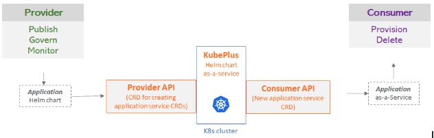
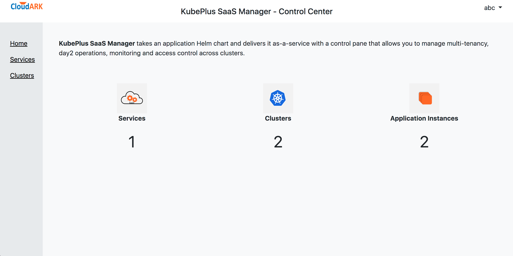
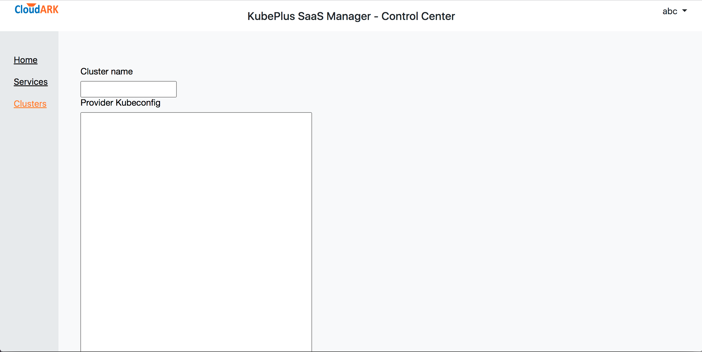
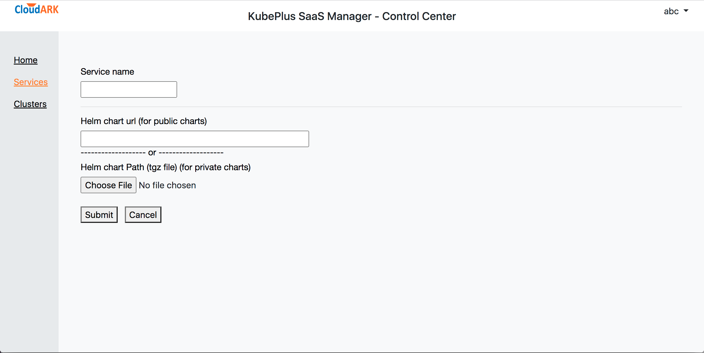
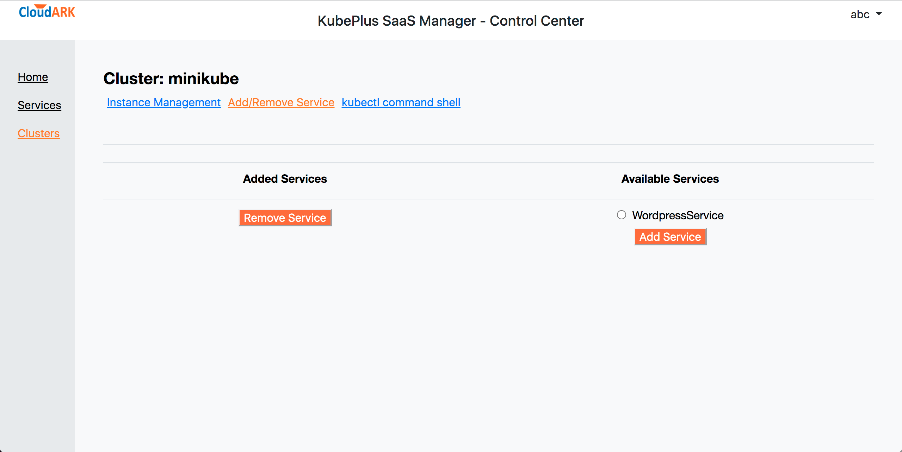
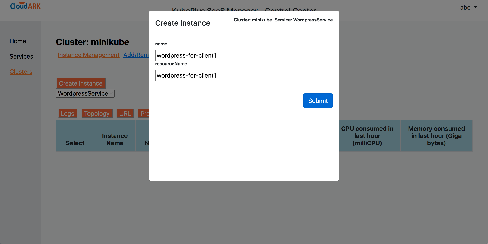
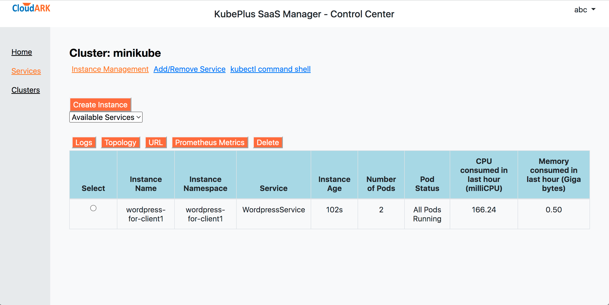
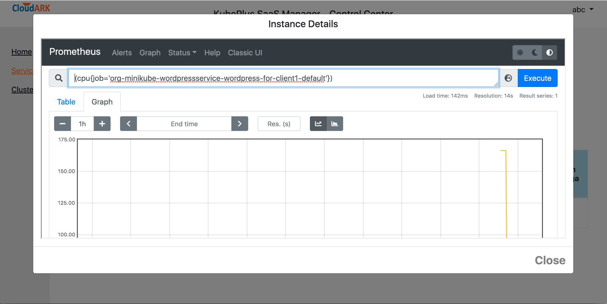
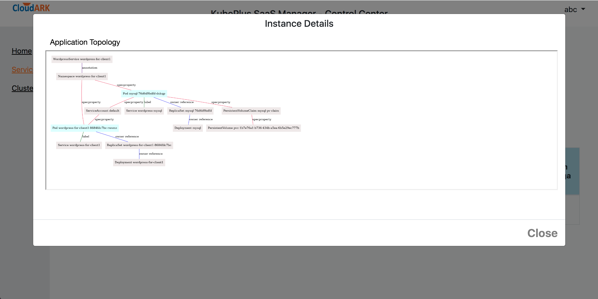
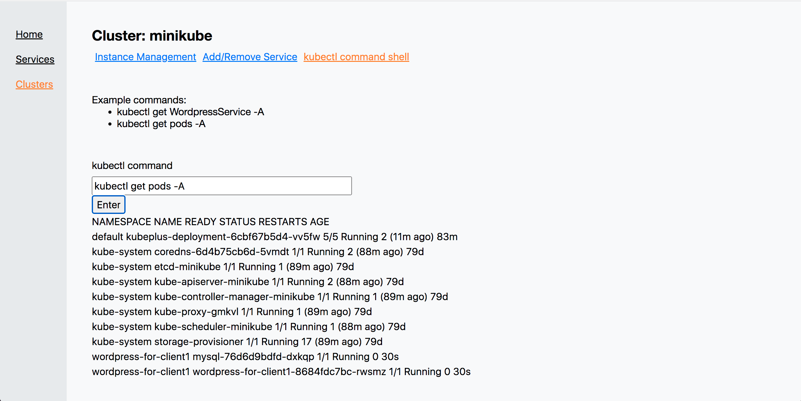

## KubePlus - Kubernetes Operator to create Multi-instance SaaS from Helm charts

KubePlus is a turn-key solution to transform any containerized application into a SaaS. It takes an application Helm chart and delivers it as-a-service by automating multi-tenancy management and day2 operations such as monitoring, troubleshooting and application upgrades. 

<p align="center">

</p>

KubePlus offers following benefits towards deploying a Kubernetes-native application (Helm chart) in SaaS form:
- Seamless support for [Namespace-based multi-tenancy](https://kubernetes.io/docs/concepts/security/multi-tenancy/) where each application instance (Helm release) is created in a separate namespace.
- Tracking consumption metrics (cpu, memory, storage and network) at Helm release level in Prometheus. Application providers can use these metrics to define consumption-based chargeback models.
- Application-specific provider and consumer APIs for role based access to the clusters.
- Troubleshooting and governance of application instances.


## Overview

The typical requirements in creating Kubernetes-based SaaS are as follows:
- Instantiate application instances in a self-service manner.
- Isolate different application instances from one another on the cluster.
- Easily govern, monitor, troubleshoot, and upgrade application instances. 

KubePlus achieves these goals as follows. KubePlus defines a Custom Resource (```provider API```) to create application-specific ```consumer APIs```.
The ```provider API``` is named ``ResourceComposition`` that enables registering an application Helm chart in the cluster by defining a new Kubernetes API (CRD) representing the chart. The new CRD is essentially the ```consumer API``` which the application consumers use to instantiate the registered Helm chart in a self-service manner. Through ``ResourceComposition``application providers can define application-level policies, which KubePlus applies when instantiating the registered chart as part of handling the consumer APIs.


<p align="center">

</p>


KubePlus comes with a control center to manage application SaaS across multiple Kubernetes clusters. The control center contains embedded Prometheus to track application resource consumption. You can host the control center yourself. For support, you can purchase our [subscription](https://cloudark.io/kubeplus-saas-manager). See the control center in action [here](https://youtu.be/ZVhTE6WSjVI).

## Try

- Create a minikube cluster with a specific version like so:
```
    $ minikube start --kubernetes-version=v1.24.3
```

- Install KubePlus Operator and retrieve provider kubeconfig
```
   $ KUBEPLUS_NS=default
   $ helm install kubeplus "https://github.com/cloud-ark/operatorcharts/blob/master/kubeplus-chart-3.0.1.tgz?raw=true" -n $KUBEPLUS_NS
   $ kubectl get configmaps kubeplus-saas-provider-kubeconfig -n $KUBEPLUS_NS -o jsonpath="{.data.kubeplus-saas-provider\.json}" > provider.conf
```

- Start the control center. For the first time you will be asked to setup user credentials.
```
Usage: ./kubeplus-control-center.sh <start|stop> <http|https> <domain_name> [<inet_ip>]
```
```
   $ ./kubeplus-control-center.sh start http localhost localhost
```

<p align="center">

</p>


- Register the cluster by adding the provider kubeconfig 

<p align="center">

</p>

- Register Wordpress Service

Use following helm chart:
```
https://github.com/cloud-ark/k8s-workshop/blob/master/wordpress-deployment-chart/wordpress-chart-0.0.3.tgz?raw=true
```

<p align="center">

</p>

- Add the service to the cluster

<p align="center">

</p>

- Create application instance

<p align="center">

</p>


- Check application resource consumption in the Prometheus

<p align="center">

</p>


<p align="center">

</p>


- Check application topology

<p align="center">

</p>


- Troubleshoot application resources 

<p align="center">

</p>

## Troubleshoot KubePlus

```
  - kubectl logs <kubeplus-pod> $KUBEPLUS_NS -c crd-hook
  - kubectl logs <kubeplus-pod> $KUBEPLUS_NS -c helmer
  - kubectl logs <kubeplus-pod> $KUBEPLUS_NS -c platform-operator
  - kubectl logs <kubeplus-pod> $KUBEPLUS_NS -c webhook-cert-setup
  - kubectl logs <kubeplus-pod> $KUBEPLUS_NS -c consumerui
```

- Cleanup:
  ```
  - helm delete kubeplus -n $KUBEPLUS_NS
  ```

## CNCF Landscape

KubePlus is part of CNCF landscape's [Application Definition section](https://landscape.cncf.io/card-mode?category=application-definition-image-build&grouping=category).


## Operator Maturity Model

As enterprise teams build their custom Kubernetes platforms using community or in house developed Operators, they need a set of guidelines for Operator readiness in multi-Operator and multi-tenant environments. We have developed the [Operator Maturity Model](https://github.com/cloud-ark/kubeplus/blob/master/Guidelines.md) for this purpose. Operator developers are using this model today to ensure that their Operator is a good citizen of the multi-Operator world and ready to serve multi-tenant workloads. It is also being used by Kubernetes cluster administrators for curating community Operators towards building their custom platforms.


## Presentations

1. [DevOps.com Webinar: Deliver your Kubernetes Applications as-a-Service](https://webinars.devops.com/deliver-your-kubernetes-applications-as-a-service)

2. [Being a good citizen of the Multi-Operator world, Kubecon NA 2020](https://www.youtube.com/watch?v=NEGs0GMJbCw&t=2s)

3. [Operators and Helm: It takes two to Tango, Helm Summit 2019](https://youtu.be/F_Dgz1V5Q2g)

4. [KubePlus presentation at community meetings (CNCF sig-app-delivery, Kubernetes sig-apps, Helm)](https://github.com/cloud-ark/kubeplus/blob/master/KubePlus-presentation.pdf)


## Contact

For support and new features [reach out to us](https://cloudark.io/kubeplus-saas-manager) or contact our team on [Slack](https://join.slack.com/t/cloudark/shared_invite/zt-2yp5o32u-sOq4ub21TvO_kYgY9ZfFfw).
