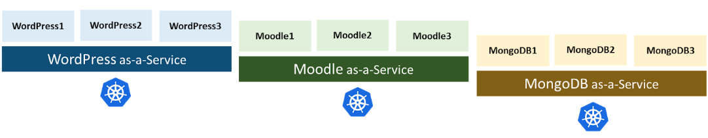
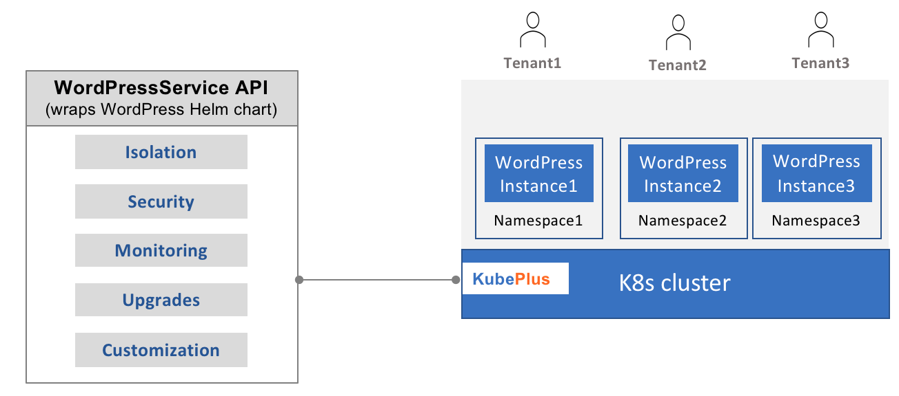
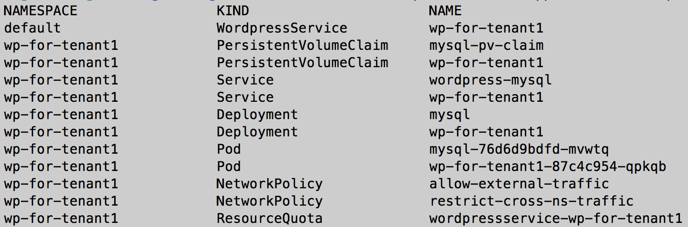
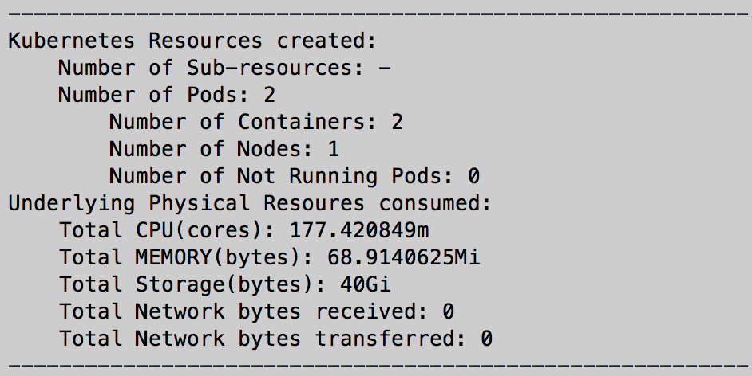

## KubePlus - Kubernetes Operator for Multi-Instance Multi-tenancy

KubePlus is a turn-key solution to transform any containerized application into a SaaS.

<p align="center">

</p>

Multi-instance multi-tenancy (MIMT) is a software architecture pattern in which a dedicated instance of an application is provided per tenant. The typical adopters of this pattern are platform engineering teams and B2B software vendors that need to host and manage multiple instances of a software application for different tenants and effectively deliver that application as a managed service.
KubePlus is a turn-key solution to build such managed services following the multi-instance multi-tenancy (MIMT) pattern on Kubernetes.
It comes with end to end automation to help you deploy and manage your MIMT application on Kubernetes. This includes isolation and security between instances along with easy to use APIs for managing upgrades, customization and resource utilization. 

KubePlus takes an application Helm chart and wraps it under a Kubernetes API (CRD). Whenever an application instance is created using this API, KubePlus ensures that every instance is created in a separate namespace and the required multi-tenancy policies are applied in order to ensure isolation between instances. The API also supports RBAC, version upgrades and additional customizations for each instance. 


<p align="center">

</p>


### Isolation

KubePlus takes an application Helm chart and wraps it in a Kubernetes API (CRD). Application providers use this API to provision application instances on a cluster. KubePlus isolates each application instance in a separate Namespace. It adds a safety perimeter around such Namespaces using Kubernetes Network Policies and non-shared persistent volumes ensuring that each application instance is appropriately isolated from other instances. Additionally, it provides controls for application providers to deploy different tenant application instances on different worker nodes for node isolation. 

### Security

The KubePlus Operator does not need any admin-level permissions on a cluster for application providers. This allows application providers to offer their managed services on any K8s clusters including those owned by their customers. KubePlus comes with a small utility that allows you to create provider specific kubeconfig on a cluster in order to enable application deployments and management. Providers have an ability to create a consumer specific further limited kubeconfig to allow for self service provisioning of application instances as well. 

### Resource utilization
KubePlus provides controls to set per-namespace resource quotas. It also monitors usage of CPU, memory, storage, and network traffic at the application instance level. The collected metrics are available in different formats and can be pulled into Prometheus for historical usage tracking.

### Upgrades
A new version of an application can be deployed by updating the application Helm chart under the existing Kubernetes CRD or registering the new chart under a new Kubernetes CRD. If the existing Kubernetes CRD object is updated, KubePlus will update all the running application instances (helm releases) to the new version of the application Helm chart.

### Customization
The spec properties of the Kubernetes CRD wrapping the application Helm chart are the fields defined in the chart’s values.yaml file. Application deployments can be customized by specifying different values for these spec properties.

## Demo

https://github.com/cloud-ark/kubeplus/assets/732525/efb255ff-fc73-446b-a583-4b89dbf61638


## Architecture

KubePlus architecture details are available [here](http://kubeplus-docs.s3-website-us-west-2.amazonaws.com/html/index.html).
KubePlus is a referenced solution for [multi-customer tenancy in Kubernetes](https://kubernetes.io/docs/concepts/security/multi-tenancy/#multi-customer-tenancy).


## Getting Started 

Let’s look at an example of creating a multi-instance WordPress Service using KubePlus. The WordPress service provider goes through the following steps towards this on their cluster:

1) Create cluster (or using existing cluster).
   For testing purposes you can create a minikube cluster:

   ``$ minikube start ``

2) Download KubePlus plugins and set up the PATH
```
  wget "https://github.com/cloud-ark/kubeplus/blob/master/kubeplus-kubectl-plugins.tar.gz?raw=true"
  mv kubeplus-kubectl-plugins.tar.gz\?raw\=true kubeplus-kubectl-plugins.tar.gz
  gunzip kubeplus-kubectl-plugins.tar.gz
  tar -xvf kubeplus-kubectl-plugins.tar
  export KUBEPLUS_HOME=`pwd`
  export PATH=$KUBEPLUS_HOME/plugins:$PATH
```

3) Set the Namespace in which to deploy KubePlus

   ``export KUBEPLUS_NS=default``

4) Create provider kubeconfig using the provider-kubeconfig.py utility that we provide

   ```
   wget https://raw.githubusercontent.com/cloud-ark/kubeplus/master/requirements.txt
   wget https://raw.githubusercontent.com/cloud-ark/kubeplus/master/provider-kubeconfig.py
   wget https://raw.githubusercontent.com/cloud-ark/kubeplus/master/parse-api-server-url.sh
   python3 -m venv venv
   source venv/bin/activate
   pip3 install -r requirements.txt
   apiserver=`./parse-api-server-url.sh`
   python3 provider-kubeconfig.py -s $apiserver create $KUBEPLUS_NS
   ```

5) Install KubePlus Operator using the generated provider kubeconfig 

   ```
   helm install kubeplus "https://github.com/cloud-ark/operatorcharts/blob/master/kubeplus-chart-3.0.35.tgz?raw=true" --kubeconfig=kubeplus-saas-provider.json -n $KUBEPLUS_NS
   until kubectl get pods -A | grep kubeplus | grep Running; do echo "Waiting for KubePlus to start.."; sleep 1; done
   ```

6) Create Kubernetes CRD representing WordPress Helm chart.
   
   The WordPress Helm chart can be specified as a [public url](./examples/multitenancy/wordpress/wordpress-service-composition.yaml#L14) or can be [available locally](./examples/multitenancy/wordpress/wordpress-service-composition-localchart.yaml#L14).

   ```
   kubectl create -f  https://raw.githubusercontent.com/cloud-ark/kubeplus/master/examples/multitenancy/wordpress/wordpress-service-composition.yaml --kubeconfig=kubeplus-saas-provider.json
   kubectl get resourcecompositions
   kubectl describe resourcecomposition wordpress-service-composition
   ```
   If the status of the wordpress-service-composition indicates that the new CRD has been created successfully, verify it:

   ```
   kubectl get crds
   ```
   
   You should see ```wordpressservices.platformapi.kubeplus``` CRD registered.

7) Create WordpressService instance1

   ```
   kubectl create -f https://raw.githubusercontent.com/cloud-ark/kubeplus/master/examples/multitenancy/wordpress/tenant1.yaml  --kubeconfig=kubeplus-saas-provider.json
   ```

8) Create WordpressService instance2

   ```
   kubectl create -f https://raw.githubusercontent.com/cloud-ark/kubeplus/master/examples/multitenancy/wordpress/tenant2.yaml --kubeconfig=kubeplus-saas-provider.json
   ```

9) Check created WordpressService instances

   ``kubectl get wordpressservices``

   ```
   NAME             AGE
   wp-tenant1   86s
   wp-tenant2   26s
   ```
   Check the details of created instance:

   ```
   kubectl describe wordpressservices wp-tenant1
   ``` 

10) Check created application resources

   ``kubectl appresources WordpressService wp-tenant1 –k kubeplus-saas-provider.json``

    ```
    NAMESPACE                 KIND                      NAME                      
    default                   WordpressService          wp-tenant1                
    wp-tenant1                PersistentVolumeClaim     mysql-pv-claim            
    wp-tenant1                PersistentVolumeClaim     wp-for-tenant1            
    wp-tenant1                Service                   wordpress-mysql           
    wp-tenant1                Service                   wp-for-tenant1            
    wp-tenant1                Deployment                mysql                     
    wp-tenant1                Deployment                wp-for-tenant1            
    wp-tenant1                Pod                       mysql-76d6d9bdfd-2wl2p    
    wp-tenant1                Pod                       wp-for-tenant1-87c4c954-s2cct 
    wp-tenant1                NetworkPolicy             allow-external-traffic    
    wp-tenant1                NetworkPolicy             restrict-cross-ns-traffic 
    wp-tenant1                ResourceQuota             wordpressservice-wp-tenant1 
    ```
    Notice that the WordpressService instance resources are deployed in a Namespace (wp-tenant1),
    which was created by KubePlus.

<!--
<p align="center">

</p>-->

11) Check application resource consumption

   ``kubectl metrics WordpressService wp-tenant1 $KUBEPLUS_NS -k kubeplus-saas-provider.json``
   
   ```
   ---------------------------------------------------------- 
   Kubernetes Resources created:
       Number of Sub-resources: -
       Number of Pods: 2
           Number of Containers: 2
           Number of Nodes: 1
           Number of Not Running Pods: 0
   Underlying Physical Resoures consumed:
       Total CPU(cores): 0.773497m
       Total MEMORY(bytes): 516.30859375Mi
       Total Storage(bytes): 40Gi
       Total Network bytes received: 0
       Total Network bytes transferred: 0
   ---------------------------------------------------------- 
   ```

12) Cleanup

    ```
    kubectl delete wordpressservice wp-tenant1 --kubeconfig=kubeplus-saas-provider.json
    kubectl delete wordpressservice wp-tenant2 --kubeconfig=kubeplus-saas-provider.json
    kubectl delete resourcecomposition wordpress-service-composition --kubeconfig=kubeplus-saas-provider.json
    helm delete kubeplus -n $KUBEPLUS_NS
    python3 provider-kubeconfig.py delete $KUBEPLUS_NS
    ```

<!--
<p align="center">

</p>-->

## Try:

1) Examples:
   - [Hello world](./examples/multitenancy/hello-world/steps.txt)
   - [Wordpress](./examples/multitenancy/wordpress/steps.txt)
   - [Bitnami Odoo chart](./examples/multitenancy/odoo/steps.txt)
   - [Application specific Day2 operations](./examples/multitenancy/appday2ops/steps.txt)

2) Run tests
```
   cd tests
   python3 -m unittest -v tests
```

3) Troubleshoot
```
   kubectl logs <kubeplus-pod> -n $KUBEPLUS_NS -c crd-hook
   kubectl logs <kubeplus-pod> -n $KUBEPLUS_NS -c helmer
   kubectl exec -it <kubeplus-pod> -n $KUBELUS_NS -c kubeconfiggenerator /bin/bash; tail -100 /root/kubeconfiggenerator.log
```

## Contributing:

Check the [contributing guidelines](./Contributing.md).


## Case studies

1) [Bitnami Charts](https://cloudark.medium.com/kubeplus-verified-to-deliver-managed-services-with-100-bitnami-helm-charts-57eae3b9f6a6)

2) [Managed Jenkins Service at UT Austin](https://cloudark.medium.com/building-a-managed-jenkins-service-for-ut-austin-a-case-study-with-kubeplus-bdc082032f73)


## CNCF Landscape

KubePlus is part of CNCF landscape's
[Application Definition section](https://landscape.cncf.io/guide#app-definition-and-development--application-definition-image-build).


## Operator Maturity Model

As enterprise teams build their custom Kubernetes platforms using community or in house developed Operators, they need a set of guidelines for Operator readin
ess in multi-Operator and multi-tenant environments.
We have developed the [Operator Maturity Model](https://github.com/cloud-ark/kubeplus/blob/master/Guidelines.md) for this purpose. Operator developers are using this model today to ensure that their Operator is a good citizen of the multi-Operator world and ready
 to serve multi-tenant workloads. It is also being used by Kubernetes cluster administrators for curating community Operators towards building their custom pl
atforms.


## Presentations

1. [KubePlus presentation at community meetings (CNCF sig-app-delivery, Kubernetes sig-apps, Helm)](https://github.com/cloud-ark/kubeplus/blob/master/KubePlus-presentation.pdf)

2. [DevOps.com Webinar: Deliver your Kubernetes Applications as-a-Service](https://webinars.devops.com/deliver-your-kubernetes-applications-as-a-service)

2. [Being a good citizen of the Multi-Operator world, Kubecon NA 2020](https://www.youtube.com/watch?v=NEGs0GMJbCw&t=2s)

3. [Operators and Helm: It takes two to Tango, Helm Summit 2019](https://youtu.be/F_Dgz1V5Q2g)


## Contact

For support and new features [reach out to us](https://cloudark.io/kubeplus-saas-manager)
or contact our team on #kubeplus channel on [CNCF Slack](https://cloud-native.slack.com/archives/C06U6MP24PN)
