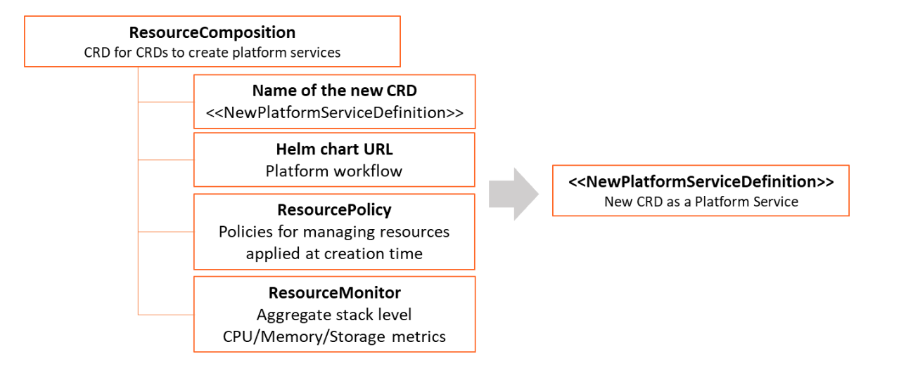
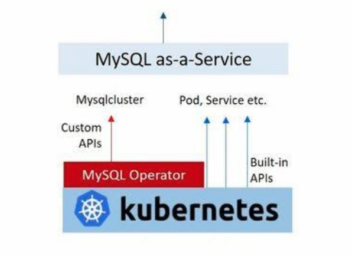

## KubePlus - CRD for CRDs to design multi-tenant platform services from Helm charts

Kubernetes platform engineering teams prepare their clusters for sharing between multiple tenants. This requires them to build platform services with appropriate tenant level isolation and resource consumption tracking. The key challenge in building such services is to enable a self-service experience and avoid the dreaded exchange of YAMLs between platform teams and their cluster users.
KubePlus solves this problem for Kubernetes platform engineering teams.
It is a framework to create multi-tenant platform services with the required isolation guarantees and per-tenant consumption metrics tracking. KubePlus achieves this by providing a mechanism that takes Helm charts of operational workflows and builds Kubernetes APIs to deliver them as-a-service, along with attaching required policies and Prometheus monitoring to them. The Kubernetes APIs thus created provide platform engineering teams a Kubernetes-native way to create, govern and monitor multitenant environments on their clusters.

<p align="center">

</p>


## KubePlus components

KubePlus has two components: 

### 1. CRD for CRDs to design your platform services from Helm charts

KubePlus offers a CRD named ResourceComposition to 
- Compose new CRDs (Custom Resource Definition) to publish platform services from Helm charts
- Define policies (e.g. Node selection, CPU/Memory limits, etc.) for managing resources of the platform services
- Get aggregated CPU/Memory/Storage/Network Prometheus metrics for the platform services
Here is the high-level structure of ResourceComposition CRD: 

<p align="center">

</p>

To understand this further let us see how a platform team can build a MySQL service for their product team/s to consume. The base Kubernetes cluster has MySQL Operator on it (either installed by the Platform team or bundled by the Kubernetes provider).

<p align="center">

</p>


The platform workflow requirements are: 
- Create a PersistentVolume of required type for MySQL instance. 
- Create Secret objects for MySQL instance and AWS backup.
- Create a MySQL instance with a backup target as AWS S3 bucket.
- Setup a policy in such a way that Pods created under this service will have specified Resource Request and Limits.  
- Get aggregated CPU/Memory/Storage/Network metrics for the overall workflow.

Here is a new platform service named MysqlService as Kubernetes API. 

<p align="center">

</p>

A new CRD named MysqlService has been created here using ResourceComposition. You provide a platform workflow Helm chart that creates required underlying resources, and additionally provide policy and monitoring inputs for the workflow. The Spec Properties of MysqlService come from values.yaml of the Helm chart. 
Product teams can use this service to get MySQL database for their application and all the required setups will be performed transparently by this service.


### 2. Kubectl plugins to visualize platform workflows

KubePlus kubectl plugins enable users to discover, monitor and troubleshoot resource relationships in a platform workflow. The plugins run entirely client-side and do not require the in-cluster component. The primary plugin of this functionality is: 
```kubectl connections```. It provides information about relationships of a Kubernetes resource instance (custom or built-in) with other resources (custom or built-in) via owner references, labels, annotations, and spec properties. KubePlus is able to  construct Kubernetes Resource relationship graphs at runtime. This enables KubePlus to build resource topologies and offer fine grained visibility and control over the platform service.

Here is the resource relationship graph for MysqlSevice created above discovered using the ```kubectl connections``` command. 
```kubectl connections MysqlService mysql1```.

<p align="center">

</p>

We have additional plugins such as ```kubectl metrics``` and ```kubectl grouplogs``` that use resource relationship graphs behind the scene and aggregate metrics and logs for the platform workflow.
You can also directly get CPU/Memory/Storage/Network metrics in Prometheus format if you setup ```ResourceMonitor``` while creating your new CRD.

More details about ```ResourceComposition``` CRD and other KubePlus details are available [here](https://cloud-ark.github.io/kubeplus/docs/html/html/index.html).


## Try it:

- Getting started:

  - Try ```kubectl connections``` plugin in your environment. It can be used with any Kubernetes resource (built-in resources like Pod, Deployment, or custom resources like MysqlCluster).

```
   $ wget https://github.com/cloud-ark/kubeplus/raw/master/kubeplus-kubectl-plugins.tar.gz
   $ gunzip kubeplus-kubectl-plugins.tar.gz
   $ tar -xvf kubeplus-kubectl-plugins.tar
   $ export KUBEPLUS_HOME=`pwd`
   $ export PATH=$KUBEPLUS_HOME/plugins/:$PATH
   $ kubectl kubeplus commands
```

[Here](./kubeplus-kubectl-commands.md) are all the kubeplus kubectl commands.

- Install KubePlus server-side component for before trying out below examples:
    ```
    - git clone --depth 1 https://github.com/cloud-ark/kubeplus.git
    - cd kubeplus/deploy
    - ./deploy-kubeplus.sh
    - helm install kubeplus kubeplus-chart --set caBundle=$(kubectl config view --raw --flatten -o json |  sed 's/certificate-authority-data/certificateauthdata/'g | jq -r '.clusters[] | select(.name == "'$(kubectl config current-context)'") | .cluster.certificateauthdata')
    ```

- CRD for CRDs:
  - Example outlined above is [here](./examples/resource-composition/steps.txt).

- Multitenancy examples:
  - [Wordpress stacks](./examples/multitenancy/wordpress-mysqlcluster-stack/steps.txt)
  - [Mysql stacks](./examples/multitenancy/stacks/steps.txt)
  - [MongoDB stacks](./examples/multitenancy/mongodb-as-a-service/steps.md)
  - Multiple [teams](./examples/multitenancy/team/steps.txt) with applications deployed later

Note: To obtain metrics, enable Kubernetes Metrics API Server on your cluster. Hosted Kubernetes solutions like GKE has this already installed.


## Platform-as-Code

KubePlus has been developed as part of our Platform-as-Code practice. Learn more about Platform-as-Code [here](https://cloudark.io/platform-as-code).


## Operator Maturity Model

As enterprise teams build their custom PaaSes using community or in house developed Operators, they need a set of guidelines for Operator development and evaluation. We have developed [Operator Maturity Model](https://github.com/cloud-ark/kubeplus/blob/master/Guidelines.md) focusing on Operator usage in multi-tenant and multi-Operator environments. Operator developers are using this model today to ensure that their Operator is a good citizen of the multi-Operator world and ready to serve multi-tenant workloads. It is also being used by Kubernetes cluster administrators today for curating community Operators towards building their custom PaaSes.


## Presentations/Talks

1. [Being a good citizen of the Multi-Operator world, Kubecon NA 2020](https://www.youtube.com/watch?v=NEGs0GMJbCw&t=2s)

2. [Operators and Helm: It takes two to Tango, Helm Summit 2019](https://youtu.be/F_Dgz1V5Q2g)

3. [KubePlus presentation at Kubernetes community meeting](https://youtu.be/ZckVULU9sYc)


## Contact

Submit issues on this repository or reach out to our team on [Slack](https://join.slack.com/t/cloudark/shared_invite/zt-2yp5o32u-sOq4ub21TvO_kYgY9ZfFfw).


## Status

Actively under development

