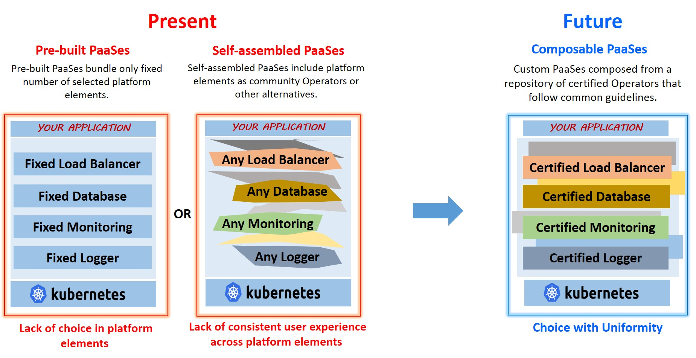
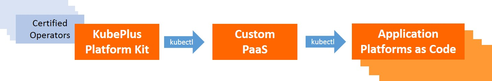
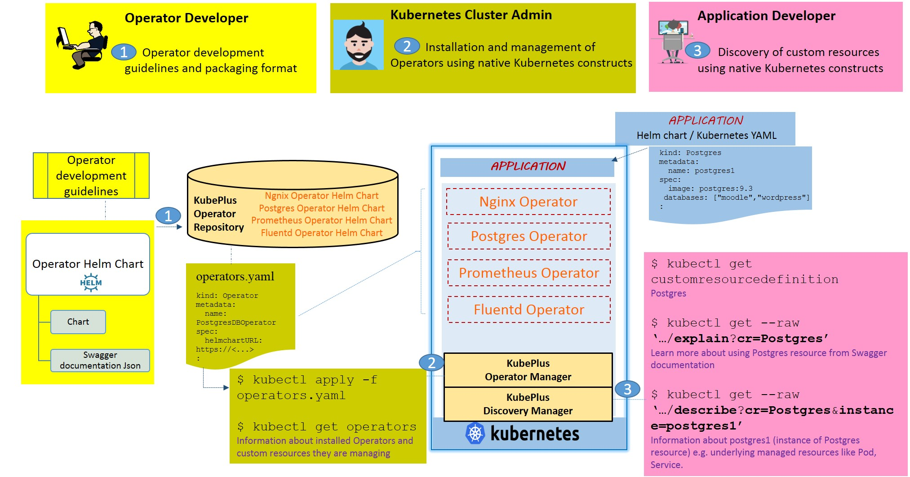
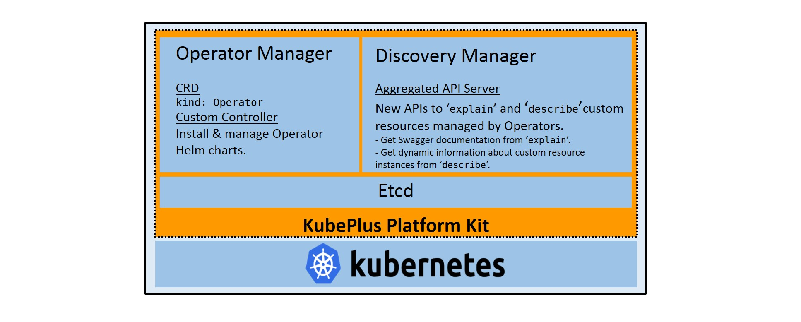

=========
KubePlus
=========

KubePlus is an open technology designed to deliver Platforms as Code experience
utilizing Kubernetes Operators.

Why Platform-as-Code
=======================

One of the key reasons for Kubernetes’s popularity is its extendibility.
Kubernetes Operators_ extend Kubernetes API to manage
third-party software as native Kubernetes objects. Number of Operators are
being built for middlewares like databases, queues, loggers, etc. This has led to
tremendous choice in the platform elements for building application platforms
on Kubernetes, making pre-built PaaS a less attractive option. Current popular
approach is to ‘self-assemble’ platform stacks using Kubernetes Operators of
choice. In addition to the effort required in building such an assembly, there is
lack of consistent user experience across multiple Operators.

.. _Operators: https://medium.com/@cloudark/why-to-write-kubernetes-operators-9b1e32a24814

KubePlus Platform Kit
======================

KubePlus Platform Kit is designed to deliver `Platform as Code`__ experience utilizing 
Kubernetes Operators. Using KubePlus Platform Kit,

* Cluster Administrator constructs a custom PaaS comprised of required Kubernetes Operators.

* Application developer declares and creates application platforms as code with Kubernetes YAML. 

.. _pac: https://medium.com/@cloudark/evolution-of-paases-to-platform-as-code-in-kubernetes-world-74464b0013ca

__ pac_

We bring consistency across multiple Kubernetes Operators with our Operator development guidelines_. 

This enables teams to Build their Own PaaSes on Kubernetes selecting required Operators 
from our `repository of certified Operators`__ that are packaged as Helm charts.

.. _guidelines: https://github.com/cloud-ark/kubeplus/blob/master/Guidelines.md

.. _repository: https://github.com/cloud-ark/operatorcharts

__ repository_

KubePlus does not introduce any new CLI. KubePlus users continue to use the
standard Kubernetes CLI (kubectl) and YAML definition format to manage their extended platforms. 

KubePlus is designed with 3 user personas in mind. 

*1. Operator developer*

*2. Cluster Administrator*

*3. Application developer*

 

Value of KubePlus
==================

*1) Uniformity between native and custom Kubernetes resources*

Our Operator development guidelines are designed to ensure custom resources become 
first-class entities of Kubernetes. 

*2) No new CLI to learn*

KubePlus does not introduce any new CLI. Users can work with the same Kubernetes native interfaces like kubectl and YAML to leverage KubePlus functionality.

*3) Eliminate out-of-band platform automation*

Kubernetes Operators embed platform element life-cycle actions directly in Kubernetes. An example of a Kubernetes Operator can be Postgres Operator that 
embeds life-cycle actions such as create a database, add user to the database, change password of a user etc.
Such Operators leverage Kubernetes's strength of control loop (current state -> desired state) eliminating additional out-of-band automation.

*4) Common language between Devs and Ops*

KubePlus leverages kubectl for management of Operators by Ops; and their consumption by Devs, making Kubernetes YAMLs as the common language between Devs and Ops. 

*5) Discovery of custom resources*

KubePlus installs an additional component, KubePlus Discovery Manager, on your Kubernetes cluster to improve usability of custom Operators.

KubePlus Discovery Manager component provides information about custom resources managed by the Operators. E.g. Assume there is a Postgres Operator which is managing a custom resource called Postgres. To make it is easy to consume Postgres resource in your application YAML, KubePlus will provide following information about Postgres resource: 

- Static information like OpenAPI Spec for the Postgres resource. This information can be used by application developers.

- Dynamic information like composition of custom resources in terms on native Kubernetes resources (e.g. If you create an instance of a Postgres custom resource, it would internally create Deployement, Pod, and a Service object.)

KubePlus Architecture
======================

Sample Scenario
================

Imagine an EdTech startup building a classroom collaboration application on Kubernetes. They have following high level requirements for their application platform:
- Platform should be composable. It should be possible to add or update required platform elements to it.
- Platform learning curve for developers should be minimal.

This application requires following platform elements.

- Nginx for load balancing: (Required life-cycle actions- Add/Remove routes, Configure SSL Certificates.)

- Postgres for backend storage: (Required life-cycle actions- Create/drop db, Backup/restore db, Add/remove users.)

- Prometheus for monitoring: (Required life-cycle actions- Define monitoring endpoints, Set metrics.)

- Fluentd for logging: (Required life-cycle action- Set log rotation policy.)

-----------------------
KubePlus Custom PaaS
-----------------------

KubePlus custom PaaS for this EdTech startup would contain four custom operators - Nginx, Postgres, Prometheus and Fluentd, which are written to 
follow our guidelines for Kubernetes Operators.

KubePlus will install two additional component: KubePlus Operator Manager and KubePlus Discovery Manager. 

KubePlus Operator Manager enables Kubernetes administrators to install and manage required Operators. KubePlus Discovery Manager enables application developers to learn more about newly added custom resources.
KubePlus does not introduce any new CLI interface. Entire workflow is supported through native Kubernetes interface of kubectl. 

**1) Install KubePlus (by cluster administrator)**

KubePlus requires Helm to be installed on the cluster.

Install Helm:

  ``$ helm init``

Once tiller pod is Running (kubectl get pods -n kube-system), install KubePlus.
We provide deployment YAMLs for deploying KubePlus.

  ``$ kubectl apply -f deploy/``

**2) Operator deployment to create custom PaaS (by cluster administrator)**

a) Once core KubePlus components (Operator Manager and Discovery Manager) are installed on the cluster, Kubernetes cluster administrators define Kubernetes Operators to be installed in a `yaml file`__ and then use following kubectl commands: 

.. _operatoryaml: https://github.com/cloud-ark/kubeplus/blob/master/postgres-operator.yaml

__ operatoryaml_

b) Install one or more Operators:

``$ kubectl apply -f <operator yaml file>``

c) Find out all the installed Operators:

``$ kubectl get operators``

**3) Get Application Platform as-Code (for application developer)**

Kubernetes application developers can create/delete/update/list the newly added 
custom resources by using kubectl CLI:

a) Find out custom resources managed by an Operator:

``$ kubectl describe operators postgres-operator``

``$ kubectl describe customresourcedefinition postgreses.postgrescontroller.kubeplus``

b) Find out details about a Custom Resource's Spec definition:

``$ kubectl get --raw "/apis/kubediscovery.cloudark.io/v1/explain?cr=Postgres"``

c) Define application Platform as Code:

``$ vi postgres.yaml``

d) Create application Platform:

``$ kubectl apply -f postgres.yaml``

e) Find out dynamic composition tree for Postgres custom resource instance:

``$ kubectl get --raw "/apis/kubediscovery.cloudark.io/v1/describe?cr=Postgres&instance=postgres1" | python -mjson.tool``

Try Out
========

Follow steps given in `kubeplus-steps.txt`__.

.. _steps: https://github.com/cloud-ark/kubeplus/blob/master/kubeplus-steps.txt

__ steps_

Operator Development Guidelines
================================

Checkout_ our guidelines for developing Operators with focus on their usability.
These guidelines are based on our study of various Operators written by the community
and through our experience of building discovery and provenance tools for Kubernetes Operators.

.. _Checkout: https://github.com/cloud-ark/kubeplus/blob/master/Guidelines.md

--------------------
Available Operators
--------------------

1) Postgres
   - Check postgres-crd-v2/README.rst for details about how to use this Operator.

If you are interested in building your own operators, you can follow steps here_:

.. _here: https://github.com/cloud-ark/kubeplus/issues/14

-------
Issues
-------

Suggestions/Issues are welcome_

.. _welcome: https://github.com/cloud-ark/kubeplus/issues

