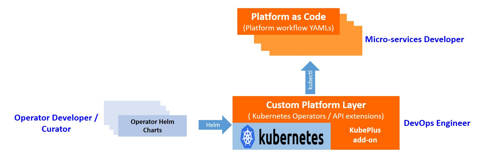
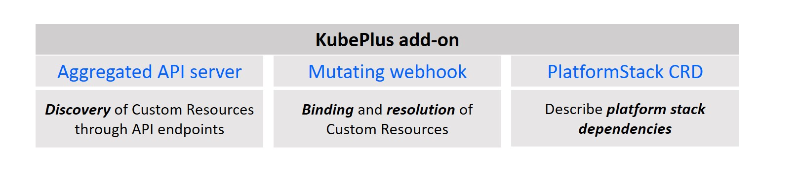
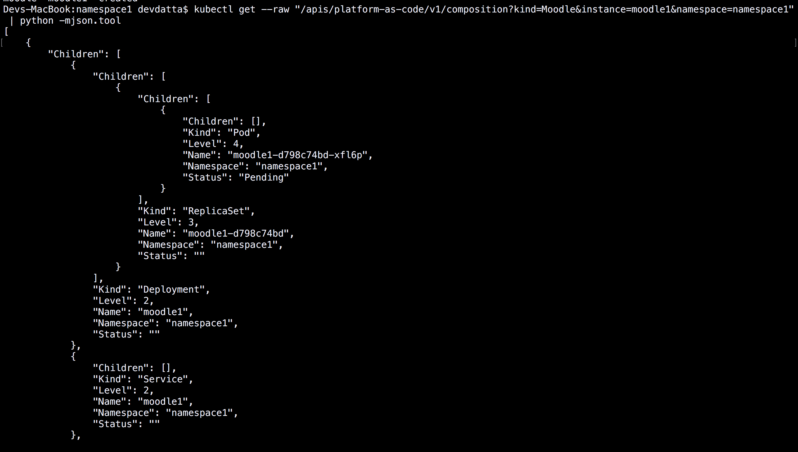
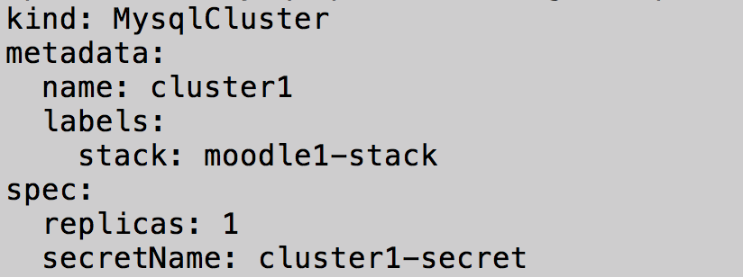

============================================
Kubernetes API Add-on for Platform-as-Code 
============================================

KubePlus API Add-on enables building `Platforms as-Code`_ on Kubernetes using Operators and Custom Resources.
It focuses on solving Kubernetes Custom Resource Discovery, Binding and Orchestration problems
in multi-Operator environments.
You can think of it as a tool that enables AWS CloudFormation/Terraform like experience when working 
with Kubernetes Custom Resources.

Kubernetes Custom Resource Definitions (CRDs), popularly known as `Operators`_, extend Kubernetes to run third-party softwares directly on Kubernetes. KubePlus API Add-on helps application developers in declaratively creating platform stacks of Kubernetes Custom Resources/APIs introduced by the Operators.

.. _Operators: https://coreos.com/operators/

.. _Platforms as-Code: https://cloudark.io/platform-as-code

What does it do?
=================

KubePlus API Add-on enables three functions - discovery, binding and orchestration of Kubernetes Custom Resources.

*Discovery* - Variety of static and dynamic information is associated with Kubernetes Custom Resources.
This includes - Spec properties, usage, implementation-level assumptions made by an Operator, 
composition tree of Kubernetes resources created as part of handling Custom Resources, permissions granted to the CRD/Operator Pod, whether Custom Resources are in use as part of a platform stack, history of declarative actions performed on Custom Resources, etc. KubePlus API Add-on enables discovering this type of information about Custom Resources directly through 'kubectl'.

*Binding* - Assembling multiple resources - built-in and Custom - to build platform stacks requires them to be bound/tied together in specific ways. In Kubernetes 'labels', 'label selectors' and name-based dns resolution satisfy the binding needs between built-in resources. However, when using Custom Resources from different Operators these built-in mechanisms are not sufficient. Correct binding requires integrating runtime information across Custom Resources, or orchestrating actions on multiple Custom and/or built-in resources.
KubePlus API Add-on enables such actions through a set of binding functions that can be used in YAML definitions of Custom Resources.

*Orchestration* - Creating platform stacks requires treating the set of resources that represent a stack as a unit. This enables performing actions on these resources together, such as enforcing ordering, visualization, etc. KubePlus provides a mechanism to define all the resources in a stack along with their dependencies.

Who is the target user of KubePlus?
====================================

KubePlus is useful to anyone who works with Kubernetes Custom Resources. These could be service developers, microservice developers, application developers, or devops engineers.

.. _discoverability and interoperability guidelines: https://github.com/cloud-ark/kubeplus/blob/master/Guidelines.md

*1. Operator Developer*

Operator developers create Operator Helm charts enhanced with 'platform-as-code annotations' (described below). These annotations are part of our broader `discoverability and interoperability guidelines`_.

*2. DevOps Engineer/Cluster Administrator*

DevOps Engineers/Cluster Administrators use standard tools such as 'kubectl' or 'helm' to deploy required Operators in a Kubernetes cluster. Additionally, they deploy KubePlus in their cluster to enable Application developers discover and use various Custom Resources efficiently.

*3. Application Developer*

Application developers use KubePlus discovery endpoints, binding functions, and PlatformStack Operator to create their platform stacks as-code composing various Custom Resources together.

How does it work?
==================

KubePlus API Add-on provides discovery endpoints, binding functions, and a orchestration mechanism to enable application developers construct platform stacks using Kubernetes Custom Resources.
These constructs are implemented using following components - an Aggregated API Server, a Mutating webhook, and an  Operator.

Discovery Endpoints
--------------------

For static and runtime information discovery, KubePlus defines following custom endpoints:

.. code-block:: bash

   kubectl get --raw "/apis/platform-as-code/v1/man"

The man endpoint is used for obtaining static usage information about a Custom Resource. It is a mechanism that an Operator developer can use to expose any assumptions or usage details that go beyond the Custom Resource Spec properties.

.. image:: ./docs/Moodle-man.png
   :scale: 25%
   :align: center

.. code-block:: bash

   kubectl get --raw "/apis/platform-as-code/v1/composition"

The composition endpoint is used for obtaining runtime composition tree of Kubernetes resources that are created as part of handling a Custom Resource instance.

These endpoints can be used manually as well as programmatically. In fact, the ``composition`` endpoint is used
by KubePlus internally as part of the binding functions.

Binding Functions
------------------

The main goal of KubePlus is to make it easy for Custom Resource users to define "stacks" of Custom Resources to achieve their end goals. Towards this we have defined following functions that can be used to glue different Custom Resources together. 

.. code-block:: bash

   1. Fn::ImportValue(<Parameter>)

This function imports value of the specified parameter into the Spec where the function is defined.

.. code-block:: bash

   1. Fn::AddLabel(label, <Resource>)

This function adds the specified label to the specified resource.

Formal grammar of these functions is available in the `functions doc`_.

.. _functions doc: https://github.com/cloud-ark/kubeplus/blob/master/docs/kubeplus-functions.txt

Here is how the ``Fn::ImportValue()`` function can be used in a Custom Resource YAML definition.

.. image:: ./docs/moodle1.png
   :scale: 10%
   :align: right

PlatformStack Operator
-----------------------

In order to define all resources of a platform stack as a unit, 
KubePlus provides a CRD/Operator. It defines the ``PlatformStack`` Custom Resource. 
This Custom Resource enables application developers to define all the stack resources as a unit, along with the
inter-dependencies between them. The dependency information is used by mutating webhook to prevent out-of-order creation of resources. Note that as per Kubernetes's level-based reconciliation philosophy, the ordering between resource creations should not matter. However, it is possible that CRDs/Operators may not satisfy this requirement. In such a case preventing out-of-order resource creation is helpful.
Note that PlatformStack Operator does not actually deploy any resources defined in a stack. Resource creation
is done normally using 'kubectl'.

.. image:: ./docs/platform-yaml.png
   :scale: 5%
   :align: center

Platform-as-Code Annotations
-----------------------------

For correct working of discovery endpoints and binding functions, following annotations need to be defined on Custom Resource Definition (CRD) YAMLs of an Operator.

.. code-block:: bash

   platform-as-code/composition 

The 'composition' annotation is used to define Kubernetes's built-in resources that are created as part of instantiating a Custom Resource instance.

.. code-block:: bash

   platform-as-code/usage 

The 'usage' annotation is used to define usage information for a Custom Resource.
The value for 'usage' annotation is the name of the ConfigMap that stores the usage information.

As an example, annotations on Moodle Custom Resource Definition are shown below:

.. code-block:: yaml

   apiVersion: apiextensions.k8s.io/v1beta1
   kind: CustomResourceDefinition
   metadata:
     name: moodles.moodlecontroller.kubeplus
     annotations:
       platform-as-code/usage: moodle-operator-usage.usage
       platform-as-code/composition: Deployment, Service, PersistentVolume, PersistentVolumeClaim, Secret, Ingress
   spec:
     group: moodlecontroller.kubeplus
     version: v1
     names:
       kind: Moodle
       plural: moodles
     scope: Namespaced

The Helm chart for Moodle Operator is available here_.

.. _here: https://github.com/cloud-ark/kubeplus-operators/tree/master/moodle/moodle-operator-chart/templates

Getting started
=================

Read our `blog post`_ to understand how Kubernetes Custom Resources affect the notion of 'as-Code' systems.

.. _blog post: https://medium.com/@cloudark/kubernetes-and-the-future-of-as-code-systems-b1b2de312742

Install KubePlus:

.. code-block:: bash

   $ git clone https://github.com/cloud-ark/kubeplus.git
   $ cd kubeplus
   $ ./deploy-kubeplus.sh

Platform-as-Code examples:

1. `Manual discovery and binding`_

.. _Manual discovery and binding: https://github.com/cloud-ark/kubeplus/blob/master/examples/moodle-with-presslabs/steps.txt

2. `Automatic discovery and binding`_

.. _Automatic discovery and binding: https://github.com/cloud-ark/kubeplus/blob/master/examples/platform-crd/steps.txt

Demo
====

See KubePlus in action_.

.. _action: https://youtu.be/taOrKGkZpEc

Feedback
=========

We are actively looking for inputs from the community on following aspects:

1. Discovery

   - What additional discovery endpoints should we add in KubePlus API Server?
     File your suggestions as comments on `issue 320`_

.. _issue 320: https://github.com/cloud-ark/kubeplus/issues/320

2. Binding

   - What additional binding functions should we add to KubePlus?
     File your suggestions as comments on `issue 319`_

.. _issue 319: https://github.com/cloud-ark/kubeplus/issues/319

3. Orchestration

   - What capabilities should we add to KubePlus PlatformStack CRD?
     File your suggestions as comments on `issue 339`_

.. _issue 339: https://github.com/cloud-ark/kubeplus/issues/339

Comparison
===========

KubePlus belongs to the class of systems that enable `declarative application management`_ in Kubernetes.
As compared to other tools and systems, distinguishing features of KubePlus are - no new CLI, 
focus on Custom Resource stacks, and seamless integration of static and runtime information in realizing such stacks.

.. _declarative application management: https://github.com/kubernetes/community/blob/master/contributors/design-proposals/architecture/declarative-application-management.md

Problem domain of declarative resource stack creation is not new. In the traditional cloud world,
this problem has been solved by Infrastructure-as-Code tools like AWS CloudFormation and Terraform that solve this problem. The main assumption that these tools work with is that the set of underlying cloud resource APIs are 
static and not going to change. With Kubernetes that is not the case. The set of resource APIs available in a cluster
is dynamic as it depends on what Operators/CRDs are installed in a cluster.
KubePlus API Add-on is focused on solving the declarative platform stack creation problem for the Kubernetes world.

For discovery, Kubernetes itself now supports 'kubectl explain' on Custom Resources.
In our experience the information that is needed for correctly using Custom Resources with other
resources goes beyond the Spec properties that 'kubectl explain' exposes. 
KubePlus's discovery endpoints provide a way for
Operator developers to expose additional information that cannot be accommodated through Custom Resource Spec properties alone.

In designing KubePlus our main philosophy has been to not introduce any new CLI for enabling
discovery, binding, and orchestration functions.
We wanted application developers to use only Kubernetes's native CLI 'kubectl' for these functions.
It should be possible though to use 'helm' and/or 'kustomize' with Custom Resource YAMLs defined using KubePlus 
binding functions. KubePlus's focus on resolving binding between resources using runtime information is unique. 
'kustomize' supports runtime information aggregation through vars and fieldrefs.
However, this is limited to resolving Spec properties of top-level Custom Resources only.
KubePlus supports runtime information integration for sub-resources of Custom Resource instances.
Other approach towards binding is to define a new CRD, such as ServiceBinding
as in the Service Catalog project. In KubePlus we have purposely avoided introducing a new CRD for defining binding 
related information as we believe it adds additional complexity for application developers.

For orchestration, there exists Application CRD in the community. Conceptually, KubePlus's PlatformStack CRD is
similar to it, in that both provide a way to define a stack of resources.
Our goal with PlatformStack CRD is to use it for orchestration functions such as ordering, label propagation, etc.
Application CRD's focus is mainly on visualization of an application stack.

Operators
==========

1. Use our `repository of Operator helm charts`_ for building your custom platform layer. Our Operators are annotated with Platform-as-Code annotations that enable Custom Resource discovery and binding.

.. _repository of Operator helm charts: https://github.com/cloud-ark/operatorcharts/

2. Follow our `Operator Development Guidelines`_ when developing your Operators, especially if your Operator
   will be used alongside other Operators in a Kubernetes cluster.

.. _Operator Development Guidelines: https://github.com/cloud-ark/kubeplus/blob/master/Guidelines.md

3. Checkout our `Operator FAQ`_ if you are new to CRDs and Operators.

.. _Operator FAQ: https://github.com/cloud-ark/kubeplus/blob/master/Operator-FAQ.md

Bug reports
============

Follow `contributing guidelines`_ to submit bug reports.

.. _contributing guidelines: https://github.com/cloud-ark/kubeplus/blob/master/Contributing.md

Status
=======

Actively under development.