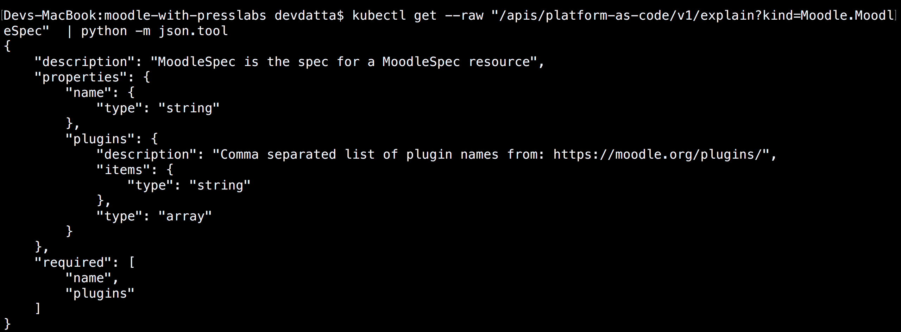

==========================
KubePlus Platform toolkit
==========================

KubePlus Platform toolkit simplifies discovery and use of Kubernetes Operators and Custom Resources in a cluster.

Kubernetes Custom Resource Definitions (CRDs), popularly known as `Operators`_, extend Kubernetes to run third-party software directly on Kubernetes. Today, number of Operators are
being built for middlewares like databases, queues, ssl certificates, etc.
The Custom Resources introduced by Operators essentially represent 'platform elements' as they encapsulate some high-level workflow actions on the underlying infrastructure resource which they are managing (database, queue, ssl certificate, etc.). A novel approach for building platforms on Kubernetes is to construct a platform stack from multiple Custom Resources from different Operators.

.. _Operators: https://coreos.com/operators/

The main challenge in this approach is interoperability between Custom Resources from different Operators. KubePlus Platform toolkit focuses on solving this challenge by standardizing on how application developers can easily discover and use Custom Resources in a cluster. Specifically, it provides a way for application developers to obtain 'man page' like static information, and 'pstree' like dynamic information for Custom Resources directly through 'kubectl'. Equipped with this information application developers can then create their platform stacks with correct YAML definitions of various Custom Resources.

Platform stacks thus defined 'as Code' using Custom Resources provide true portability across Cloud providers, and across different environments as the entire stack is running on Kubernetes. It also enables Kubernetes YAML to become the common language between Operations teams and application development teams.

.. .. image:: ./docs/KubePlus-Flow.jpg
..   :scale: 25%
..   :align: center

KubePlus Architecture
======================

KubePlus streamlines the process of discovering static and runtime information about Custom Resources
introduced by various Operators in a cluster. Static information consists of: a) how-to-use guides for Custom Resources supported by an Operator, b) any code level assumptions made by an Operator, c) OpenAPI Spec definitions for a Custom Resource. Runtime information consists of: a) identification of Kubernetes's native resources that are created as part of instantiating a Custom Resource instance, 
b) history of declarative actions performed on Custom Resource instances.

KubePlus does not introduce any new input format, such as a new Spec, for Custom Resource discovery. Discovery is enabled via annotations, ConfigMaps, and custom endpoints.

-----------------------------
Platform-as-Code Annotations
-----------------------------

KubePlus defines following annotations that need to be set on Custom Resource Definitions (CRDs).

.. code-block:: bash

   platform-as-code/usage 

The 'usage' annotation is used to define usage information for a Custom Resource.

.. code-block:: bash

   platform-as-code/constants 

The 'constants' annotation is used to surface any code level assumptions made by an Operator.

.. code-blocK:: bash

   platform-as-code/openapispec 

The 'openapispec' annotation is used to define OpenAPI Spec for a Custom Resource.

The values for 'usage', 'constants', 'openapispec' annotations are names of ConfigMaps that store the corresponding data. Creating these ConfigMaps is the responsibility of Operator developer.
Don't forget to package these ConfigMaps along with your Operator Helm Chart. Here_ is an example of Moodle Helm Chart with these annotations and ConfigMaps.

.. _Here: https://github.com/cloud-ark/kubeplus-operators/tree/master/moodle/moodle-operator-chart/templates

.. code-block:: bash

   platform-as-code/composition 

The 'composition' annotation is used to define Kubernetes's native resources that are created as part of instantiating a Custom Resource instance. KubePlus uses the values in this annotations along with OwnerReferences, to build dynamic composition tree of Kubernetes's native resources that are created as part of instantiating a Custom Resource instance.

As an example, annotations on Moodle Custom Resource Definition are shown below:

.. code-block:: yaml

   apiVersion: apiextensions.k8s.io/v1beta1
   kind: CustomResourceDefinition
   metadata:
     name: moodles.moodlecontroller.kubeplus
     annotations:
       platform-as-code/usage: moodle-operator-usage.usage
       platform-as-code/constants: moodle-operator-implementation-details.implementation_choices
       platform-as-code/openapispec: moodle-openapispec.openapispec
       platform-as-code/composition: Deployment, Service, PersistentVolume, PersistentVolumeClaim, Secret, Ingress
   spec:
     group: moodlecontroller.kubeplus
     version: v1
     names:
       kind: Moodle
       plural: moodles
     scope: Namespaced

----------------------------
Platform-as-Code Endpoints
----------------------------

Towards enabling application developers to discover information about Custom Resources directly from kubectl, KubePlus exposes following endpoints - 'man', 'explain' and 'composition'. 

These endpoints are implemented using Kubernetes's aggregated API Server.

.. code-block:: bash

   $ kubectl get --raw "/apis/platform-as-code/v1/man?kind=Moodle"

The 'man' endpoint is used to find out 'man page' like information about Custom Resources.
It essentially exposes the information packaged in 'usage' and 'constants' annotations on a CRD.

.. image:: ./docs/Moodle-man.png
   :scale: 25%
   :align: center

.. code-block:: bash

   $ kubectl get --raw "/apis/platform-as-code/v1/explain?kind=Moodle"  | python -m json.tool
   $ kubectl get --raw "/apis/platform-as-code/v1/explain?kind=Moodle.MoodleSpec"  | python -m json.tool

The 'explain' endpoint is used to discover Spec of Custom Resources. 
It exposes the information packaged in 'openapispec' annotation on a CRD.

.. code-block:: bash

   $ kubectl get --raw "/apis/platform-as-code/v1/composition?kind=Moodle&instance=moodle1&namespace=namespace1" | python -mjson.tool

The 'composition' endpoint is used by application developers for discovering the runtime composition tree of native Kubernetes resources that are created as part of provisioning a Custom Resource instance.
It uses listing of native resources available in 'composition' annotation and Custom Resource OwnerReferences to build this tree.

.. image:: ./docs/Moodle-composition.png
   :scale: 25%
   :align: center

Examples of possible future endpoints are: 'provenance', 'functions', and 'configurables'. We look forward to inputs from the community on what additional information on Custom Resources you would like to get from such endpoints.

Usage
======

.. _discoverability and interoperability guidelines: https://github.com/cloud-ark/kubeplus/blob/master/Guidelines.md

*1. Operator Developer*

Operator developers use `discoverability and interoperability guidelines`_ when developing their Operators. These guidelines enable creating Operators such that they are discoverable and consistent to use alongside other Operators in a cluster. This includes adding Platform-as-Code annotations to the CRDs.

*2. DevOps Engineer*

DevOps Engineers/Cluster Administrators uses standard tools such as 'kubectl' or 'helm' to deploy required Operators in a cluster. We `provide`_ Operators that you can use.

.. _provide: https://github.com/cloud-ark/operatorcharts/

Additionally they deploy KubePlus in their cluster so that application developers can discover and use various Custom Resources efficiently.

*3. Application Developer*

Application developers use Platform-as-Code endpoints with kubectl to discover static and runtime information about Custom Resources in their cluster. They can then build their platform stacks 
composing various Custom Resources together.

Demo
====

See KubePlus in action_.

.. _action: https://youtu.be/wj-orvFzUoM

Try it
=======

Follow `these steps`_.

.. _these steps: https://github.com/cloud-ark/kubeplus/blob/master/examples/moodle-with-presslabs/steps.txt

Available Operators
====================

We are maintaining a `repository of Operators`_ that follow the Operator development guidelines
mentioned above. You can use Operators from this repository or create your own Operators that follow the guidelines. Make sure to add the platform-as-code annotations to enable your Operator consumers to easily find static and runtime information about your Custom Resources right through kubectl.

.. _repository of Operators: https://github.com/cloud-ark/operatorcharts/

RoadMap
========

Here are our road map items:

1. Automated discovery and binding between Custom Resources.
2. Integrating Kubeprovenance_ functionality into KubePlus.
3. Improving operator-analysis to check conformance of Operators with guidelines.
4. Tracking and visualizing entire platform stacks.

.. _Kubeprovenance: https://github.com/cloud-ark/kubeprovenance

Issues/Suggestions
===================

Follow `contributing guidelines`_ to submit suggestions, bug reports or feature requests.

.. _contributing guidelines: https://github.com/cloud-ark/kubeplus/blob/master/Contributing.md

Status
=======

Actively under development.