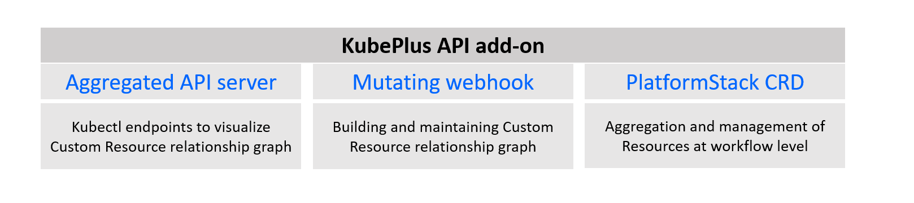
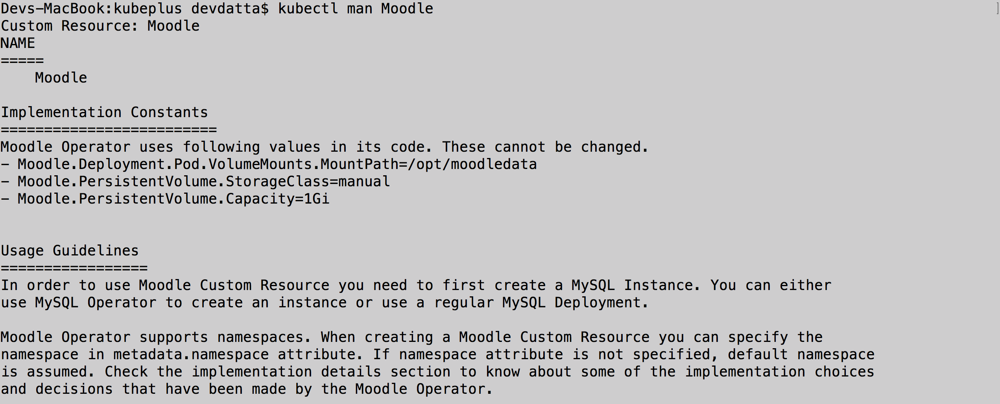
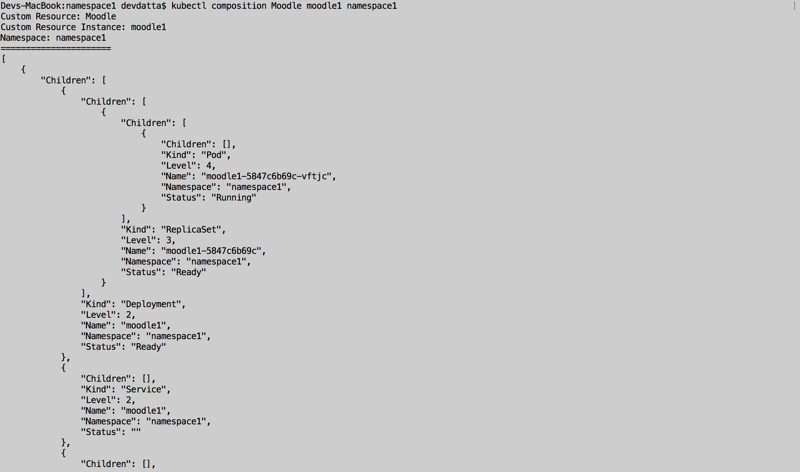
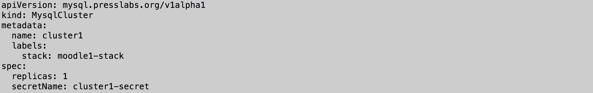
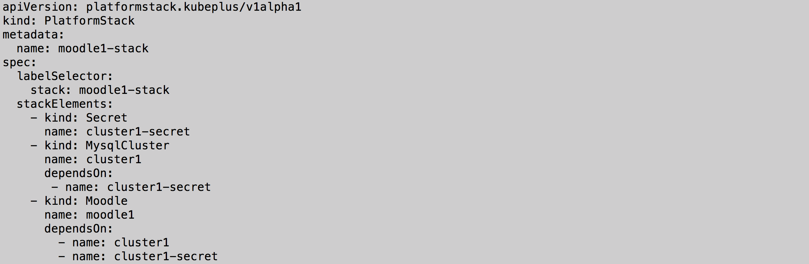

=======================
KubePlus API Add-on
=======================

KubePlus API add-on simplifies building workflow automation using Kubernetes Custom APIs/ Resources by extending the Kubernetes resource graph and maintaining all implicit and explicit relationships of Custom Resources created through labels, annotations, spec properties or sub-resources. It brings uniformity in using variety of Custom APIs/Resources and allows users to discover and use them more efficiently and visualize their dependencies with other APIs/Resources for debugging and monitoring purpose. 

This tool is being developed as a part of our  `Platform as Code practice`_.

.. _Platform as Code practice: https://cloudark.io/platform-as-code

KubePlus API add-on offers following interfaces through kubectl:

**1. kubectl man <Custom Resource>:** Provides information about how to perform supported actions by the Custom Resource

**2. kubectl composition <Custom Resource Instance>:** Provides information about sub resources created by the Custom Resource Instance

**3. kubectl cr-relations <Custom Resource Instance>:** Provide information about relationships of Custom Resource Instance with other instances via labels / annotations / Spec Properties / sub-resources.

You enhance your Kubernetes CRD / Operator packages with a set of Platform-as-Code annotations and then use KubePlus API add-on for workflow modeling with Custom Resources introduced by those Operators. 

KubePlus API add-on extends the Kubernetes resource graph and maintains all implicit and explicit relationships of Custom Resources created through labels, annotations, spec properties or sub-resources. This Custom Resource relationship graph is then exposed through the interfaces discussed above for improving visibility and debuggability. KubePlus API add-on additionally allows you to define workflow level Kubernetes Resource dependencies and then allows applying certain security or robustness policies to all these Resources together. 

--------
Details
--------

Kubernetes Custom Resources and Custom Controllers, popularly known as `Operators`_, extend Kubernetes to run third-party softwares directly on Kubernetes. Teams adopting Kubernetes assemble required Operators of platform softwares such as databases, security, backup etc. to build the required application platforms. KubePlus API add-on simplifies creation of platform workflows leveraging these Custom Resources.

.. image:: ./docs/KubePlus-workflow.jpg
   :scale: 15%
   :align: center

The main benefit of using KubePlus to application/microservice developers are:

- easily discover static and runtime information about Custom Resources available in their cluster.
- Aggregate resources at workflow level to ensure robustness and security for the end to end workflow.

KubePlus API Add-on provides discovery endpoints, binding functions, and an orchestration mechanism to enable application developers to define platform workflows using Kubernetes Custom and built-in resources.

You can think of KubePlus API Add-on as a tool that enables AWS CloudFormation/Terraform like experience when working with Kubernetes Custom Resources.

.. _Operators: https://coreos.com/operators/

.. _as Code: https://cloudark.io/platform-as-code

KubePlus API add-on Components
-------------------------------

Kubectl Endpoints
------------------

KubePlus API add-on offers following custom endpoints for static and runtime information discovery about Custom Resources:

**man endpoint**

.. code-block:: bash

   kubectl get --raw "/apis/platform-as-code/v1/man"

The man endpoint is used for obtaining static usage information about a Custom Resource. Here is an example
of using 'man' endpoint for 'MysqlCluster' Custom Resource.

**composition endpoint**

.. code-block:: bash

   kubectl get --raw "/apis/platform-as-code/v1/composition"

The composition endpoint is used for obtaining runtime composition tree of Kubernetes built-in resources that are created by the Operator as part of handling a Custom Resource instance. Here is an example of using 'composition' endpoint on 'MysqlCluster' Custom Resource instance.

**cr-relationships endpoint**

.. code-block:: bash

   kubectl get --raw "/apis/platform-as-code/v1/relationships"

The cr-relationships endpoint is used for querying relationships of a Custom Resource Instance created through labels, annotations, spec properties or sub-resources. This endpoint is currently under development.

We provide kubectl plugins for these endpoints. In order to use the plugins you need to add KubePlus folder to your PATH variable.

.. code-block:: bash

   $ export PATH=$PATH:`pwd`

Once this is done, you can use following 'kubectl man' and 'kubectl composition' commands.

.. code-block :: bash

   kubectl man <Custom Resource>

.. code-block:: bash

   kubectl composition <Custom Resource> <Custom Resource Instance> [<Namespace]

Platform-as-Code annotations on CRD packages
---------------------------------------------

In order to build and maintain Custom Resource relationship graph, KubePlus API add-on expects CRD packages to be updated with some of the Platform-as-code annotations as described below. 

.. code-block:: bash

   platform-as-code/usage

The 'usage' annotation is used to define usage information for a Custom Resource.
The value for 'usage' annotation is the name of the ConfigMap that stores the usage information.

.. code-block:: bash

   platform-as-code/composition

The 'composition' annotation is used to define Kubernetes's built-in resources that are created as part of instantiating a Custom Resource instance.

.. code-block:: bash
   platform-as-code/annotation-relation
   platform-as-code/label-relation
   platform-as-code/specprop-relation

Above annotations are used to declare annotation / label / spec-property based relationships that 
instances of this Custom Resource can have with other Resources.  

These annotations need to be defined on the Custom Resource Definition (CRD) YAMLs of Operators
in order to make Custom Resources discoverable and usable by application developers.

As an example, annotations on MysqlCluster Custom Resource Definition (CRD) are shown below:

.. code-block:: yaml

  apiVersion: apiextensions.k8s.io/v1beta1
  kind: CustomResourceDefinition
  metadata:
    name: mysqlclusters.mysql.presslabs.org
    annotations:
      helm.sh/hook: crd-install
      platform-as-code/usage: mysqlcluster-usage.usage
      platform-as-code/composition: StatefulSet, Service, ConfigMap, Secret, PodDisruptionBudget
  spec:
    group: mysql.presslabs.org
    names:
      kind: MysqlCluster
      plural: mysqlclusters
      shortNames:
      - mysql
    scope: Namespaced

Implicit and Explicit Relationships
------------------------------------

Custom Resource relationships can be categorized into two categories. Explicit relationships based on labels/annotations/spec-properties are static and can be hard-coded into Helm charts / YAML files before the deployment. Implicit relationships can not be hard coded pre-deployment and need to be resolved run-time. Example of implicit relationship can be – Restic Custom Resource depends on label on Moodle Custom Resources Deployment sub-resource which gets created only after Moodle resource is created. KubePlus API add-on offers additional functions that can be used directly in the YAML definitions to define such implicit dependencies. 

.. code-block:: bash

   1. Fn::ImportValue(<Parameter>)

This function should be used for defining Custom Resource Spec property values that need to be resolved using runtime information. The function resolves specified parameter at runtime using information about various resources running in a cluster and imports that value into the Spec where the function is defined.

Here is how the ``Fn::ImportValue()`` function can be used in a Custom Resource YAML definition.

.. image:: ./docs/moodle1.png
   :scale: 10%
   :align: right

In the above example the name of the ``Service`` object which is child of ``cluster1`` Custom Resource instance 
and whose name contains the string ``master`` is discovered at runtime and that value is injected as the value of
``mySQLServiceName`` attribute in the ``moodle1`` Custom Resource Spec.

.. code-block:: bash

   2. Fn::AddLabel(label, <Resource>)

This function adds the specified label to the specified resource by resolving the resource name using runtime
information in a cluster.

.. code-block:: bash

   3. Fn::AddAnnotation(annotation, <Resource>)

This function adds the specified annotation to the specified resource by resolving the resource name using runtime
information in a cluster.

The ``AddLabel`` and ``AddAnnotation`` functions should be defined as annotations on those Custom Resources that
need appropriate labels and/or annotations on other resources in a cluster for their operation.
`Here`_ is an example of using the ``AddLabel`` function with the ``Restic`` Custom Resource.

.. _Here: https://github.com/cloud-ark/kubeplus/blob/master/examples/platform-crd/moodle-mysql-restic/restic.yaml#L8

Restic Custom Resource takes backups of Deployments. For this, it requires that the Deployment object be given a label.
In order to take backup of Moodle Custom Resource, we need to add a label on its Deployment object. This is
achieved using the ``AddLabel`` function defined as ``pac/action`` annotation on the Restic Custom Resource Spec.

Formal grammar of ``ImportValue``, ``AddLabel``, ``AddAnnotation`` functions is available in the `functions doc`_.

.. _functions doc: https://github.com/cloud-ark/kubeplus/blob/master/docs/kubeplus-functions.txt

Check our `slide deck`_ in the Kubernetes Community Meeting for more details of the above example.

PlatformStack Operator
-----------------------
Creating workflows requires treating the set of resources representing the workflow as a unit. For this purpose, KubePlus provides a Custom Resource of its own - PlatformStack. This Custom Resource enables application developers to define all the resources in a workflow as a unit along with the inter-dependencies between them. The dependency information is used for ensuring robustness and security of the workflows including, preventing out-of-order creation of resources and ensuring that resources that are still in use cannot be deleted. This CRD is being updated to enable applying certain workflow level security or robustness guarantees to all resources involved. 

PlatformStack Operator does not actually deploy any resources defined in a workflow. Resource creation is done by application developers as usual using 'kubectl'.

Getting started
----------------

Read our `blog post`_ to understand how Kubernetes Custom Resources affect the notion of 'as-Code' systems.

.. _blog post: https://medium.com/@cloudark/kubernetes-and-the-future-of-as-code-systems-b1b2de312742

Install KubePlus:

.. code-block:: bash

   $ git clone https://github.com/cloud-ark/kubeplus.git
   $ cd kubeplus
   $ ./deploy-kubeplus.sh

Install KubePlus kubectl plugins:

We provide kubectl plugins for 'man' and 'composition' endpoints to simplify querying of the man page
information and composition tree information about Custom Resources. In order to use the plugins you
will need to add KubePlus folder to your PATH variable.

.. code-block:: bash

   $ export PATH=$PATH:`pwd`

Platform-as-Code examples:

1. `Manual discovery and binding`_

.. _Manual discovery and binding: https://github.com/cloud-ark/kubeplus/blob/master/examples/moodle-with-presslabs/steps.txt

2. `Automatic discovery and binding`_

.. _Automatic discovery and binding: https://github.com/cloud-ark/kubeplus/blob/master/examples/platform-crd/steps.txt

Operator Maturity Model
------------------------

In order to build Platform workflows as code using Operators and Custom Resources, it is important for Cluster
administrators to evaluate different Operators against a standard set of requirements. We have developed
`Operator Maturity Model`_ towards this focusing on Operator usage in multi-Operator environments.
We use this model when curating community Operators for enterprise readiness. 

.. _Operator Maturity Model: https://github.com/cloud-ark/kubeplus/blob/master/Guidelines.md

Comparison
-----------

Check comparison of KubePlus with other `community tools`_.

.. _community tools: https://github.com/cloud-ark/kubeplus/blob/master/Comparison.md

Operator FAQ
-------------

New to Operators? Checkout `Operator FAQ`_.

.. _Operator FAQ: https://github.com/cloud-ark/kubeplus/blob/master/Operator-FAQ.md

Bug reports
------------

Follow `contributing guidelines`_ to submit bug reports.

.. _contributing guidelines: https://github.com/cloud-ark/kubeplus/blob/master/Contributing.md

Status
-------
Actively under development.

KubePlus in Action
-------------------

1. Kubernetes Community Meeting notes_

.. _notes: https://discuss.kubernetes.io/t/kubernetes-weekly-community-meeting-notes/35/60

2. Kubernetes Community Meeting `slide deck`_

.. _slide deck: https://drive.google.com/open?id=1fzRLBpCLYBZoMPQhKMQDM4KE5xUh6-xU

3. Kubernetes Community Meeting demo_

.. _demo: https://www.youtube.com/watch?v=taOrKGkZpEc&feature=youtu.be

