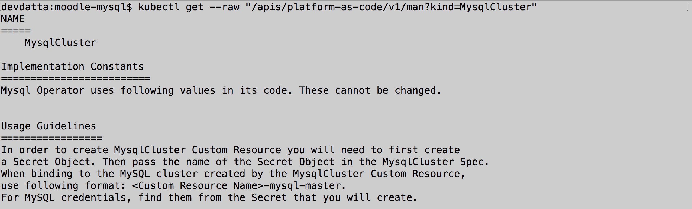
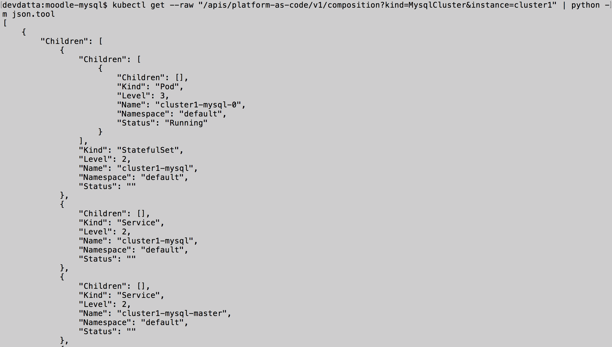

============================================
Kubernetes API Add-on for Platform-as-Code 
============================================

Kubernetes Custom Resources and Custom Controllers, popularly known as `Operators`_, extend Kubernetes to run third-party softwares directly on Kubernetes. KubePlus API Add-on simplifies creation of platform workflows consisting of Custom and built-in resources in multi-Operator environments. The main benefit of using KubePlus to application/microservice developers are:

- easily discover static and runtime information about Custom Resources available in their cluster
- easily define bindings between Custom and/or built-in Resources which are resolved at runtime
- define dependency between Custom and/or built-in Resources in order to prevent out-of-order creation of resources in a stack.

You can think of KubePlus API Add-on as a tool that enables AWS CloudFormation/Terraform like experience when working with Kubernetes Custom Resources.

.. _Operators: https://coreos.com/operators/

.. _as Code: https://cloudark.io/platform-as-code

KubePlus API Add-on provides discovery endpoints, binding functions, and an orchestration mechanism to enable application developers to construct platform stacks using Kubernetes Custom Resources.
These mechanisms are implemented using following components - an Aggregated API Server, a Mutating webhook, and an  Operator.

.. image:: ./docs/KubePlus-components1.jpg 
   :scale: 25% 
   :align: center

Discovery Endpoints
--------------------

Variety of static and runtime information is associated with Kubernetes Custom Resources.
This includes - Spec properties, usage information, implementation-level assumptions made by an Operator, 
composition tree of Kubernetes resources created as part of handling Custom Resources, etc. 
KubePlus defines following custom endpoints for static and runtime information discovery:

.. code-block:: bash

   kubectl get --raw "/apis/platform-as-code/v1/man"

The man endpoint is used for obtaining static usage information about a Custom Resource. 

.. code-block:: bash

   kubectl get --raw "/apis/platform-as-code/v1/composition"

The composition endpoint is used for obtaining runtime composition tree of Kubernetes resources that are created as part of handling a Custom Resource instance.

Platform-as-Code Annotations
-----------------------------

For correct working of discovery endpoints following annotations need to be defined on Custom Resource Definition (CRD) YAMLs of an Operator.

.. code-block:: bash

   platform-as-code/composition 

The 'composition' annotation is used to define Kubernetes's built-in resources that are created as part of instantiating a Custom Resource instance.

.. code-block:: bash

   platform-as-code/usage 

The 'usage' annotation is used to define usage information for a Custom Resource.
The value for 'usage' annotation is the name of the ConfigMap that stores the usage information.

As an example, annotations on MysqlCluster Custom Resource Definition are shown below:

.. code-block:: yaml

  apiVersion: apiextensions.k8s.io/v1beta1
  kind: CustomResourceDefinition
  metadata:
    name: mysqlclusters.mysql.presslabs.org
    annotations:
      helm.sh/hook: crd-install
      platform-as-code/composition: StatefulSet, Service, ConfigMap, Secret, PodDisruptionBudget
      platform-as-code/usage: mysqlcluster-usage.usage
  spec:
    group: mysql.presslabs.org
    names:
      kind: MysqlCluster
      plural: mysqlclusters
      shortNames:
      - mysql
    scope: Namespaced

..The Helm chart for above mentioned MySQL Operator is available here_.

.... _here: https://github.com/cloud-ark/operatorcharts/blob/master/mysql-operator-0.2.5-3.tgz

Binding Functions
------------------

KubePlus API Add-on defines following functions that can be used to glue different Custom Resources together. 

.. code-block:: bash

   1. Fn::ImportValue(<Parameter>)

This function imports value of the specified parameter into the Spec where the function is defined.

.. code-block:: bash

   1. Fn::AddLabel(label, <Resource>)

This function adds the specified label to the specified resource.

Formal grammar of these functions is available in the `functions doc`_.

.. _functions doc: https://github.com/cloud-ark/kubeplus/blob/master/docs/kubeplus-functions.txt

Here is how the ``Fn::ImportValue()`` function can be used in a Custom Resource YAML definition.

.. image:: ./docs/mysql-cluster1.png
   :scale: 10%
   :align: left

.. image:: ./docs/moodle1.png
   :scale: 10%
   :align: right

In the above example the name of the ``Service`` object which is child of ``cluster1`` Custom Resource instance 
and whose name contains the string ``master`` is discovered and injected at runtime as the value of
``mySQLServiceName`` attribute in the ``moodle1`` Custom Resource Spec.

Check our `slide deck`_ in the Kubernetes Community Meeting for more details of the above example.

PlatformStack Operator
-----------------------
Creating platform stacks requires treating the set of resources that represent a stack as a unit. 
For this purpose KubePlus provides a CRD/Operator of its own which defines the ``PlatformStack`` Custom Resource. This Custom Resource enables application developers to define all the stack resources as a unit, along with the inter-dependencies between them. The dependency information is used by mutating webhook to prevent out-of-order creation of resources. PlatformStack Operator does not actually deploy any resources defined in a stack. Resource creation is done normally using 'kubectl'.

.. image:: ./docs/platform-stack1.png
   :scale: 10%
   :align: center

Getting started
=================

Read our `blog post`_ to understand how Kubernetes Custom Resources affect the notion of 'as-Code' systems.

.. _blog post: https://medium.com/@cloudark/kubernetes-and-the-future-of-as-code-systems-b1b2de312742

Install KubePlus:

.. code-block:: bash

   $ git clone https://github.com/cloud-ark/kubeplus.git
   $ cd kubeplus
   $ ./deploy-kubeplus.sh

Platform-as-Code examples:

1. `Manual discovery and binding`_

.. _Manual discovery and binding: https://github.com/cloud-ark/kubeplus/blob/master/examples/moodle-with-presslabs/steps.txt

2. `Automatic discovery and binding`_

.. _Automatic discovery and binding: https://github.com/cloud-ark/kubeplus/blob/master/examples/platform-crd/steps.txt

Who is the target user of KubePlus?
====================================

KubePlus is useful to anyone who works with Kubernetes Custom Resources. These could be service developers, microservice developers, application developers, or devops engineers.

.. image:: ./docs/Platform-as-Code-workflow.jpg
   :scale: 25%
   :align: center

.. _discoverability and interoperability guidelines: https://github.com/cloud-ark/kubeplus/blob/master/Guidelines.md

*1. Operator Developer*

Operator Developers create Operator Helm charts enhanced with 'platform-as-code annotations'. These annotations are part of our broader `discoverability and interoperability guidelines`_.

*2. DevOps Engineer/Cluster Administrator*

DevOps Engineers/Cluster Administrators use standard tools such as 'kubectl' or 'helm' to deploy required Operators in a Kubernetes cluster. Additionally, they deploy KubePlus in their cluster to equip application developers to discover and use various Custom Resources efficiently.

*3. Application/Microservices Developer*

Application/Microservices Developers use KubePlus discovery endpoints, binding functions, and PlatformStack Operator to create their platform stacks as-code composing various Custom Resources together.

KubePlus in Action
===================

1. Kubernetes Community Meeting notes_

.. _notes: https://discuss.kubernetes.io/t/kubernetes-weekly-community-meeting-notes/35/60

2. Kubernetes Community Meeting `slide deck`_

.. _slide deck: https://drive.google.com/open?id=1fzRLBpCLYBZoMPQhKMQDM4KE5xUh6-xU

3. Kubernetes Community Meeting demo_

.. _demo: https://www.youtube.com/watch?v=taOrKGkZpEc&feature=youtu.be

..Feedback
..=========

..We are actively looking for inputs from the community on following aspects:

..1. Discovery

..   - What additional discovery endpoints should we add in KubePlus API Server?
..     File your suggestions as comments on `issue 320`_

.... _issue 320: https://github.com/cloud-ark/kubeplus/issues/320

..2. Binding

..   - What additional binding functions should we add to KubePlus?
..     File your suggestions as comments on `issue 319`_

.... _issue 319: https://github.com/cloud-ark/kubeplus/issues/319

..3. Orchestration

..   - What capabilities should we add to KubePlus PlatformStack CRD/Operator?
..     File your suggestions as comments on `issue 339`_

.... _issue 339: https://github.com/cloud-ark/kubeplus/issues/339

Comparison
===========

Check comparison of KubePlus with other `community tools`_.

.. _community tools: https://github.com/cloud-ark/kubeplus/blob/master/Comparison.md

Operators
==========

1. Use our `repository of Operator helm charts`_ for building your custom platform layer. Our Operators are annotated with Platform-as-Code annotations that enable Custom Resource discovery and binding.

.. _repository of Operator helm charts: https://github.com/cloud-ark/operatorcharts/

2. Follow our `Operator Development Guidelines`_ when developing your Operators, especially if your Operator
   will be used alongside other Operators in a Kubernetes cluster.

.. _Operator Development Guidelines: https://github.com/cloud-ark/kubeplus/blob/master/Guidelines.md

3. Checkout our `Operator FAQ`_ if you are new to CRDs and Operators.

.. _Operator FAQ: https://github.com/cloud-ark/kubeplus/blob/master/Operator-FAQ.md

Bug reports
============

Follow `contributing guidelines`_ to submit bug reports.

.. _contributing guidelines: https://github.com/cloud-ark/kubeplus/blob/master/Contributing.md

Status
=======

Actively under development.