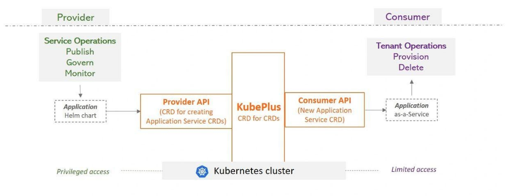

.. CloudARK documentation master file, created by
   sphinx-quickstart on Wed Aug 30 10:11:27 2017.
   You can adapt this file completely to your liking, but it should at least
   contain the root `toctree` directive.

Welcome to KubePlus documentation
====================================

KubePlus is a turn-key solution to transform any containerized application into a SaaS. It takes an application Helm chart and delivers it as-a-service by automating multi-tenancy management and day2 operations such as monitoring, troubleshooting and application upgrades. KubePlus consists of a CRD that enables creating new Kubernetes APIs (CRDs) to realize such services. The new CRDs enable creation of a Helm release per tenant with tenant level isolation, monitoring and consumption tracking.

.. image:: application-stacks-1.png
   :align: center

KubePlus is designed to help software vendors accelerate their journey to SaaS or enterprise platform teams rapidly deliver managed services for any custom applications.

Overview
---------
KubePlus takes an application Helm chart and delivers it as-a-service by automating multi-tenancy management and day2 operations. KubePlus consists of a CRD that enables creating new Kubernetes APIs (CRDs) to realize such services. Provider of the service has privileged access to the cluster and is able to create these services from Helm charts. Consumer of the service has limited access to the cluster and is able to use newly created service API / CRD and create an instance of the application. Behind the scene the provider is able to upgrade, monitor or govern this service.

- Create: Create SaaS for any application packaged as Helm chart.
- Govern: Tenant level policies for isolation and resource utilization.
- Monitor: Tenant level consumption metrics for CPU, memory, storage, network.
- Troubleshoot: Tenant level Kubernetes resource relationship graphs.

Next section provides details about KubePlus components.

.. toctree::
   :maxdepth: 3
   :caption: Contents:

   kubeplus-components
   getting-started
   roadmap
   operators
   community
   comparison

..   roadmap
..   examples
..   troubleshooting

..   architecture

