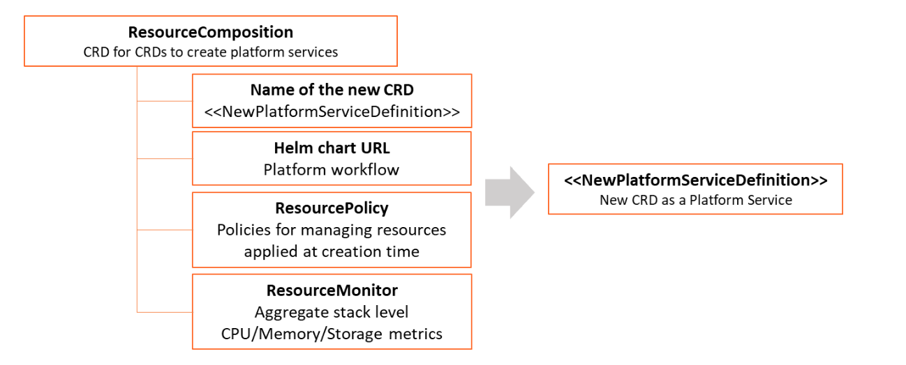
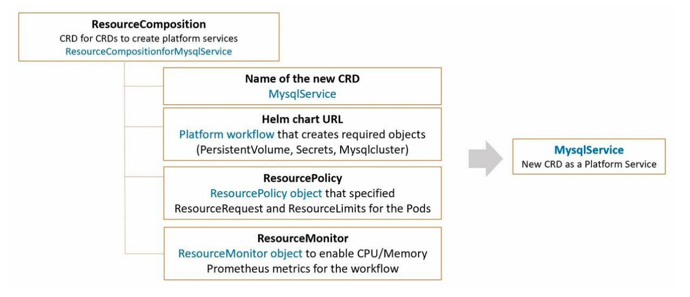

=======================
KubePlus Components
=======================

KubePlus consists of - CRD for CRDs, CRD annotations, and kubectl plugins.

CRD for CRDs to design your platform services from Helm charts
---------------------------------------------------------------

KubePlus offers a CRD named ResourceComposition to 
- Compose new CRDs (Custom Resource Definition) to publish platform services from Helm charts
- Define policies (e.g. Node selection, CPU/Memory limits, etc.) for managing resources of the platform services
- Get aggregated CPU/Memory/Storage Prometheus metrics for the platform services
Here is the high-level structure of ResourceComposition CRD: 

To understand this further let us see how a platform team can build a MySQL service for their product team/s to consume. The base Kubernetes cluster has MySQL Operator on it (either installed by the Platform team or bundled by the Kubernetes provider).

.. image:: mysql-as-a-service.png
   :height: 250px
   :width: 400px
   :align: center

The platform workflow requirements are: 
- Create a PersistentVolume of required type for MySQL instance. 
- Create Secret objects for MySQL instance and AWS backup.
- Setup a policy in such a way that Pods created under this service will have specified Resource Request and Limits.  
- Get aggregated CPU/Memory metrics for the overall workflow.

Here is a new platform service named MysqlService as Kubernetes API. 

A new CRD named MysqlService has been created here using ResourceComposition. You provide a platform workflow Helm chart that creates required underlying resources, and additionally provide policy and monitoring inputs for the workflow. The Spec Properties of MysqlService come from values.yaml of the Helm chart. Product teams can use this service to get MySQL database for their application and all the required setups will be performed transparently by this service.

.. code-block:: bash

  apiVersion: workflows.kubeplus/v1alpha1
  kind: ResourceComposition
  metadata:
    name: mysqlservicetenant 
  spec:
    # newResource defines the new CRD to be installed define a workflow.
    newResource:
      resource:
        kind: MysqlServiceTenant
        group: platformapi.kubeplus
        version: v1alpha1
        plural: mysqlservicetenants
      # URL of the Helm chart that contains Kubernetes resources that represent a workflow.
      chartURL: https://github.com/cloud-ark/operatorcharts/blob/master/mysqlcluster-stack-0.0.1.tgz?raw=true
      chartName: mysqlcluster-stack
    # respolicy defines the resource policy to be applied to instances of the specified custom resource.
    respolicy:
      apiVersion: workflows.kubeplus/v1alpha1
      kind: ResourcePolicy 
      metadata:
        name: mysqlservicetenant-policy
      spec:
        resource:
          kind: MysqlServiceTenant
          group: platformapi.kubeplus
          version: v1alpha1
        policy:
          # Add following requests and limits for the first container of all the  Pods that are related via 
          # owner reference relationship to instances of resources specified above.
          podconfig:
            limits:
              cpu: 200m
              memory: 4Gi
            requests:
              cpu: 100m
              memory: 2Gi
            nodeSelector: values.nodeName
    # resmonitor identifies the resource instances that should be monitored for CPU/Memory/Storage.
    # All the Pods that are related to the resource instance through either ownerReference relationship, or all the relationships
    # (ownerReference, label, annotation, spec properties) are considered in calculating the statistics. 
    # The generated output is in Prometheus format.
    resmonitor:
      apiVersion: workflows.kubeplus/v1alpha1
      kind: ResourceMonitor
      metadata:
        name: mysqlservicetenant-monitor
      spec:
        resource:
          kind: MysqlServiceTenant
          group: platformapi.kubeplus
          version: v1alpha1
        # This attribute indicates that Pods that are reachable through all the   relationships should be used
        # as part of calculating the monitoring statistics.
        monitorRelationships: all

Kubectl plugins
----------------

KubePlus offers following kubectl plugins towards discovery and use of Custom Resources and obtaining insights into Kubernetes-native application.

.. code-block:: bash

   $ kubectl man cr
   $ kubectl connections
   $ kubectl metrics cr
   $ kubectl metrics service
   $ kubectl metrics account
   $ kubectl metrics helmrelease
   $ kubectl grouplogs cr
   $ kubectl grouplogs service
   $ kubectl grouplogs helmrelease

In order to use these plugins you need to add KubePlus folder to your PATH variable.

.. code-block:: bash

   $ export KUBEPLUS_HOME=<Full path where kubeplus is cloned>
   $ export PATH=$PATH:`pwd`/plugins

CRD annotations
-----------------

In order to build and maintain Custom Resource relationship graphs, KubePlus depends on following annotations to be defined on the CRD manifests: 

.. code-block:: bash

   resource/usage

The 'usage' annotation is used to define usage information for a Custom Resource.
The value of 'usage' annotation is the name of the ConfigMap that stores the usage information.

.. code-block:: bash

   resource/composition

The 'composition' annotation is used to define Kubernetes's built-in resources that are created as part of instantiating a Custom Resource instance.

.. code-block:: bash

   resource/annotation-relationship
   resource/label-relationship
   resource/specproperty-relationship

The relationship annotations are used to declare annotation / label / spec-property based relationships that instances of this Custom Resource can have with other Resources.  

Above annotations need to be defined on the Custom Resource Definition (CRD) YAMLs of Operators in order to make Custom Resources discoverable and usable by DevOps/Platform engineers.

As an example, annotations on Moodle Custom Resource Definition (CRD) are shown below:

.. code-block:: yaml

  apiVersion: apiextensions.k8s.io/v1beta1
  kind: CustomResourceDefinition
  metadata:
    name: moodles.moodlecontroller.kubeplus
    annotations:
      resource/composition: Deployment, Service, PersistentVolume, PersistentVolumeClaim, Secret, Ingress
      resource/usage: moodle-operator-usage.usage
      resource/specproperty-relationship: "on:INSTANCE.spec.mySQLServiceName, value:Service.spec.metadata.name"
  spec:
    group: moodlecontroller.kubeplus
    version: v1
    names:
      kind: Moodle
      plural: moodles
    scope: Namespaced

The composition annotation declares the set of Kubernetes resources that are created by the Moodle Operator when instantiating a Moodle Custom Resource instance.
The specproperty relationship defines that an instance of Moodle Custom Resource is connected through it's mySQLServiceName spec attribute to an instance of a Service resource through that resource's name (metadata.name). Below is an example of a Kubernetes platform workflow in which a Moodle Custom Resource instance is bound to a MysqlCluster Custom Resource instance through the Service resource that is created by the MysqlCluster Operator. The specproperty relationship helps discover this relationship as seen below:

.. code-block:: bash

  (venv) Devs-MacBook:kubeplus devdatta$ kubectl connections Moodle moodle1 namespace1
  Level:0 kind:Moodle name:moodle1 Owner:/
  Level:1 kind:Service name:cluster1-mysql-master Owner:MysqlCluster/cluster1
  Level:2 kind:Pod name:cluster1-mysql-0 Owner:MysqlCluster/cluster1
  Level:3 kind:Service name:cluster1-mysql-nodes Owner:MysqlCluster/cluster1
  Level:3 kind:Service name:cluster1-mysql Owner:MysqlCluster/cluster1
  Level:2 kind:Pod name:moodle1-5847c6b69c-mtwg8 Owner:Moodle/moodle1
  Level:3 kind:Service name:moodle1 Owner:Moodle/moodle1

Here are examples of defining the ``resource/label-relationship`` and ``resoure/annotation`` relationship.

.. code-block:: bash

  resource/annotation-relationship: on:Pod, key:k8s.v1.cni.cncf.io/networks, value:INSTANCE.metadata.name

This annotation-relationship annotation is defined on NetworkAttachmentDefinition CRD available from the Multus Operator. It defines that the relationship between a Pod and an instance of NetworkAttachmentDefinition Custom Resource instance is through the ``k8s.v1.cni.cncf.io/networks`` annotation. This annotation needs to be defined on a Pod and the value of the annotation is the name of a NetworkAttachmentDefinition Custom resource instance.

.. code-block:: bash

  resource/specproperty-relationship: "on:INSTANCE.spec.volumeMounts, value:Deployment.spec.containers.volumemounts.mountpath"
  resource/label-relationship: "on:Deployment, value:INSTANCE.spec.selector"

Above annotations are defined on the Restic Custom Resource available from the Stash Operator. Restic Custom Resource needs two things as input. First, the mount path of the Volume that needs to be backed up. Second, the Deployment in which the Volume is mounted needs to be given some label and that label needs to be specified in the Restic Custom Resource's selector.

CRD annotations for Community Operators
----------------------------------------

Checkout `CRD Annotations`_.

.. _CRD Annotations: https://github.com/cloud-ark/kubeplus/blob/master/Operator-annotations.md

