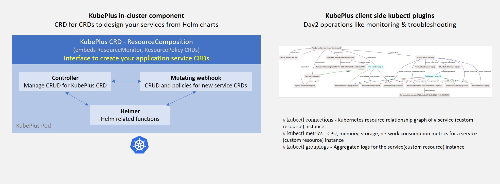
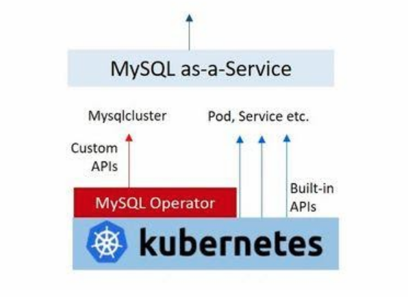
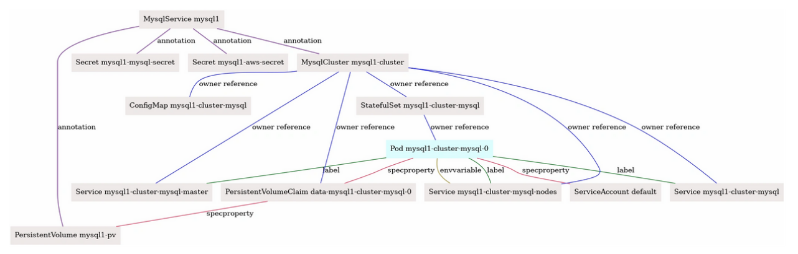

=======================
KubePlus Components
=======================

KubePlus consists of a Kubernetes Operator and a set of kubectl plugins. The KubePlus Kubernetes Operator consists of a Kubernetes Controller, a MutatingWebHook, and a module that knows how to deploy Helm charts. KubePlus requires that the Helm charts be defined using Helm 3.0.




KubePlus Kubernetes Operator
----------------------------

KubePlus offers a CRD named ResourceComposition to 

- Create new CRDs (Custom Resource Definition) to publish platform services from Helm charts
- Define policies (e.g. CPU/Memory limits, Node selection, etc.) for managing resources of the platform services
- Get aggregated cpu, memory, storage, and network metrics for the platform services in Prometheus format

Here is the high-level structure of ResourceComposition CRD: 

.. image:: crd-for-crds-1.png
   :height: 250px
   :width: 550px
   :align: center

To understand this further let us see how a platform team can build a MySQL service for their product team/s to consume. The base Kubernetes cluster has MySQL Operator installed on it (either installed by the Platform team or bundled by the Kubernetes provider).




The platform workflow requirements are: 

- Create a PersistentVolume of required type for MySQL instance. 
- Create Secret objects for MySQL instance and for storing backups of a MySQL instance on AWS.
- Setup a policy to provide specified resource requests and limits to all the Pods that are created under this service.  
- Get aggregated cpu, memory, storage and network metrics for all the Pods that are part of a MySQL instance.

Platform team creates a Helm chart that defines the required resources to be created (MySQL Custom Resource, PersistentVolume object, Secret objects).

Here is a new platform service named MysqlService created using 
:code:`ResourceComposition`. 

..
 .. image:: mysql-as-a-service-crd.png
   :height: 250px
   :width: 550px
   :align: center

A new CRD named MysqlService has been created here using ResourceComposition. You provide a platform workflow Helm chart that creates required underlying resources. 
When defining the new :code:`Kind`, make sure that you define the group as :code:`platformapi.kubeplus` and version as :code:`v1alpha1`.
Additionally provide any policy and monitoring inputs for the workflow as part of :code:`ResourceComposition` definition. The Spec Properties of MysqlService come from values.yaml of the Helm chart. Product teams can use this service to get MySQL database for their application.

.. code-block:: bash

  apiVersion: workflows.kubeplus/v1alpha1
  kind: ResourceComposition
  metadata:
    name: mysqlservicecrd 
  spec:
    # newResource defines the new CRD to be installed define a workflow.
    newResource:
      resource:
        kind: MysqlService
        group: platformapi.kubeplus
        version: v1alpha1
        plural: mysqlservices
      # URL of the Helm chart that contains Kubernetes resources that represent a workflow.
      chartURL: https://github.com/cloud-ark/operatorcharts/blob/master/mysqlcluster-stack-0.0.1.tgz?raw=true
      chartName: mysqlcluster-stack
    # respolicy defines the resource policy to be applied to instances of the specified custom resource.
    respolicy:
      apiVersion: workflows.kubeplus/v1alpha1
      kind: ResourcePolicy 
      metadata:
        name: mysqlservice-policy
      spec:
        resource:
          kind: MysqlService
          group: platformapi.kubeplus
          version: v1alpha1
        policy:
          # Add following requests and limits for the first container of all the  Pods that are related via 
          # owner reference relationship to instances of resources specified above.
          podconfig:
            limits:
              cpu: 200m
              memory: 4Gi
            requests:
              cpu: 100m
              memory: 2Gi
            nodeSelector: values.nodeName
    # resmonitor identifies the resource instances that should be monitored for CPU/Memory/Storage.
    # All the Pods that are related to the resource instance through either ownerReference relationship, or all the relationships
    # (ownerReference, label, annotation, spec properties) are considered in calculating the statistics. 
    # The generated output is in Prometheus format.
    resmonitor:
      apiVersion: workflows.kubeplus/v1alpha1
      kind: ResourceMonitor
      metadata:
        name: mysqlservice-monitor
      spec:
        resource:
          kind: MysqlService
          group: platformapi.kubeplus
          version: v1alpha1
        # This attribute indicates that Pods that are reachable through all the   relationships should be used
        # as part of calculating the monitoring statistics.
        monitorRelationships: all

**ResourceComposition**

ResourceComposition definition consists of the following:

- Details of the new API that you want to create (group, version, kind, plural). Currently a unique kind name is required across all the resources present in the cluster. Also, the new API should be registered under the group ``platformapi.kubeplus`` and version ``v1alpha1``.
- A publicly accessible Helm chart URL.
- A friendly chart name.
- ResourcePolicy section (defined under `respolicy`)
- ResourceMonitoring section (defined under `resmonitor`)

Creating an instance of ResourceComposition registers the specified new API in the cluster. When users create resources of this new API, the Helm chart that was defined as part of the registration of the new API gets deployed as a Helm release in a new namespace. The spec properties of this new API are all the values that are defined in ``values.yaml`` of the registered Helm chart.

*Helm chart requirements*

Make sure that the underlying service Helm chart adheres to following restrictions:

- The Helm chart should not contain Namespace definition. This is because all the Helm chart resources are created in the new Namespace that KubePlus creates for that resource instance (Helm release). The Namespace defined in the Helm chart will get created just as an object in the NS that KubePlus creates. But it won't contain any of the actual service instance resources. They will be present in the NS that KubePlus has created. So defining NS in the Helm chart is superfluous and will lead to confusion.
- The Helm chart should not take Namespace field as input through values.yaml. This is because the Namespace name so entered will be overridden by the NS that KubePlus creates.


**ResourcePolicy**

ResourcePolicy definition consists of specification of *Pod-level mutations* which will be applied to the Pods that are created when the Helm chart corresponding to the new API is deployed. Note that the Helm chart may or may not define Pods directly. There might be higher-level resources defined in the chart, such as Deployments, StatefulSets, or custom resources such as MysqlCluster, which internally create Pods. KubePlus is able to discover all the Pods for a particular Helm release and perform the mutations by modifying such Pods' spec. The mutations are done before the Pods are actually created to ensure that there are no Pod restarts.

Currently two mutations are supported as part of ``podconfig`` spec attribute:

- requests and limits: These fields are used to define cpu and memory resource request and limits for containers defined in a Pod. If a Pod is made of several containers currently only first container's spec is mutated. Also, currently initContainers are not supported.
- nodeSelector: This field is used to specify Node name on which a Pod needs to run. KubePlus updates the Pod's spec to include ``nodeSelector`` attribute based on the provided value.

The values for above fields can be statically defined, or they can be customized per resource instance of the new API. If it is the latter then the value needs to be specified to be input from the underlying ``values.yaml``. In the above example, requests and limits are statically defined, whereas ``nodeSelector`` is defined to be different per resource instance of the new API. Hence its value is specified to be ingested from a special field (``nodeName``) that can be included in the new API YAML.

**ResourceMonitor**

ResourcMonitor defines the monitoring requirements. The monitoring metrics that are collected consist of cpu, memory, storage and network (ingress/egress) for all the Pods that are related to a resource instance. The ``monitorRelationships`` attribute defines what all relationships to track to build the monitoring metrics. The supported values for it are ``all`` and ``owner``. In Kubernetes, resources are related to one another through four different relationships - ownerReferences, labels, spec properties, and annotations. 
Attribute value ``all`` indicates that all these relationships be used to discover the Pods. Attribute value ``owner`` indicates that only ownerReference relationship be used to discover the Pods. When ``ResourceMonitor`` is used as part of ``ResourceComposition`` definition like above, ``monitorRelationships`` should be set to ``all`` so that we use all the Pods that are created as part of the underlying Helm chart when calculating the metrics.
Collected metrics are output in Prometheus format. 

The resource section in both ``ResourcePolicy`` and ``ResourceMonitor`` specifies the GVK (group, version, kind) of the resource for which policy needs to be enforced or that needs to be monitored. Set these to be the same as resource that is defined as part of ``ResourceComposition.newResource.resource`` section.
In the future we plan to support creation of ``ResourcePolicy`` and ``ResourceMonitor`` separately from ``ResourceComposition`` for general purpose policy and monitoring. At that time the resource section can contain the coordinates (GVK) for any resource present in a cluster.


KubePlus kubectl plugins for monitoring and troubleshooting
---------------------------------------------------------------

KubePlus kubectl plugins enable users to discover, monitor and troubleshoot service instances. In order to use these plugins you need to add KubePlus folder to your PATH variable.

.. code-block:: bash

   $ export KUBEPLUS_HOME=<Full path where kubeplus is cloned>
   $ export PATH=$KUBEPLUS_HOME/plugins:$PATH

or

.. code-block:: bash

    curl -L https://github.com/cloud-ark/kubeplus/raw/master/kubeplus-kubectl-plugins.tar.gz -o kubeplus-kubectl-plugins.tar.gz
    gunzip kubeplus-kubectl-plugins.tar.gz
    tar -xvf kubeplus-kubectl-plugins.tar
    export KUBEPLUS_HOME=`pwd`
    export PATH=$KUBEPLUS_HOME/plugins/:$PATH

Check the available KubePlus kubectl plugins by running: ``kubectl kubeplus commands``

.. code-block:: bash

   $  kubectl kubeplus commands


      NAME
              kubectl kubeplus commands

      SYNOPSIS
              kubectl man
              kubectl connections
              kubectl metrics
              kubectl applogs
              kubectl appurl
	      kubectl appresources
              kubectl retrieve kubeconfig provider
              kubectl retrieve kubeconfig consumer
              kubectl grantpermission consumer

      DESCRIPTION
              KubePlus provides a suite of kubectl plugins to discover, monitor and troubleshoot Kubernetes applications.

              The discovery plugins (kubectl man, kubectl connections, kubectl appresources) help with discovering the static and runtime
              information about an application.
              - kubectl man provides the ability to discover man page like information about Kubernetes Custom Resources.
              - kubectl connections provides the ability to discover Kubernetes resources that are related to one another
                through one of the following relationships - ownerReferences, label, annotations, spec properties.
              - kubectl appresources displays all the resources that have been created for an application.
              The monitoring and troubleshooting plugins (kubectl metrics and kubectl applogs) enable collecting application metrics and logs.
              - kubectl metrics collects CPU, Memory, Storage, and Network metrics for an application. These are available in Prometheus format.
              - kubectl applogs collects logs for all the containers of all the Pods in an application.
              The kubeconfig files that are meant to be used by SaaS provider and SaaS consumers are available through:
              - kubectl retrieve kubeconfig provider
              - kubectl retrieve kubeconfig consumer
              These kubeconfig files are provided with limited RBAC permissions appropriate for the persona.
              - kubectl grantpermission consumer 
              This plugin enables provider to grant permission for the created service to the consumer. A consumer will be able to create service instances only after that.


The primary plugin is: ```kubectl connections```. It provides information about relationships of a Kubernetes resource instance (custom or built-in) with other resources (custom or built-in) via owner references, labels, annotations, and spec properties. KubePlus constructs Kubernetes Resource relationship graphs at runtime providing it the ability to offer fine grained visibility and control over the application service instances.

Here is the resource relationship graph for MysqlSevice created above discovered using the kubectl connections command. 

``kubectl connections MysqlService mysql1``





KubePlus Operator bundles these plugins as part of the ``Helmer`` module. 

Resource relationship graphs
-----------------------------

For resource policy enforcement and monitoring, KubePlus needs to discover
resource topologies. It does that by discovering Kubernetes Resource relationship graphs. In order to do this, KubePlus depends on the following annotations: 

.. code-block:: bash

   resource/composition
   resource/label-relationship
   resource/specproperty-relationship
   resource/annotation-relationship

These annotations need to be defined on the Custom Resource Definition (CRD) YAMLs of Operators in order to make Custom Resources discoverable.

The 'composition' annotation is used to specify the list of Kubernetes's built-in resources that are created as part of instantiating a Custom Resource instance. Three relationship annotations are used to declare label, spec-property, and annotation based relationships that instances of a Custom Resource can have with other Kubernetes resources.

KubePlus adds the ``annotation-relationship`` annotation to the CRD of the new API that is registered via ``ResourceComposition``. Here is an example of this annotation added by KubePlus on WordpressService CRD.

.. code-block:: yaml

  resource/annotation-relationship: on:Secret;PersistentVolumeClaim;Role;RoleBinding;ServiceAccount;Service;Pod;MysqlCluster;Namespace, key:meta.helm.sh/release-name, value:wordpressservice-INSTANCE.metadata.name

This annotation relationship definition indicates that an instance of WordpressService is related to instances of Secret, PersistentVolumeClaim, Role, RoleBinding, ServiceAccount, Service, Pod, MysqlCluster, and Namespace resources through the ``meta.helm.sh/release-name`` annotation. The value of the annotation will have the following structure ``wordpresservice-<name of the WordpressService instance>``. When deploying Helm charts, KubePlus creates the Helm releases with following naming scheme ``<service-name>-<resource-name>``. The value of the annotation is based on this naming scheme. The list of resources listed in the ``on`` section of the resource/annotation-relationship annotation are discovered by KubePlus by performing a dry-run on the registered Helm chart.


CRD annotations on community Operators
---------------------------------------

KubePlus kubectl plugins are general purpose and can be used with any other Operator as long as the CRDs managed by that Operator are annotated with above annotations. Here are some examples of community Operators annotated with above annotations. 

**Moodle Operator**

`Moodle Operator`_ defines and manages Moodle CRD.

.. _Moodle Operator: https://github.com/cloud-ark/kubeplus-operators

Annotations on Moodle Custom Resource Definition (CRD) are shown below:

.. code-block:: yaml

  apiVersion: apiextensions.k8s.io/v1beta1
  kind: CustomResourceDefinition
  metadata:
    name: moodles.moodlecontroller.kubeplus
    annotations:
      resource/composition: Deployment, Service, PersistentVolume, PersistentVolumeClaim, Secret, Ingress
      resource/specproperty-relationship: "on:INSTANCE.spec.mySQLServiceName, value:Service.spec.metadata.name"
  spec:
    group: moodlecontroller.kubeplus
    version: v1
    names:
      kind: Moodle
      plural: moodles
    scope: Namespaced

The composition annotation declares the set of Kubernetes resources that are created by the Moodle Operator when instantiating a Moodle Custom Resource instance. The specproperty relationship defines that an instance of Moodle Custom Resource is connected through it's mySQLServiceName spec attribute to an instance of a Service resource through that resource's name (metadata.name). Once this relationship is defined, here is how kubectl connections plugin helps discover the resource relationship graph for a Moodle Custom resource instance named moodle1.

.. code-block:: bash

  (venv) Devs-MacBook:kubeplus devdatta$ kubectl connections Moodle moodle1 namespace1
  Level:0 kind:Moodle name:moodle1 Owner:/
  Level:1 kind:Service name:cluster1-mysql-master Owner:MysqlCluster/cluster1
  Level:2 kind:Pod name:cluster1-mysql-0 Owner:MysqlCluster/cluster1
  Level:3 kind:Service name:cluster1-mysql-nodes Owner:MysqlCluster/cluster1
  Level:3 kind:Service name:cluster1-mysql Owner:MysqlCluster/cluster1
  Level:2 kind:Pod name:moodle1-5847c6b69c-mtwg8 Owner:Moodle/moodle1
  Level:3 kind:Service name:moodle1 Owner:Moodle/moodle1

**Multus Operator**

The `Multus Operator`_ defines and manages NetworkAttachmentDefinition CRD.

.. _Multus Operator: https://github.com/k8snetworkplumbingwg/multus-cni

.. code-block:: bash

  resource/annotation-relationship: on:Pod, key:k8s.v1.cni.cncf.io/networks, value:INSTANCE.metadata.name

The annotation-relationship annotation is defined on the NetworkAttachmentDefinition CRD. It defines that the relationship between a Pod and an instance of NetworkAttachmentDefinition Custom Resource instance is through the ``k8s.v1.cni.cncf.io/networks`` annotation. This annotation needs to be defined on a Pod and the value of the annotation is the name of a NetworkAttachmentDefinition Custom resource instance.

**Stash Operator**

The `Stash Operator`_ defines and manages Restic CRD.

.. _Stash Operator: https://github.com/stashed/stash

.. code-block:: bash

  resource/specproperty-relationship: "on:INSTANCE.spec.volumeMounts, value:Deployment.spec.containers.volumemounts.mountpath"
  resource/label-relationship: "on:Deployment, value:INSTANCE.spec.selector"

Above annotations are defined on the Restic CRD. Restic Custom Resource needs two things as input. First, the mount path of the Volume that needs to be backed up. Second, the Deployment in which the Volume is mounted needs to be given some label and that label needs to be specified in the Restic Custom Resource's selector.

**Annotated Operators**

We maintain a listing of annotated community Operators. Check it out `here`_.

.. _here: https://github.com/cloud-ark/kubeplus/blob/master/Operator-annotations.md

We will be happy to include your annotated Operator in this list.
Just submit a PR to KubePlus repo with details about the CRDs that your Operator manages and all the relationships that it depends on when handling its custom resource instances. We will help you define these relationships on your CRDs.


