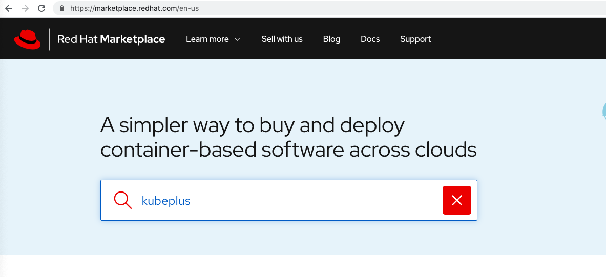

=========================
OpenShift Deployment
=========================

Setup
------

1. Make sure your Openshift Cluster is registered with Redhat Marketplace. Follow `cluster registration link`_ for reference:

.. _cluster registration link: https://marketplace.redhat.com/en-us/documentation/clusters#register-openshift-cluster-with-red-hat-marketplace

2. Install KubePlus Pre-requisite resources. You can use either oc cli or kubectl cli. The commands are exactly the same.

.. code-block:: bash

    kubectl create -f https://raw.githubusercontent.com/cloud-ark/kubeplus/master/deploy/kubeplus-openshift-prereqs.yaml

or

.. code-block:: bash

    oc create -f https://raw.githubusercontent.com/cloud-ark/kubeplus/master/deploy/kubeplus-openshift-prereqs.yaml

3. Go to `Redhat Marketplace`_, search for "KubePlus" operator.
   Customer can do free trial signup or Purchase.

.. _Redhat Marketplace: marketplace.redhat.com

4. Install operator from `Redhat Marketplace Operators section`_

.. _Redhat Marketplace Operators section: https://marketplace.redhat.com/en-us/documentation/operators

Follow `HelloWorldSerivce sample example`_

.. _HelloWorldService sample example: https://cloud-ark.github.io/kubeplus/docs/html/html/sample-example.html

5. Debug:

.. code-block:: bash

  $ KUBEPLUS_NS=openshift-operators
  $ KUBEPLUS=`kubectl get pods -A | grep kubeplus | awk '{print $2}'`
  $ kubectl logs $KUBEPLUS -n $KUBEPLUS_NS -c crd-hook
  $ kubectl logs $KUBEPLUS -n $KUBEPLUS_NS -c helmer
  $ kubectl logs $KUBEPLUS -n $KUBEPLUS_NS -c platform-operator
  $ kubectl logs $KUBEPLUS -n $KUBEPLUS_NS -c webhook-cert-setup