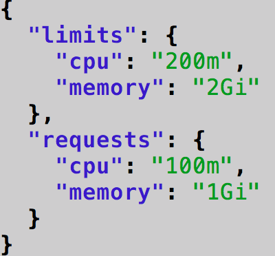
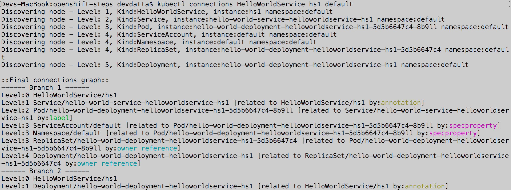
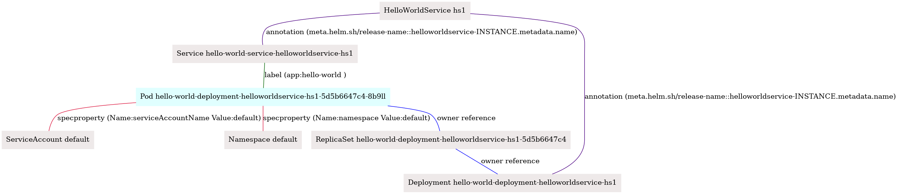

===================================
Sample Example - HelloWorldService
===================================

Here we demonstrate how a Provider can use KubePlus to deliver a "hello-world as-a-Service" using a Hello World Helm chart.
The helm chart defines a Deployment and a Service. The Pod managed
by the Deployment prints the messages that are provided as input.
When registering the service, Provider defines the CPU and Memory requests and limits that should be provided to the HelloWorld Pod. KubePlus ensures that every HelloWorldService instances' Pod is given the CPU and Memory requests and limits that are configured by the Provider when registering the HelloWorldService. Consumers create HelloWorldService instances 
and pass custom hello messages to print to the Pod.

Setup
------

In order to try this example you will need to install Kubernetes CLI (kubectl), or if you are using OpenShift, the OpenShift CLI (oc).
Choose the CLI version that works with your Kubernetes version.
Once the appropriate CLI is installed, follow these steps.

Open three command terminal windows. Name them as:

- Provider window 1
- Provider window 2
- Consumer window 

Provider window 1
------------------

Do following steps in provider window 1:

1. Define the NAMESPACE in which you have installed KubePlus.
   For OpenShift users, the namespace needs to be 'openshift-operators'.

.. code-block:: bash

    KUBEPLUS_NS=<Namespace>

2. Create hello-world-resource-composition:

Here is the hello-world-resource-composition.yaml file. Save it as hello-world-resource-composition.yaml.

.. code-block:: bash

	apiVersion: workflows.kubeplus/v1alpha1
	kind: ResourceComposition
	metadata:
	  name: hello-world-resource-composition
	spec:
	  # newResource defines the new CRD to be installed define a workflow.
	  newResource:
	    resource:
	      kind: HelloWorldService
	      group: platformapi.kubeplus
	      version: v1alpha1
	      plural: helloworldservices
	    # URL of the Helm chart that contains Kubernetes resources that represent a workflow.
	    chartURL: https://github.com/cloud-ark/operatorcharts/blob/master/hello-world-chart-0.0.2.tgz?raw=true
	    chartName: hello-world-chart
	  # respolicy defines the resource policy to be applied to instances of the specified custom resource.
	  respolicy:
	    apiVersion: workflows.kubeplus/v1alpha1
	    kind: ResourcePolicy 
	    metadata:
	      name: hello-world-service-policy
	    spec:
	      resource:
	        kind: HelloWorldService 
	        group: platformapi.kubeplus
	        version: v1alpha1
	      policy:
	        # Add following requests and limits for the first container of all the Pods that are related via 
	        # owner reference relationship to instances of resources specified above.
	        podconfig:
	          limits:
	            cpu: 200m
	            memory: 2Gi
	          requests:
	            cpu: 100m
	            memory: 1Gi
	  # resmonitor identifies the resource instances that should be monitored for CPU/Memory/Storage.
	  # All the Pods that are related to the resource instance through either ownerReference relationship, or all the relationships
	  # (ownerReference, label, annotation, spec properties) are considered in calculating the statistics. 
	  # The generated output is in Prometheus format.
	  resmonitor:
	    apiVersion: workflows.kubeplus/v1alpha1
	    kind: ResourceMonitor
	    metadata:
	      name: hello-world-service-monitor
	    spec:
	      resource:
	        kind: HelloWorldService 
	        group: platformapi.kubeplus
	        version: v1alpha1
	      # This attribute indicates that Pods that are reachable through all the relationships should be used
	      # as part of calculating the monitoring statistics.
	      monitorRelationships: all

Create hello-world-resource-composition as follows:

.. code-block:: bash

    kubectl create -f hello-world-resource-composition.yaml -n $KUBEPLUS_NS

or

.. code-block:: bash

    oc create -f hello-world-resource-composition.yaml -n $KUBEPLUS_NS

3. Wait till HelloWorldService CRD is registered in the cluster.

.. code-block:: bash

    until kubectl get crds | grep hello  ; do echo "Waiting for HelloworldService CRD to be registered.."; sleep 1; done

or

.. code-block:: bash

    until oc get crds | grep hello  ; do echo "Waiting for HelloworldService CRD to be registered.."; sleep 1; done

Consumer window
----------------

Do following steps in consumer window:

1. Install KubePlus kubectl plugins

.. code-block:: bash

    curl -L https://github.com/cloud-ark/kubeplus/raw/master/kubeplus-kubectl-plugins.tar.gz -o kubeplus-kubectl-plugins.tar.gz
    gunzip kubeplus-kubectl-plugins.tar.gz
    tar -xvf kubeplus-kubectl-plugins.tar
    export KUBEPLUS_HOME=`pwd`
    export PATH=$KUBEPLUS_HOME/plugins/:$PATH
    kubectl kubeplus commands
  or
    oc kubeplus commands

2. Install Docker and verify that you are able to run docker commands without requiring sudo.

.. code-block:: bash

	docker ps

This should return without any errors.

3. Check the HellowWorldService API documentation

.. code-block:: bash

	kubectl man HelloWorldService

You should see following output:

.. code-block:: bash

	KIND:	HelloWorldService
	GROUP:	platformapi.kubeplus
	VERSION:	v1alpha1

	DESCRIPTION:
	Here is the values.yaml for the underlying Helm chart representing this resource.
	The attributes in values.yaml become the Spec properties of the resource.

	::::::::::::::
	/hello-world-chart/values.yaml
	::::::::::::::
	# Default value for namespace.

	greeting: Hello World!

4. Create HelloWorldService instance. 

   HelloWorldService instances can be created in any namespace.

Copy below YAML and save it as hello-world-service.yaml

.. code-block:: bash

	apiVersion: platformapi.kubeplus/v1alpha1
	kind: HelloWorldService 
	metadata:
	  name: hs1
	spec:
	  greeting: Hello hello hello

.. code-block:: bash

    kubectl create -f hello-world-service.yaml

or

.. code-block:: bash

    oc create -f hello-world-service.yaml

This will create hs1 instance in the default namespace.

5. Check it has been created:

.. code-block:: bash

     kubectl get helloworldservices
     kubectl describe helloworldservices hs1

or

.. code-block:: bash

     oc get helloworldservices
     oc describe helloworldservices hs1

Verify that the Status field is populated in hs1 instance.

6. Verify that HelloWorldService has started

.. code-block:: bash

    HELLOWORLD_POD=`kubectl get pods -A | grep hello-world-deployment-helloworldservice | awk '{print $2}'`
    HELLOWORLD_NS=`kubectl get pods -A | grep hello-world-deployment-helloworldservice | awk '{print $1}'`
    kubectl port-forward $HELLOWORLD_POD -n $HELLOWORLD_NS 8082:5000 &
    curl localhost:8082

or

.. code-block:: bash

     HELLOWORLD_POD=`oc get pods -A | grep hello-world-deployment-helloworldservice | awk '{print $2}'`
     HELLOWORLD_NS=`oc get pods -A | grep hello-world-deployment-helloworldservice | awk '{print $1}'`
     oc port-forward $HELLOWORLD_POD -n $HELLOWORLD_NS 8082:5000 &
     curl localhost:8082

You should see following output:

.. code-block:: bash

	Hello hello hello

7. Verify resource requests and limits have been set on the Pod that belongs to HelloWorldService instance.

.. code-block:: bash

	kubectl get pods $HELLOWORLD_POD -n $HELLOWORLD_NS -o json | jq -r '.spec.containers[0].resources'

or

.. code-block:: bash
   
    oc get pods $HELLOWORLD_POD -n $HELLOWORLD_NS -o json | jq -r '.spec.containers[0].resources'

You should see following output:

8. Check resource relationship graph for HelloWorldService instance:

.. code-block:: bash

    kubectl connections HelloWorldService hs1 $HELLOWORLD_NS

or

.. code-block:: bash

    oc connections HelloWorldService hs1 $HELLOWORLD_NS

You should see following output:

9. (Only on Linux or MacOS) Visualize the relationship graph:

.. code-block:: bash

    kubectl connections HelloWorldService hs1 $HELLOWORLD_NS -o png

or

.. code-block:: bash

    oc connections HelloWorldService hs1 $HELLOWORLD_NS -o png

Provider window 1
-----------------

Back on the provider window 1, perform following steps:

.. code-block:: bash

    KUBEPLUS_POD=`kubectl get pods -A | grep kubeplus-deployment | awk '{print $2}'`

    KUBEPLUS_NS=`kubectl get pods -A | grep kubeplus-deployment | awk '{print $1}'`

    kubectl port-forward $KUBEPLUS_POD -n $KUBEPLUS_NS 8081:8090

or

.. code-block:: bash

    KUBEPLUS_POD=`oc get pods -A | grep kubeplus-deployment | awk '{print $2}'`

    KUBEPLUS_NS=`oc get pods -A | grep kubeplus-deployment | awk '{print $1}'`

    oc port-forward $KUBEPLUS_POD -n $KUBEPLUS_NS 8081:8090

Provider window 2
------------------

In provider window 2, get CPU/Memory/Storage/Network metrics for HelloWorldService instance:

.. code-block:: bash

    HELLOWORLD_NS=`kubectl get pods -A | grep hello-world-deployment-helloworldservice | awk '{print $1}'`

or

.. code-block:: bash

    HELLOWORLD_NS=`oc get pods -A | grep hello-world-deployment-helloworldservice | awk '{print $1}'`

.. code-block:: bash

    curl -kv "http://127.0.0.1:8081/apis/kubeplus/metrics?kind=HelloWorldService&instance=hs1&namespace=$HELLOWORLD_NS"

You should see output of the following form:

.. image:: hello-world-metrics.png
   :align: center

